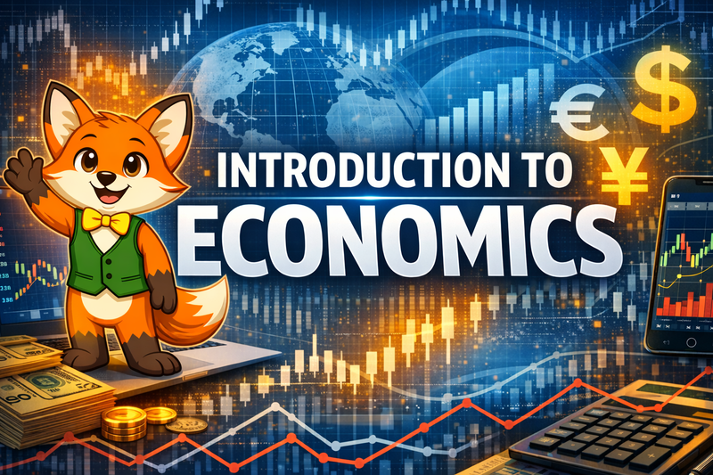

# Welcome to Interactive Intelligent Textbook Introduction to Economics

An this is an interactive intelligent textbook for learning economics fundamentals that leverage an extensive set of interactive MicroSimulations (MicroSims) and interactive infographics.

## Key Features

1. 14 [Chapters](./chapters/index.md) of content covering 206 economics concepts
2. Over 60 interactive [MicroSims](./sims/index.md) and infographics
3. Search tool (upper right corner of the page header)
4. [Glossary of Economic Terms](./glossary.md) over 200 terms
5. Detailed [FAQ](./faq.md)
6. [Learning Graph](./learning-graph/index.md) with 381 concept dependency relationships
7. 14 Chapter quizzes (one for each chapter)
8. Over 140 detailed annotated references organized by each chapter
9. Detailed [Instructors Guide](./teachers-guide/index.md) on how teachers can customize this interactive intelligent textbook for their own classroom
10. Short graphic novel [Stories](./stories/index.md) about innovators in economics.

Use the navigation menu on the left to explore chapters and content.
Use the search form at the upper right corner to go directly to specific topics in the book.

Please let me know if you have any feedback.

[Dan McCreary on LinkedIn](https://www.linkedin.com/in/danmccreary/)