# The Wealth of Watching: Adam Smith and the Pin Factory

Cover Image Prompt

Please generate a new wide-landscape 16:9 cover image for a graphic novel titled "The Wealth of Watching." The style should be warm Enlightenment-era oil painting with rich golden-brown tones and candlelight warmth. The central figure is Adam Smith — a tall, thin man in his 40s with a prominent nose, wearing a powdered wig and a dark green frock coat — standing in a bustling 18th-century pin factory. He holds a quill and notebook, gazing with wonder at rows of workers performing specialized tasks. Pins and wire glint in the light from high windows. In the background, the spires of Edinburgh are visible through an open doorway. The title "THE WEALTH OF WATCHING" appears in elegant serif font across the top, with "The Story of Adam Smith" in smaller text below. The mood is one of intellectual discovery and quiet awe.
Generate the image now.

Narrative Prompt

This graphic novel tells the story of Adam Smith (1723–1790), the Scottish philosopher widely considered the father of modern economics. The narrative follows Smith from his traumatic childhood kidnapping, through his awkward student years, his revolutionary first book on human sympathy, his famous visit to a pin factory, and the writing of The Wealth of Nations (1776). The art style should evoke the Scottish Enlightenment — warm candlelit interiors, misty Highland landscapes, and the bustling streets of Edinburgh and Glasgow. The color palette emphasizes deep greens, warm golds, weathered stone grays, and the rich browns of leather-bound books. Smith should be depicted consistently as a tall, thin, somewhat ungainly man with a prominent nose and kind but distracted eyes, often talking to himself or lost in thought. The tone balances intellectual excitement with human warmth, showing that the man who described the invisible hand was first and foremost a student of human nature and empathy.

### Prologue – The Quiet Observer

In 1776, a book appeared that would change the world as profoundly as any revolution. It was not written by a general or a king, but by a shy, absent-minded Scottish professor who talked to himself on long walks and once fell into a tanning pit because he was lost in thought. His name was Adam Smith, and his superpower was something anyone can develop: the ability to watch people carefully and ask *why* they do what they do.

## Panel 1: A Child Stolen

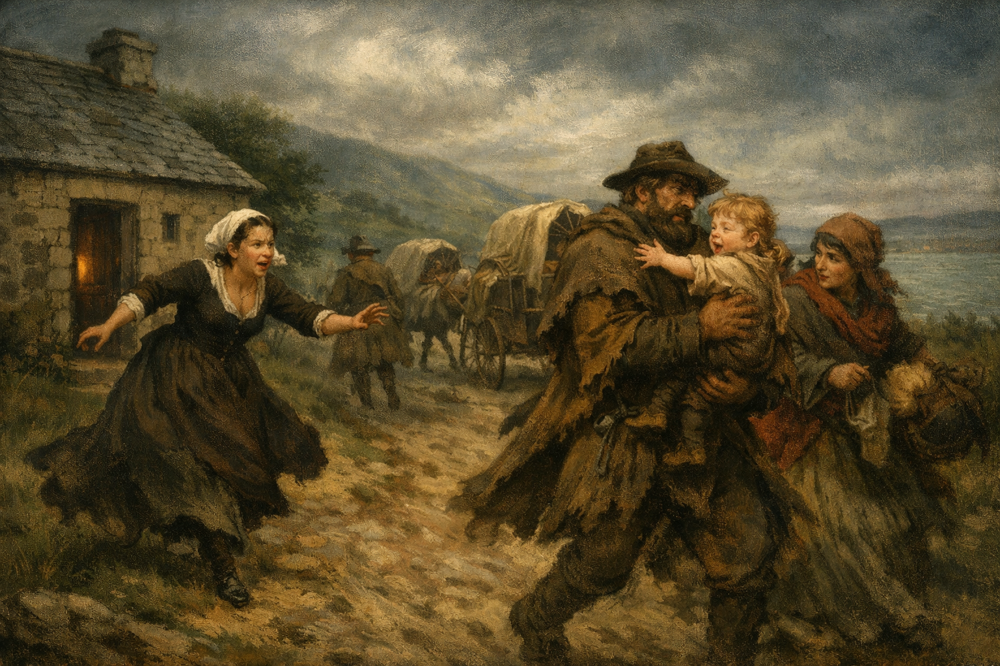

Image Prompt

I am about to ask you to generate a series of images for a graphic novel.
Please make the images have a consistent style and consistent characters.
Do not ask any clarifying questions. Just generate the image immediately when asked to do so.

Please generate a 16:9 image in warm Enlightenment-era oil painting style depicting panel 1 of 14. The scene shows a small Scottish coastal village, Kirkcaldy, in 1726. A three-year-old boy with light brown hair is being carried away by a group of traveling people moving along a dirt road, while in the background a stone cottage with a slate roof stands with its door open. A woman in a dark dress — the boy's mother, Margaret Douglas — is running from the cottage toward the road, her face showing panic and determination. The landscape is misty green Scottish hills with the Firth of Forth visible in the distance. The color palette is muted greens, slate grays, and stormy sky blues. The emotional tone is tense and dramatic, but with a sense that rescue is imminent.
Generate the image now.

Adam Smith's life began with loss and danger. His father, a lawyer and customs official, died months before Adam was born in 1723 in Kirkcaldy, Scotland. At the age of three, young Adam was snatched by a band of traveling people passing through town. His uncle organized a search party and rescued him quickly, but the incident left its mark. Smith's mother, Margaret Douglas, became fiercely protective of her only child — and Adam grew up unusually close to her, a quiet boy who preferred books and observation to rough play.

## Panel 2: The Awkward Student

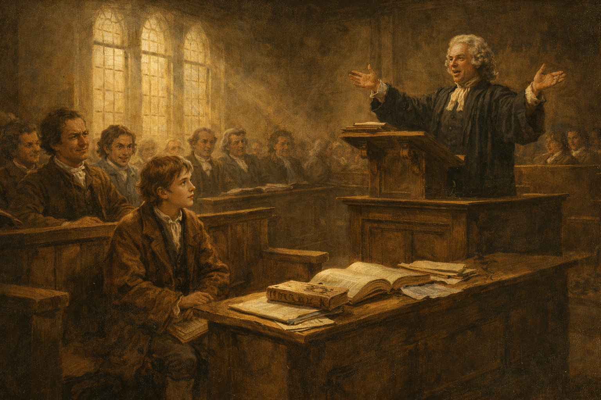

Image Prompt

Please generate a 16:9 image in warm Enlightenment-era oil painting style depicting panel 2 of 14. Make the characters and style consistent with the prior panel. The scene shows the interior of a lecture hall at the University of Glasgow, circa 1737. A 14-year-old Adam Smith — thin, gangly, with an oversized coat — sits in a wooden pew surrounded by older students who glance at him with mild amusement. At the front, the philosopher Francis Hutcheson lectures passionately, gesturing broadly, wearing academic robes. Hutcheson's face is animated with enthusiasm. Sunlight streams through tall arched windows, illuminating dust motes. Books and papers are scattered on the wooden desk before Smith. The color palette is warm amber light against dark wood and stone walls. The emotional tone is one of intellectual awakening — the awkward boy is transfixed by the lecture.
Generate the image now.

At just fourteen, Smith entered the University of Glasgow — young even by 18th-century standards. He was an odd student: shy, prone to fits of abstraction, and known for talking to himself while walking. But he found his intellectual hero in Professor Francis Hutcheson, a charismatic Irish philosopher who lectured in English rather than Latin and paced the room with infectious energy. Hutcheson taught that humans have a natural "moral sense" — an inborn ability to feel the pleasure and pain of others. This idea would become the seed of Smith's entire life's work.

## Panel 3: Oxford and Loneliness

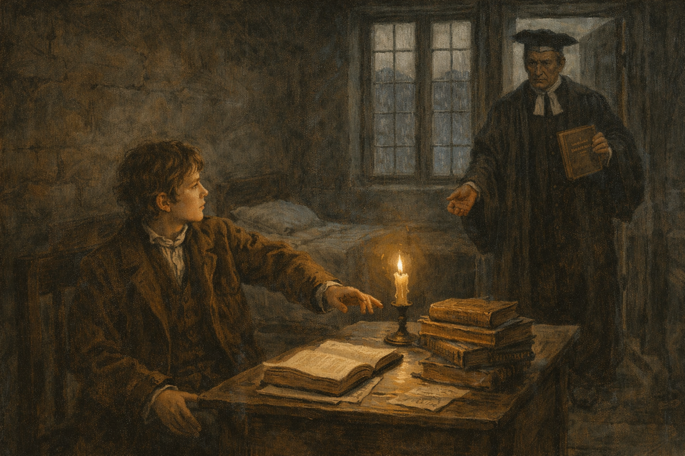

Image Prompt

Please generate a 16:9 image in warm Enlightenment-era oil painting style depicting panel 3 of 14. Make the characters and style consistent with the prior panels. The scene shows a young Adam Smith, now around 17, sitting alone in a cold, dimly lit room at Balliol College, Oxford, circa 1740. He is reading David Hume's "A Treatise of Human Nature" by candlelight, hunched over a small desk piled with books. The room is spartan — bare stone walls, a narrow bed, a single window showing gray English rain. A stern-faced college proctor stands in the doorway, having just confiscated the book — Smith's hand reaches toward where the book was. The color palette is cold blues and grays contrasted with the warm golden glow of the single candle. The emotional tone is isolation and quiet rebellion.
Generate the image now.

Smith won a scholarship to Oxford, but found it a deeply disappointing place. The professors rarely lectured and seemed uninterested in teaching. Left largely to educate himself, Smith devoured books — until the college authorities confiscated his copy of David Hume's *Treatise of Human Nature*, which they considered dangerously radical. Smith spent six lonely years at Oxford, battling homesickness and what may have been a nervous breakdown. But the solitude forged something important: the habit of thinking deeply and independently, refusing to accept ideas simply because authorities endorsed them.

## Panel 4: The Edinburgh Lectures

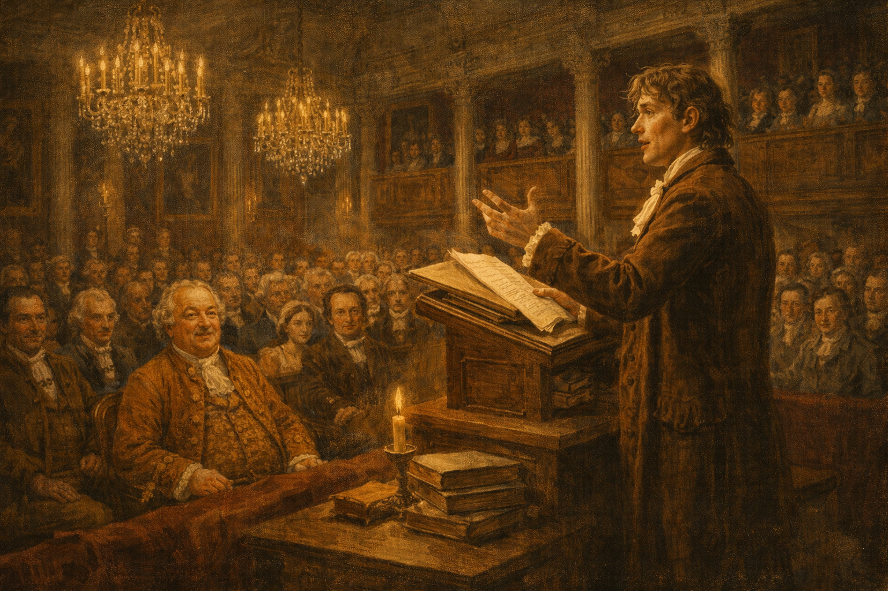

Image Prompt

Please generate a 16:9 image in warm Enlightenment-era oil painting style depicting panel 4 of 14. Make the characters and style consistent with the prior panels. The scene shows Adam Smith, now in his late 20s, delivering a public lecture in an elegant Edinburgh assembly room, circa 1748. He stands at a lectern before a packed audience of well-dressed Scottish gentlemen and a few women in the gallery. Smith is animated despite his shyness — one hand gestures while the other grips his notes. In the front row, the philosopher David Hume — a plump, jovial man with bright eyes — watches with a delighted smile. The room is lit by dozens of candles in crystal chandeliers. The walls are adorned with classical columns and portraits. The color palette is warm candlelight golds against deep burgundy and forest green fabrics. The emotional tone is intellectual excitement and the birth of a friendship.
Generate the image now.

Back in Scotland, Smith began giving public lectures in Edinburgh on rhetoric and literature. These lectures were a sensation — crowds packed the hall to hear this eccentric young thinker connect ideas about language, history, and human nature in ways no one had before. It was here that Smith met David Hume, already Scotland's most famous (and most controversial) philosopher. The two became lifelong friends — an odd pair, since Hume was sociable and witty while Smith was reserved and absent-minded. But they shared something deeper: a conviction that understanding human behavior required observation, not just theology.

## Panel 5: The Theory of Moral Sentiments

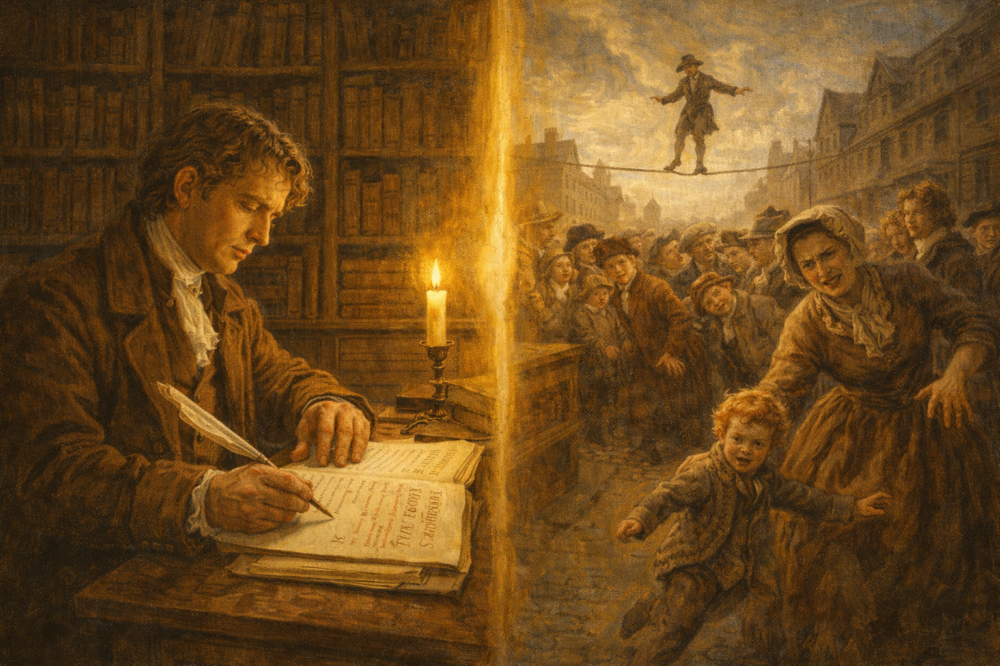

Image Prompt

Please generate a 16:9 image in warm Enlightenment-era oil painting style depicting panel 5 of 14. Make the characters and style consistent with the prior panels. The scene is a split composition. On the left side, Adam Smith sits in a book-lined study in Glasgow, circa 1759, writing by candlelight — the manuscript pages before him are titled "The Theory of Moral Sentiments." He is in his mid-30s, wearing a simple brown coat and white cravat. On the right side, a visual metaphor: a crowded Glasgow street scene where people unconsciously mirror each other's emotions — a mother wincing as her child stumbles, a crowd of spectators at a rope-walker all leaning to one side in sympathy. Connecting both halves is a warm golden light suggesting the insight that links them. The color palette is warm browns, creams, and golden highlights. The emotional tone is revelatory — the moment when private reflection meets universal truth.
Generate the image now.

In 1759, Smith published his first masterwork: *The Theory of Moral Sentiments*. Its central idea was radical for its time — and still surprises people today. Smith argued that human society is held together not by reason or religion, but by *sympathy*: our ability to imagine ourselves in another person's situation and feel what they feel. He noticed that when we watch a tightrope walker, we instinctively lean and sway. When a friend suffers, we suffer too. This "fellow-feeling," Smith argued, is the glue of civilization. It was a bestseller, and it made him famous across Europe. But Smith wasn't done — he sensed a deeper puzzle waiting to be solved.

## Panel 6: The Pin Factory

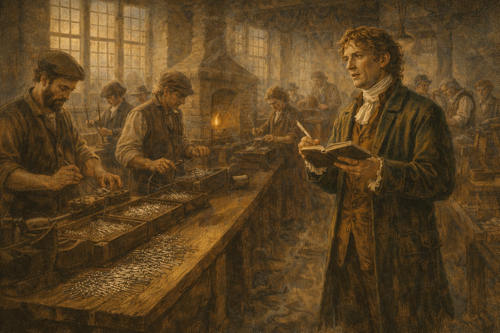

Image Prompt

Please generate a 16:9 image in warm Enlightenment-era oil painting style depicting panel 6 of 14. Make the characters and style consistent with the prior panels. This is the central panel of the story. The scene shows Adam Smith, now in his early 40s, standing in the middle of a busy pin-making factory in Scotland, circa 1765. He is holding a small notebook and quill, his eyes wide with fascination. Around him, workers perform specialized tasks in sequence: one man draws out wire, another straightens it, a third cuts it, a fourth sharpens the point, a fifth grinds the top for the head, others attach and polish the heads. Each worker is focused on their single task with practiced speed. Pins catch the light on a wooden sorting table in the foreground. The factory has high windows letting in dusty golden light, exposed wooden beams, and a brick hearth. The color palette is industrial warm — amber light, iron grays, copper tones, and the green of Smith's coat. The emotional tone is the eureka moment — Smith seeing the invisible architecture of productivity for the first time.
Generate the image now.

This is the moment that changed economics forever. Smith visited a small pin factory — a humble workshop employing just ten workers. He expected to see a simple craft. Instead, he witnessed something extraordinary. Rather than each worker making complete pins from start to finish (which would produce perhaps one pin per person per day), the work had been divided into eighteen distinct operations. One man drew out the wire. Another straightened it. A third cut it. A fourth sharpened the point. Together, those ten workers produced 48,000 pins per day. Smith stood in that factory and saw the hidden engine of prosperity: *the division of labor* — the idea that specialization and cooperation create wealth far beyond what any individual could achieve alone.

## Panel 7: The Grand Tour

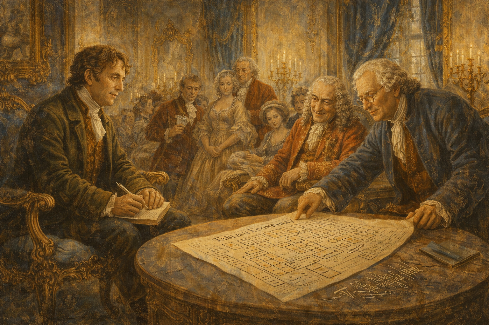

Image Prompt

Please generate a 16:9 image in warm Enlightenment-era oil painting style depicting panel 7 of 14. Make the characters and style consistent with the prior panels. The scene shows Adam Smith in a Parisian salon, circa 1766. He sits in an ornate chair in a lavishly decorated room — gilt mirrors, silk curtains, Rococo flourishes — surrounded by French intellectuals. Across from him sits Voltaire, elderly and sharp-eyed, leaning forward with interest. Nearby, the Physiocrat François Quesnay — an older man with spectacles and a physician's air — shows Smith a large chart on the table: his "Tableau Économique," a flow diagram of the economy. Other philosophers and well-dressed women look on. Smith appears slightly uncomfortable with the opulence but intellectually engaged. The color palette is rich French blues, golds, and ivory. The emotional tone is cross-pollination of ideas across cultures.
Generate the image now.

In 1764, Smith left his university post to serve as tutor to the young Duke of Buccleuch on a "Grand Tour" of Europe. In Paris, he encountered the most brilliant minds of the French Enlightenment. He debated Voltaire. He studied with the Physiocrats, particularly François Quesnay, the physician-turned-economist who had created the first model of an economy as a circular flow system. Smith absorbed their insight that economies are *systems* — interconnected networks where changes in one part ripple through the whole. But he also saw where they were wrong, and the ideas for a far more ambitious book began to crystallize in his mind.

## Panel 8: The Invisible Hand

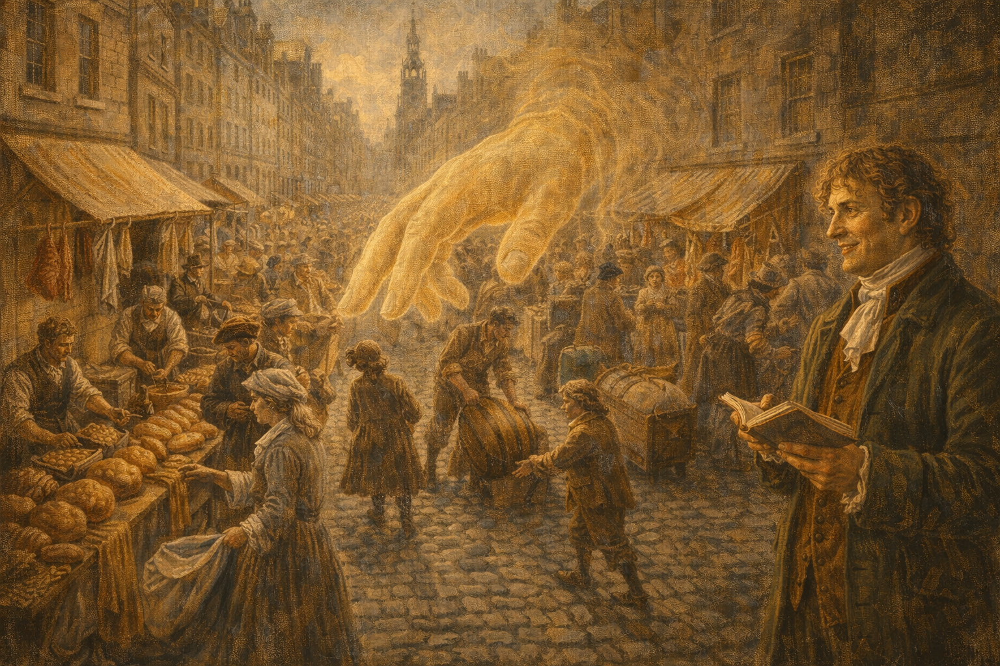

Image Prompt

Please generate a 16:9 image in warm Enlightenment-era oil painting style depicting panel 8 of 14. Make the characters and style consistent with the prior panels. The scene shows a bustling 18th-century Scottish market town — Edinburgh's High Street, circa 1770. The view is from slightly above, looking down the cobblestone street crowded with merchants, shoppers, and craftspeople. A baker displays bread, a butcher hangs cuts of meat, a brewer rolls a barrel, a weaver shows cloth — each pursuing their own trade. Overlaid on the scene, like a ghostly presence, is a giant translucent hand made of flowing golden light, gently guiding the flow of goods and people without anyone noticing it. Adam Smith stands to one side of the scene, in his green coat, watching the market with a knowing smile, his notebook in hand. The color palette is the warm bustle of everyday commerce — earth tones, market colors, with the ethereal gold of the invisible hand. The emotional tone is wonder at the hidden order within apparent chaos.
Generate the image now.

Back in Scotland, Smith spent the next decade writing his masterwork in quiet Kirkcaldy, living with his mother. The central insight he labored to explain was what he called "the invisible hand": the idea that when individuals pursue their own self-interest through trade and specialization, they unintentionally promote the good of society as a whole. The baker doesn't bake bread out of kindness — he bakes it to earn a living. But the result is that everyone gets bread. Smith was not naive about this; he warned extensively about monopolies, collusion, and the exploitation of workers. The invisible hand, he understood, only works when markets are fair and open.

## Panel 9: The Wealth of Nations

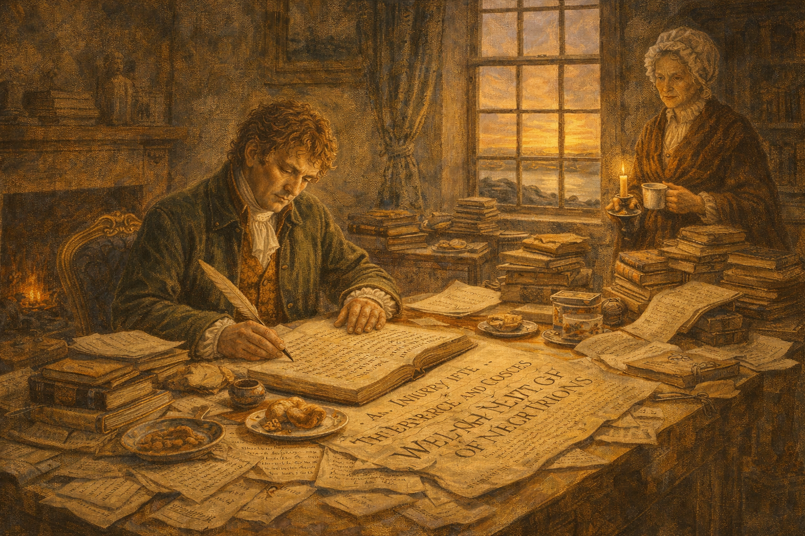

Image Prompt

Please generate a 16:9 image in warm Enlightenment-era oil painting style depicting panel 9 of 14. Make the characters and style consistent with the prior panels. The scene shows Adam Smith's study in Kirkcaldy, 1776. The room is cluttered chaos — towers of books, scattered papers, half-eaten meals on plates pushed aside, a cold fireplace. Smith sits at a large desk, quill in hand, looking exhausted but triumphant. Before him lies a massive completed manuscript: "An Inquiry into the Nature and Causes of the Wealth of Nations." His mother, Margaret Douglas, now elderly, stands in the doorway holding a candle and a cup of tea, looking at her son with quiet pride. Through the window, a new day is dawning over the Firth of Forth. The color palette is the warm mess of creative labor — papers and books in cream and brown, ink stains, with the dawn light bringing rose and gold through the window. The emotional tone is exhausted triumph and maternal love.
Generate the image now.

On March 9, 1776 — the same year as the American Declaration of Independence — *An Inquiry into the Nature and Causes of the Wealth of Nations* was published. It was enormous: five books, over 900 pages, covering everything from the price of silver to the economics of education. Smith argued that a nation's wealth comes not from gold or conquest but from the productive labor of its people. He attacked monopolies, trade restrictions, and the colonial exploitation of foreign lands. He championed free trade not as a dogma but as a tool for mutual benefit. The book was an immediate success, but Smith, characteristically, worried that no one would read it.

## Panel 10: The Tension Within

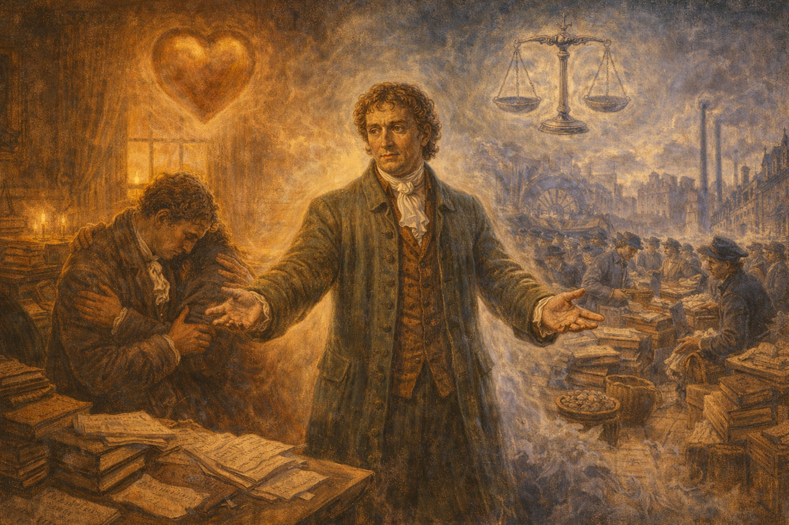

Image Prompt

Please generate a 16:9 image in warm Enlightenment-era oil painting style depicting panel 10 of 14. Make the characters and style consistent with the prior panels. The scene is a visual essay showing the tension at the heart of Smith's thought. On the left side of the panel, a warm, intimate scene: Smith comforting a grieving friend, representing The Theory of Moral Sentiments and the power of sympathy. On the right side, a dynamic market scene representing The Wealth of Nations: traders exchanging goods, a factory producing efficiently. In the center, Adam Smith stands as a bridge between both worlds, one hand reaching toward empathy, the other toward commerce. Above him, like two sides of a coin, float ghostly images of a heart and a scale. The background transitions from warm domestic interior on the left to bustling commercial exterior on the right. The color palette transitions from warm reds and golds (sympathy) to cool blues and silvers (commerce). The emotional tone is philosophical depth — showing that Smith saw these not as contradictions but as two aspects of the same human nature.
Generate the image now.

Many people today think Adam Smith was simply the champion of selfishness and free markets. This misses the deepest insight of his life's work. Smith wrote *two* great books, and he considered *The Theory of Moral Sentiments* the more important one. His vision of economics was built on a foundation of empathy. Yes, self-interest drives commerce — but sympathy, fairness, and moral judgment hold society together. Smith spent his entire career revising both books, trying to reconcile these two forces. He understood what many economists after him forgot: markets work only when embedded in a society of people who care about each other.

## Panel 11: The Walking Philosopher

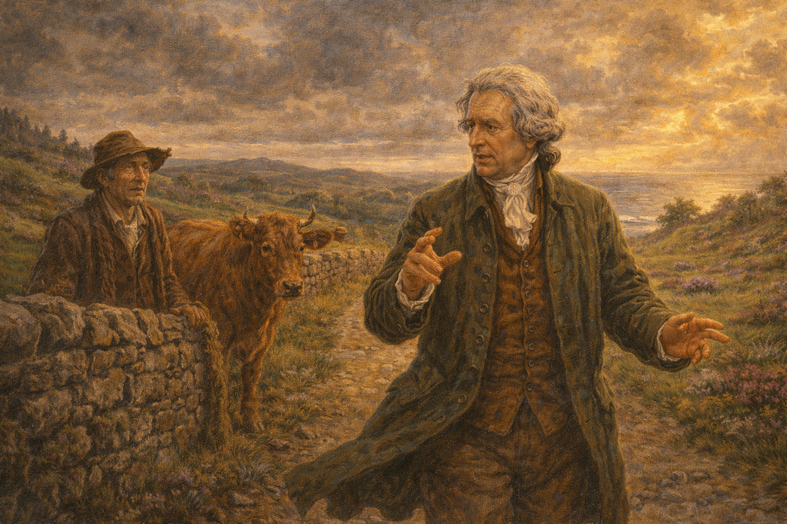

Image Prompt

Please generate a 16:9 image in warm Enlightenment-era oil painting style depicting panel 11 of 14. Make the characters and style consistent with the prior panels. The scene shows an older Adam Smith, in his 60s, walking alone on a path through the Scottish countryside near Kirkcaldy, circa 1785. He is deep in thought, gesturing and talking to himself, completely unaware of his surroundings. His wig is slightly askew, his coat unbuttoned. He is about to walk past a startled farmer and his cow without noticing them. The landscape is beautiful — rolling green hills, heather in purple bloom, a stone wall, the sea in the distance. The sky is dramatic with both clouds and golden light breaking through. The color palette is the full spectrum of Scottish landscape — deep greens, purple heather, gray stone, golden light. The emotional tone is affectionate humor and the charm of genius — showing that the man who explained the world to itself could barely navigate a country path.
Generate the image now.

Smith's eccentricities became legendary. He once walked fifteen miles in his nightgown, so lost in thought that he didn't notice until church bells snapped him out of his reverie. At dinner parties, he would fall silent for long stretches, then suddenly burst out with a complete theory, startling the other guests. He put bread and butter into a teapot, poured water on them, and declared it the worst tea he'd ever tasted. His friends loved him for it. Beneath the absent-mindedness was a mind that never stopped watching, questioning, and connecting — finding patterns in human behavior that others walked right past.

## Panel 12: Legacy of the Observer

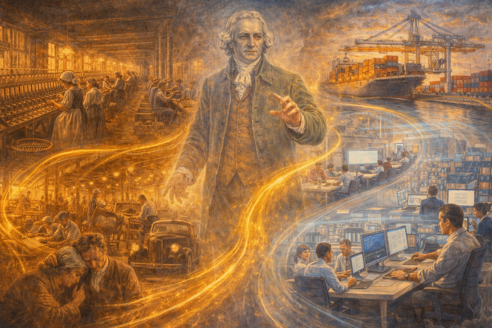

Image Prompt

Please generate a 16:9 image in warm Enlightenment-era oil painting style depicting panel 12 of 14. Make the characters and style consistent with the prior panels. The scene shows a montage that connects Smith's ideas to the modern world. In the center, a ghostly figure of Adam Smith stands watching. Around him, scenes from different eras spiral outward: a 19th-century textile factory with division of labor, a 20th-century assembly line (evoking Henry Ford), a modern open-plan tech office with specialists collaborating, a contemporary global shipping port with containers being loaded. Each scene echoes the pin factory's principle of specialization. The transitions between eras are smooth, connected by flowing golden lines suggesting the invisible hand at work across centuries. The color palette transitions from warm 18th-century tones through industrial grays to modern clean whites and blues. The emotional tone is awe at the enduring power of a simple observation.
Generate the image now.

Adam Smith died on July 17, 1790, at the age of 67. On his deathbed, he expressed disappointment that he had not accomplished more — a remarkable statement from the man who essentially invented economics as a discipline. Before he died, he ordered most of his unpublished manuscripts burned, leaving us only his two great books. But those books were enough. The division of labor, free trade, the invisible hand, the importance of institutions, the moral foundations of markets — Smith's ideas became the framework through which the modern world understands itself. Every economics textbook begins where he began: watching people work and asking why.

## Panel 13: Smith's Unfinished Question

Image Prompt

Please generate a 16:9 image in warm Enlightenment-era oil painting style depicting panel 13 of 14. Make the characters and style consistent with the prior panels, however this one has much more bright colors showing the transition to a positive energy modern era. The scene shows a modern high school economics classroom. Diverse students — different races, genders, and backgrounds — sit at desks engaged in a lively discussion. On the whiteboard behind them are key Smith concepts: "Division of Labor," "The Invisible Hand," "Sympathy," with arrows connecting them. One student is sketching a supply-and-demand curve. Another holds up a phone showing a gig economy app, connecting Smith's ideas to modern work. A teacher stands to the side, facilitating rather than lecturing. On the wall, a portrait of Adam Smith watches the scene with a slight smile. Through the classroom windows, a modern city is visible. The color palette blends warm classroom tones with bright, diverse clothing colors with many bright colors. The emotional tone is connection across time — Smith's questions are still alive in this room.
Generate the image now.

Smith left behind a question that economics is still trying to answer: How do we build societies where self-interest and sympathy work together instead of against each other? Where markets create prosperity without crushing the people they're supposed to serve? Where specialization makes us productive without making us narrow? Today's biggest economic challenges — inequality, climate change, the gig economy, artificial intelligence replacing jobs — are all variations of the puzzles Smith first identified in that pin factory and in his study of human nature. His work isn't a finished answer. It's an invitation to keep watching, keep questioning, and keep caring.

## Panel 14: Your Turn to Watch

Image Prompt

Please generate a 16:9 image in warm Enlightenment-era oil painting style blending into modern style, depicting panel 14 of 14. Make the characters and style consistent with the prior panels. The scene is a creative split: on the left, the 18th-century pin factory where Smith stands with his notebook. On the right, the same composition mirrored in a modern setting with super bright colors — a young diverse student standing in a contemporary workplace (a coffee shop, a logistics center, or a tech startup), holding a phone or tablet, observing how work is organized with the same curious expression Smith wore. Between them, a bridge of golden light connects past and present. Both figures are surrounded by floating annotations — Smith's "Division of Labor" on his side, modern terms like "Supply Chain," "Platform Economy," "Specialization" on the student's side. The color palette blends warm Enlightenment gold on the left with clean modern tones on the right, unified by the golden bridge. The emotional tone is inspiring — you can do what Smith did, right where you are.
Generate the image now.

Adam Smith's greatest lesson wasn't about markets or money — it was about *paying attention*. He walked into a factory and saw what thousands of people before him had overlooked. He watched a crowd lean with a tightrope walker and discovered the foundation of human morality. He observed butchers, bakers, and brewers and found the logic of an entire economic system. You have the same superpower. The next great economic insight is hiding in plain sight — in your school, your neighborhood, your phone, your part-time job. Economics starts with observing people. What patterns do you see?

### Epilogue – What Made Adam Smith Different?

| Challenge | How Smith Responded | Lesson for Today |
|-----------|---------------------|------------------|
| Lost his father before birth, kidnapped as a toddler | Drew strength from his mother's devotion and channeled early insecurity into deep observation | Adversity can sharpen your ability to notice what others miss |
| Socially awkward and prone to distraction | Turned his eccentricity into a strength — his "absent-mindedness" was actually deep thinking | Being different isn't a weakness; it can be your greatest intellectual tool |
| Disappointed by Oxford's lazy professors | Educated himself, read forbidden books, developed independent thinking | Don't wait for institutions to teach you — pursue knowledge on your own terms |
| Needed to reconcile self-interest with morality | Wrote two complementary masterworks showing that empathy and commerce are both part of human nature | The best thinkers hold two opposing ideas at once and find the deeper truth |
| Wanted to explain the wealth of nations | Started not with theory but with observation — watching ten workers make pins | The most powerful ideas come from looking carefully at ordinary things |

### Call to Action

Adam Smith didn't need a laboratory, a telescope, or a fortune. He needed his eyes, his curiosity, and the willingness to take human nature seriously. Economics is not a set of equations locked in a textbook — it is the living study of how people cooperate, compete, specialize, and care for each other. If you've ever wondered why some jobs pay more than others, why your favorite app is free but your data isn't, why some neighborhoods thrive while others struggle, or why countries trade — you're already thinking like an economist. The question is: what will you do with that curiosity?

---

*"It is not from the benevolence of the butcher, the brewer, or the baker that we expect our dinner, but from their regard to their own interest."*
— Adam Smith, *The Wealth of Nations* (1776)

---

*"How selfish soever man may be supposed, there are evidently some principles in his nature which interest him in the fortune of others, and render their happiness necessary to him, though he derives nothing from it except the pleasure of seeing it."*
— Adam Smith, *The Theory of Moral Sentiments* (1759)

---

*"No society can surely be flourishing and happy, of which the far greater part of the members are poor and miserable."*
— Adam Smith, *The Wealth of Nations* (1776)

---

## References

1. [Adam Smith (Wikipedia)](https://en.wikipedia.org/wiki/Adam_Smith) - Comprehensive biography covering Smith's life, works, and legacy in economics and moral philosophy.

2. [The Wealth of Nations (Wikipedia)](https://en.wikipedia.org/wiki/The_Wealth_of_Nations) - Overview of Smith's 1776 masterwork, including its key arguments about division of labor, free trade, and the role of self-interest.

3. [The Theory of Moral Sentiments (Wikipedia)](https://en.wikipedia.org/wiki/The_Theory_of_Moral_Sentiments) - Summary of Smith's 1759 work on sympathy, moral judgment, and the social foundations of ethical behavior.

4. [Division of Labour (Wikipedia)](https://en.wikipedia.org/wiki/Division_of_labour) - The economic concept Smith made famous through his pin factory example, explaining how specialization increases productivity.

5. [Scottish Enlightenment (Wikipedia)](https://en.wikipedia.org/wiki/Scottish_Enlightenment) - The intellectual movement that shaped Smith's thinking, including his friendships with David Hume and other Scottish philosophers.

6. [Invisible Hand (Wikipedia)](https://en.wikipedia.org/wiki/Invisible_hand) - The metaphor Smith used to describe how individual self-interest can lead to beneficial social outcomes in competitive markets.
