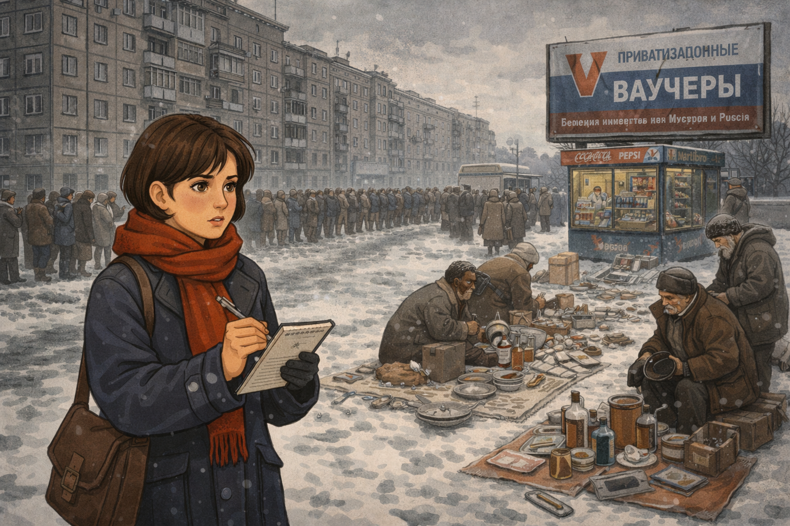
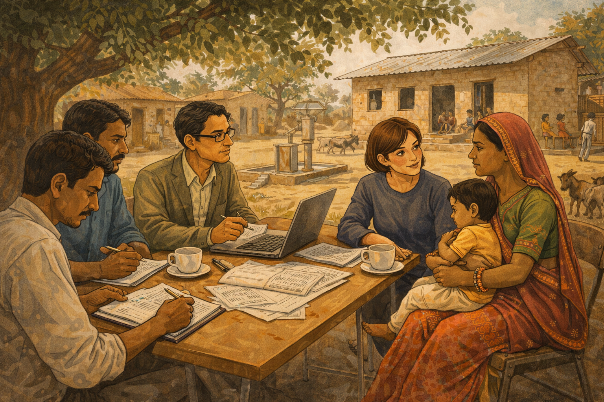
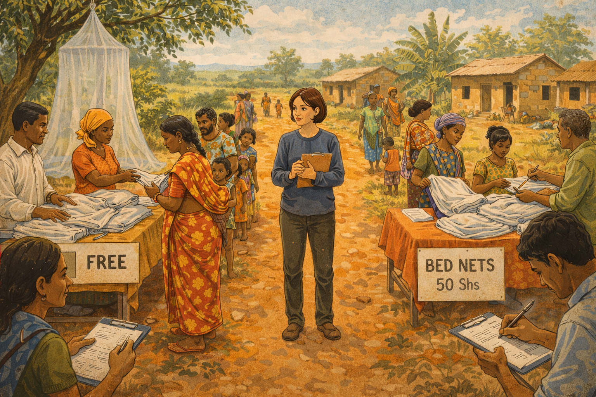
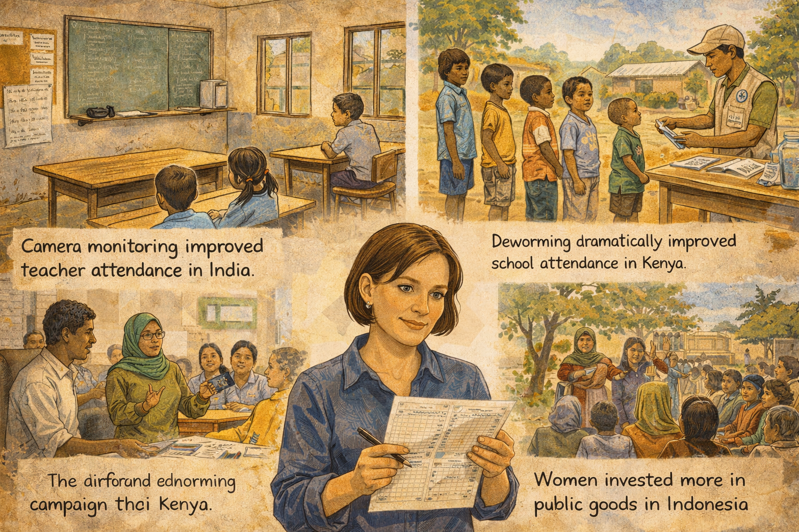
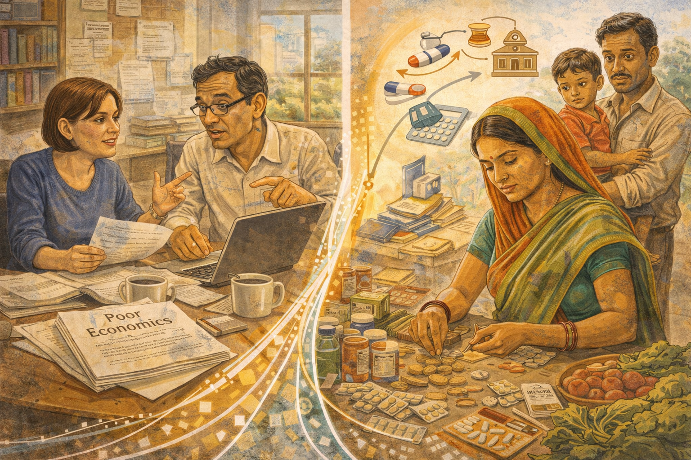
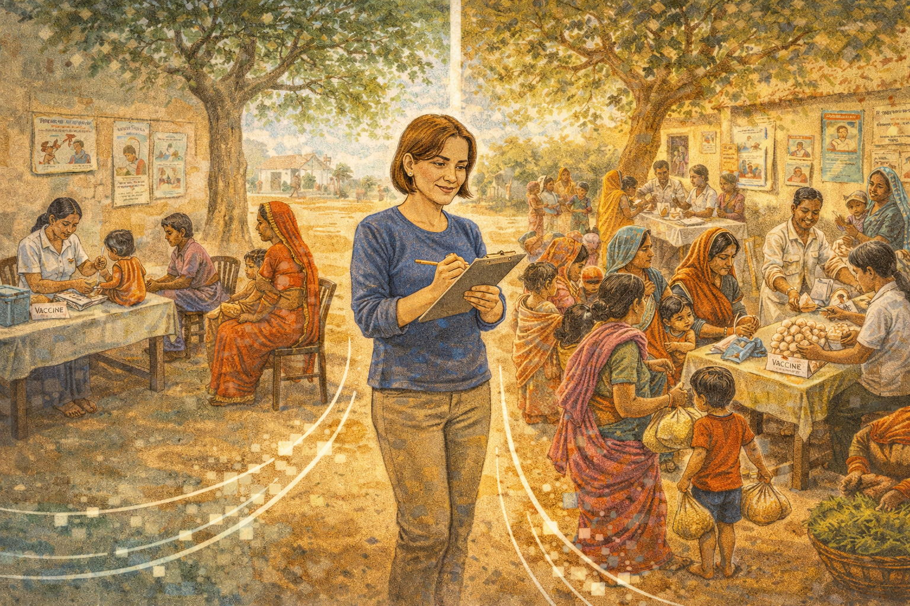
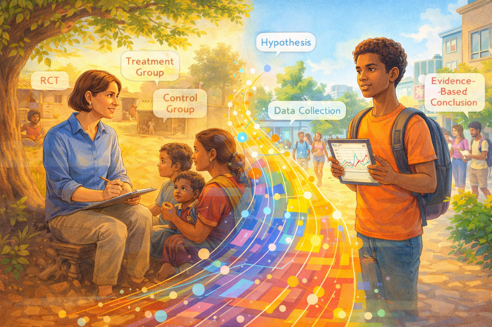

# What Actually Works: Esther Duflo and the Experiment That Changed Economics

Cover Image Prompt

Please generate a new wide-landscape 16:9 cover image for a graphic novel titled "What Actually Works." The style should be clean contemporary illustration with a warm documentary photography feel — bright natural light, earthy tones, and vivid splashes of color from clothing and market goods. The central figure is Esther Duflo — a petite French woman in her late 30s with short brown hair and warm brown eyes, wearing a simple blue cotton kurta and carrying a clipboard and pen. She stands at the edge of a sunlit Indian village, where a randomized controlled trial is underway: on one side, a group of children sit in a school under a corrugated metal roof with a teacher and a blackboard; on the other side, a community health worker distributes bed nets from a table. Villagers go about their daily lives around her. In the background, green rice paddies stretch to distant hills under a wide blue sky. The title "WHAT ACTUALLY WORKS" appears in bold modern sans-serif font across the top, with "The Story of Esther Duflo" in smaller text below. The mood is one of scientific curiosity meeting human compassion.
Generate the image now.

Narrative Prompt

This graphic novel tells the story of Esther Duflo (born 1972), the French-American economist who pioneered the use of randomized controlled trials (RCTs) to fight global poverty. The narrative follows Duflo from her childhood in Paris, through her transformative experience in post-Soviet Russia, her partnership with Abhijit Banerjee at MIT, and their groundbreaking field experiments across India, Kenya, and Indonesia — culminating in the 2019 Nobel Prize in Economics. The art style should be clean contemporary illustration with a warm documentary photography feel — natural light, earthy tones, and vivid local colors. Settings range from Parisian apartments to dusty Indian villages, Kenyan school yards, MIT lecture halls, and Stockholm's Nobel ceremony. Duflo should be depicted consistently as a petite woman with short brown hair, an open and determined expression, and a preference for simple, practical clothing. Her partner Abhijit Banerjee should appear as a tall, thin Indian man with glasses and an intellectual warmth. The tone balances scientific rigor with deep human empathy, showing that the best way to help people is to listen to them, test your assumptions, and let the evidence speak.

### Prologue – The Question Nobody Was Testing

For decades, the world's brightest economists argued about poverty. Some said foreign aid was essential. Others said it was wasted. Some championed free markets. Others demanded government intervention. They wrote papers, built models, and gave speeches — but almost nobody bothered to run an actual experiment to find out who was right. Then a young French woman walked into a village in India with a clipboard, a question, and a radical idea: *What if we treated economics like medicine, and tested our prescriptions before we wrote them?*

## Panel 1: A Girl in Paris

Image Prompt

I am about to ask you to generate a series of images for a graphic novel.
Please make the images have a consistent style and consistent characters.
Do not ask any clarifying questions. Just generate the image immediately when asked to do so.

Please generate a 16:9 image in clean contemporary illustration style with warm documentary photography feel, depicting panel 1 of 14. The scene shows a cozy apartment in Paris, circa 1982. A ten-year-old girl with short brown hair — young Esther Duflo — sits cross-legged on a bedroom floor surrounded by history books and a globe. Her mother, a pediatrician, sits nearby reading a medical journal. On the bookshelf behind them are volumes on history, medicine, and social justice. Through the window, Parisian rooftops and the distant silhouette of the Eiffel Tower are visible under a gray autumn sky. Young Esther is tracing routes on the globe with her finger, her expression intensely curious. A copy of a magazine about humanitarian work lies open beside her. The color palette is warm Parisian grays and creams with pops of red from book spines and a cozy reading lamp. The emotional tone is intellectual curiosity kindled in childhood — a girl who already wants to understand how the world works.
Generate the image now.

Esther Duflo was born on October 25, 1972, in Paris, France, into a family that took social responsibility seriously. Her mother, a pediatrician, spent her vacations providing medical care to children in war zones. Her father was a mathematics professor. Young Esther grew up surrounded by books, maps, and dinner-table conversations about inequality and justice. She devoured history — not the history of kings and battles, but the history of ordinary people struggling against systems bigger than themselves. From her mother, she absorbed a crucial lesson: caring about people is not enough. You have to *do* something, and you have to do it *right*.

## Panel 2: The Collapse of Certainty

Image Prompt

Please generate a 16:9 image in clean contemporary illustration style with warm documentary photography feel, depicting panel 2 of 14. Make the characters and style consistent with the prior panel. The scene shows Moscow, Russia, in January 1994. A 21-year-old Esther Duflo — petite, short brown hair, wearing a heavy winter coat and scarf — stands on a snowy Moscow street, notebook in hand, looking at the chaos of post-Soviet economic transition. Around her, the scene is jarring: elderly Russians selling personal possessions on blankets in the snow, a long bread line stretching past a crumbling Soviet-era apartment block, a newly opened kiosk selling Western goods at prices no one can afford. A billboard advertises privatization vouchers. The sky is heavy and gray. Duflo's expression is a mix of shock and determination — she is seeing firsthand what happens when economic theories are applied without evidence. The color palette is cold — steel grays, dirty whites, muted blues — with only Duflo's red scarf providing warmth. The emotional tone is disillusionment giving birth to purpose.
Generate the image now.

In 1994, as a graduate student, Duflo traveled to Moscow to work with economist Jeffrey Sachs on Russia's chaotic transition from communism to capitalism. What she witnessed shook her to her core. Western economists had prescribed "shock therapy" — rapid privatization and free markets — based on elegant theories. The result was economic devastation: hyperinflation, mass poverty, and oligarchs seizing public assets. Duflo saw brilliant economists confidently prescribing medicine they had never tested on patients they had never met. The experience crystallized a question that would drive her entire career: *How can economists be so sure about what works when they have never run an experiment?*

## Panel 3: The Search for a Better Way

Image Prompt

Please generate a 16:9 image in clean contemporary illustration style with warm documentary photography feel, depicting panel 3 of 14. Make the characters and style consistent with the prior panels. The scene shows a lecture hall at MIT in Cambridge, Massachusetts, circa 1995. Esther Duflo, now 23, sits in a packed economics seminar. At the front, a professor draws a diagram on the chalkboard showing the logic of randomized controlled trials — a treatment group and a control group with random assignment. Duflo leans forward, her eyes bright with recognition, pen frozen mid-note. Around her, other graduate students look attentive but less electrified. The lecture hall has the classic MIT feel — functional, slightly worn, fluorescent lights, institutional furniture. Through the windows, the Charles River and Boston skyline are visible. The color palette is institutional but warm — wood-toned desks, green chalkboard, warm light from windows. The emotional tone is intellectual revelation — the moment the method clicks.
Generate the image now.

Duflo arrived at MIT for her PhD in 1995, searching for a rigorous way to answer the questions that haunted her. She found inspiration in an unlikely place: medical science. For decades, doctors had used randomized controlled trials — randomly assigning patients to receive a drug or a placebo — to determine what actually works. The logic was simple and powerful: if you randomly divide people into two groups and treat only one, any difference in outcomes must be caused by the treatment, not by pre-existing differences. Duflo realized this method could revolutionize economics. Instead of arguing about whether a program works, you could *test* it — just as doctors test a new medicine.

## Panel 4: Meeting Abhijit

Image Prompt

Please generate a 16:9 image in clean contemporary illustration style with warm documentary photography feel, depicting panel 4 of 14. Make the characters and style consistent with the prior panels. The scene shows the MIT economics department common room, circa 1997. Esther Duflo sits across a small table from Abhijit Banerjee — a tall, thin Indian man in his late 30s with glasses, slightly disheveled hair, and an animated expression. They are deep in conversation, coffee cups and scattered papers between them. Banerjee is gesturing enthusiastically while sketching something on a napkin. Duflo listens intently, occasionally challenging him with a pointed question. Behind them, a bookshelf is stuffed with economics journals, and a window shows the MIT campus in autumn — red and gold leaves on the trees. Other faculty and students mill about in the background. The color palette is warm academic tones — wood, paper, autumn colors through windows. The emotional tone is the spark of an intellectual partnership that will change the world.
Generate the image now.

At MIT, Duflo met Abhijit Banerjee, an Indian-born economist who shared her frustration with armchair theorizing about poverty. Banerjee had grown up in Kolkata, where poverty was not an abstraction but a daily reality he witnessed from childhood. Together, they began sketching out a vision: what if economists went into the field, partnered with local governments and NGOs, and ran rigorous experiments on actual anti-poverty programs? Not small pilot studies, but large-scale randomized trials with thousands of participants, careful data collection, and honest reporting of results — even when those results were uncomfortable. It was the beginning of one of the most productive partnerships in the history of economics.

## Panel 5: The First Experiment

Image Prompt

Please generate a 16:9 image in clean contemporary illustration style with warm documentary photography feel, depicting panel 5 of 14. Make the characters and style consistent with the prior panels. The scene shows a primary school in a rural village in Rajasthan, India, circa 2001. Esther Duflo and a team of local research assistants sit under the shade of a large neem tree, interviewing a village mother who holds a young child. Nearby, a modest school building with a tin roof is visible — some children sit inside with a teacher, others play outside. On a folding table, Duflo has spread out data collection forms and a laptop. A research assistant writes notes on a clipboard. The village is dusty and sun-drenched, with mud-brick houses, a hand pump for water, and goats wandering past. The color palette is warm Indian earth tones — ochres, dusty oranges, deep greens from the neem tree, bright sari colors on the village women. The emotional tone is careful, respectful engagement — scientists who listen before they prescribe.
Generate the image now.

In the early 2000s, Duflo and Banerjee launched their first major field experiments in India. One of their earliest studies tackled a simple question: Why do so many children in India attend school but learn so little? Working with the NGO Pratham, they designed a randomized trial in the slums of Mumbai and rural villages of Rajasthan. Some schools received extra teaching assistants who worked with struggling students in small groups; others did not. The results were striking — children who received the extra help showed dramatic improvements in reading and math. But the deeper lesson was the method itself: instead of debating education policy in conference rooms, they had *measured* what worked, in the real world, with real children.

## Panel 6: The Bed Net Debate

Image Prompt

Please generate a 16:9 image in clean contemporary illustration style with warm documentary photography feel, depicting panel 6 of 14. Make the characters and style consistent with the prior panels. This is a central panel of the story. The scene shows a health clinic distribution point in rural Kenya, circa 2006. On one side of the scene, a table staffed by community health workers distributes free insecticide-treated bed nets to a line of mothers with children. On the other side, a nearly identical table sells the same nets for a small price — and far fewer people are in line. Duflo stands between the two tables, clipboard in hand, observing the difference with a knowing expression. Data collection assistants record how many nets are taken and how many are actually used. A large mosquito net hangs from a nearby tree for demonstration. The setting is a green Kenyan landscape — red earth paths, banana trees, corrugated-roof houses, blue sky. The color palette is vivid East African colors — red earth, green vegetation, bright kangas and clothing, white bed nets. The emotional tone is the clarity of evidence overturning conventional wisdom.
Generate the image now.

One of Duflo's most famous experiments tackled a question that had divided the development world for years: Should life-saving mosquito bed nets be given away for free, or sold at a subsidized price? Many economists argued that charging even a small amount would ensure people "valued" the nets and actually used them. It sounded like common sense. Duflo and her colleagues tested it in Kenya — and common sense turned out to be wrong. When nets were free, far more people took them *and* used them. When even a small fee was charged, demand collapsed. The experiment didn't just settle a policy debate; it demonstrated that intuition is not evidence, and that the lives of millions of children depended on knowing the difference.

## Panel 7: Building J-PAL

Image Prompt

Please generate a 16:9 image in clean contemporary illustration style with warm documentary photography feel, depicting panel 7 of 14. Make the characters and style consistent with the prior panels. The scene shows the founding of J-PAL (Abdul Latif Jameel Poverty Action Lab) at MIT, circa 2003. Duflo and Banerjee stand in a modest MIT office that is being transformed into a global research hub. A world map on the wall has pins in dozens of countries — India, Kenya, Indonesia, Morocco, Colombia, and more. Young researchers from many nationalities work at desks with laptops, analyzing data. Filing cabinets are stuffed with field reports. A whiteboard lists ongoing experiments: "Deworming — Kenya," "Microfinance — India," "Teacher Incentives — Rajasthan." Duflo stands at the center, leading a team meeting with energy and purpose. The color palette is bright and international — the diverse clothing of researchers, colorful map pins, warm MIT brick visible through windows. The emotional tone is the excitement of building something new — a global laboratory for fighting poverty with evidence.
Generate the image now.

In 2003, Duflo and Banerjee co-founded the Abdul Latif Jameel Poverty Action Lab — J-PAL — at MIT. It was a radical idea: a research center dedicated entirely to running randomized experiments on poverty programs around the world. J-PAL would partner with governments, NGOs, and international organizations, designing rigorous trials and sharing results openly. The lab grew rapidly, establishing regional offices in South Asia, Africa, Latin America, and Southeast Asia. By 2019, J-PAL researchers had conducted over 1,000 randomized evaluations in 83 countries, and their evidence had influenced policies affecting over 400 million people. Duflo had built not just a lab but a movement — transforming how the world fights poverty.

## Panel 8: Surprising Results

Image Prompt

Please generate a 16:9 image in clean contemporary illustration style with warm documentary photography feel, depicting panel 8 of 14. Make the characters and style consistent with the prior panels. The scene is a visual essay showing several surprising results from Duflo's experiments. The composition is divided into three connected vignettes. Top left: an Indian classroom where a teacher is absent from the desk, illustrating the finding that teacher absenteeism was rampant and that monitoring cameras improved attendance. Top right: a Kenyan village where a deworming campaign is underway — children line up to receive pills, showing that a cheap health intervention dramatically improved school attendance. Bottom center: an Indonesian village meeting where women participate in local government, illustrating the finding that female leaders invested more in public goods. Duflo appears as a connecting figure between the vignettes, studying data printouts. Each vignette has a small caption-style text suggesting the finding. The color palette is warm and varied across settings. The emotional tone is the thrill of discovery — each experiment overturning an assumption.
Generate the image now.

Again and again, Duflo's experiments produced results that challenged conventional wisdom. In India, they discovered that teacher absenteeism was a bigger problem than lack of schools — and that simple monitoring with cameras could cut it dramatically. In Kenya, Michael Kremer's deworming study (conducted in the same experimental tradition) showed that a pill costing less than a dollar per child was one of the most cost-effective ways to boost school attendance. In Indonesia, Duflo found that villages with women leaders spent more on public health and water infrastructure. Each experiment was small on its own, but together they built a mosaic of evidence that reshaped how governments and organizations spent billions of dollars.

## Panel 9: Resistance and Criticism

Image Prompt

Please generate a 16:9 image in clean contemporary illustration style with warm documentary photography feel, depicting panel 9 of 14. Make the characters and style consistent with the prior panels. The scene shows a contentious panel discussion at an economics conference, circa 2010. Duflo sits on a stage panel alongside skeptical senior economists — older men in suits who gesture dismissively. One critic points at a slide showing an RCT design, questioning its relevance. Another holds up a thick book of economic theory. In the audience, reactions are mixed — some nod in agreement with the critics, others look supportive of Duflo. Duflo remains calm and composed, leaning slightly forward, ready to respond with data rather than rhetoric. The conference setting is a modern hotel ballroom with institutional carpet and harsh lighting. The color palette is cool and corporate — grays, blues, podium wood — with Duflo's simple but warm clothing providing contrast. The emotional tone is the tension of challenging an establishment — a young woman taking on decades of orthodoxy with evidence.
Generate the image now.

Not everyone was convinced. Prominent economists attacked randomized trials from multiple directions. Some called them "undignified" — arguing that treating poor people like experimental subjects was ethically suspect. Others complained that small experiments in one village could not tell you what would work for an entire country. Some governments resisted because experiments might reveal that their favorite programs did not work. Duflo faced the criticism head-on. She argued that the real indignity was spending billions on programs without checking whether they helped. The real ethical failure was letting ideology, not evidence, determine the fate of the world's poorest people. And she kept running experiments, letting the results make her case.

## Panel 10: Poor Economics

Image Prompt

Please generate a 16:9 image in clean contemporary illustration style with warm documentary photography feel, depicting panel 10 of 14. Make the characters and style consistent with the prior panels. The scene is a split composition. On the left side, Duflo and Banerjee sit together at a desk in their MIT office, working on their book manuscript — papers spread everywhere, a laptop open, coffee mugs, and animated discussion between them. The manuscript pages are titled "Poor Economics." On the right side, a visual representation of the book's core message: a poor family in India making complex economic decisions — a woman carefully counting coins at a market stall, choosing between medicine and school fees, weighing risk and opportunity with the same sophistication as any Wall Street trader. The two halves are connected by flowing lines of data and evidence. The color palette blends MIT academic tones on the left with warm Indian market colors on the right. The emotional tone is respect — showing that poor people are rational decision-makers navigating impossible constraints.
Generate the image now.

In 2011, Duflo and Banerjee published *Poor Economics: A Radical Rethinking of the Way to Fight Global Poverty*. The book synthesized years of experimental findings into a powerful argument: poor people are not poor because they are lazy or stupid. They are poor because they face an overwhelming set of constraints — bad information, missing institutions, impossible trade-offs — and they navigate these constraints with remarkable ingenuity. The book demolished stereotypes from both left and right. Aid is not always wasted, but it is not always effective either. Markets are not always the answer, but neither is government. The only way to know what works is to test it. *Poor Economics* became an international bestseller and changed how millions of readers thought about poverty.

## Panel 11: The Nudge and the Detail

Image Prompt

Please generate a 16:9 image in clean contemporary illustration style with warm documentary photography feel, depicting panel 11 of 14. Make the characters and style consistent with the prior panels. The scene shows a vaccination clinic in rural Rajasthan, India, circa 2008. The composition contrasts two scenarios. On the left, a standard vaccination camp with a few mothers waiting — turnout is low, the health worker looks discouraged. On the right, an identical camp but with a small twist: a woman at a table gives each family a bag of lentils as an incentive for vaccinating their child. This side is bustling with mothers and children, the health worker is busy and smiling. Duflo stands between the two scenes, making notes, a slight smile on her face — the small nudge made all the difference. The setting is a dusty village square with a banyan tree, colorful saris, and hand-painted health posters on a wall. The color palette is warm and vivid — Indian earth tones, bright sari colors, green vegetation. The emotional tone is the power of small details — sometimes a bag of lentils changes everything.
Generate the image now.

One of Duflo's most charming findings came from a vaccination study in Rajasthan. Immunization rates were dismally low, even though the vaccines were free and available. Economists assumed the problem was supply — not enough clinics. Duflo's experiment revealed the truth was more human and more surprising. When her team offered families a small bag of lentils as an incentive for bringing their children to be vaccinated, immunization rates surged. The cost was trivial; the effect was enormous. The lesson was vintage Duflo: don't assume you know why people behave the way they do. Test it. The answer might be a bag of lentils, a text-message reminder, or a default option on a form. Small nudges, rigorously tested, can save millions of lives.

## Panel 12: Stockholm Calling

Image Prompt

Please generate a 16:9 image in clean contemporary illustration style with warm documentary photography feel, depicting panel 12 of 14. Make the characters and style consistent with the prior panels. The scene shows the early morning of October 14, 2019. Esther Duflo and Abhijit Banerjee sit on the edge of their bed in their home near Cambridge, Massachusetts. Duflo holds a phone to her ear, her expression one of stunned joy — she has just received the call from Stockholm announcing the Nobel Prize in Economics. Banerjee sits beside her, glasses pushed up on his forehead, grinning broadly. Their young children peer around the bedroom doorway, curious about the commotion. Through the window, dawn light is just breaking. On the nightstand, a stack of books and research papers suggests a life lived in constant inquiry. The color palette is intimate and warm — soft morning light, rumpled bedding in blues and whites, the glow of the phone screen. The emotional tone is private joy and disbelief — the moment a lifetime of work is recognized.
Generate the image now.

On October 14, 2019, Esther Duflo's phone rang before dawn. The voice on the other end told her she had won the Nobel Prize in Economics, shared with Abhijit Banerjee and Michael Kremer, "for their experimental approach to alleviating global poverty." At 46, Duflo became the youngest person ever to receive the economics Nobel, and only the second woman in its history. In her Nobel lecture, she did not celebrate herself. Instead, she used the world's biggest stage to argue that economists have a moral duty to fight poverty with the same rigor that engineers use to build bridges — testing, measuring, and improving. She compared economists to plumbers: "We need to get our hands dirty, deal with the details, and fix the leaks."

## Panel 13: Evidence Changes the World

Image Prompt

Please generate a 16:9 image in clean contemporary illustration style with warm documentary photography feel, depicting panel 13 of 14. Make the characters and style consistent with the prior panels, however this one has much more bright colors showing the transition to a positive energy modern era. The scene shows a modern high school economics classroom. Diverse students — different races, genders, and backgrounds — sit at desks engaged in a lively activity. On the whiteboard behind them are key concepts: "Randomized Controlled Trial," "Evidence-Based Policy," "Treatment vs. Control Group," with diagrams showing experimental design. One student is designing their own mini-experiment on a laptop. Another holds up a chart showing before-and-after data from a real J-PAL study. A teacher facilitates discussion, pointing to a world map covered in pins showing where experiments have been conducted. On the wall, a portrait of Esther Duflo watches the scene. Through the classroom windows, a bright modern city is visible. The color palette is vibrant and optimistic — bright clothing, colorful data visualizations, warm sunlight flooding the room with many bright colors. The emotional tone is connection across time — Duflo's method is alive in this classroom.
Generate the image now.

Today, the experimental revolution Duflo helped launch has transformed economics and global development. Governments in India, Kenya, Indonesia, and dozens of other countries now use randomized evaluations to test programs before scaling them up. J-PAL's evidence has influenced policies on education, health, microfinance, and governance affecting hundreds of millions of people. The approach has spread beyond poverty reduction into criminal justice, environmental policy, and public health. Duflo's deepest legacy is not any single experiment but a change in how we think: instead of asking "What *should* work?" we now ask "What *does* work?" It is a question that empowers anyone — including you — to challenge assumptions and demand proof.

## Panel 14: Your Turn to Experiment

Image Prompt

Please generate a 16:9 image in clean contemporary illustration style with warm documentary photography feel blending into modern style, depicting panel 14 of 14. Make the characters and style consistent with the prior panels. The scene is a creative split: on the left, Esther Duflo sits under a neem tree in an Indian village, clipboard in hand, talking with a local mother — the scene of a field experiment in warm earth tones. On the right, the same composition mirrored in a modern setting with super bright colors — a young diverse student stands in their school or community, holding a tablet displaying data from their own mini-experiment, observing their surroundings with the same curious, rigorous expression Duflo wears. Between them, a bridge of flowing data points and colorful charts connects past and present. Both figures are surrounded by floating annotations — Duflo's side shows "RCT," "Treatment Group," "Control Group"; the student's side shows "Hypothesis," "Data Collection," "Evidence-Based Conclusion." The color palette blends warm documentary tones on the left with clean bright modern tones on the right, unified by the data bridge. The emotional tone is inspiring — you can test what works, right where you are.
Generate the image now.

Esther Duflo's greatest lesson is not about poverty or economics — it is about *intellectual humility*. She showed that the smartest people in the room can be wrong, that common sense is often neither common nor sensible, and that the only honest answer to "Does this work?" is "Let's find out." You do not need a PhD or a laboratory to think like Duflo. You need a question, a willingness to test your assumptions, and the courage to accept the answer even when it surprises you. The next time someone tells you they know the solution to a problem — in your school, your community, or the world — ask the question Duflo made famous: *What's the evidence?*

### Epilogue – What Made Esther Duflo Different?

| Challenge | How Duflo Responded | Lesson for Today |
|-----------|---------------------|------------------|
| Saw economic theories devastate Russia without evidence | Committed to testing ideas before implementing them at scale | Never trust a prescription that has not been tested on real patients |
| Economists considered field experiments undignified or impractical | Built J-PAL into a global laboratory running experiments in 83 countries | If the establishment says your method is impossible, prove them wrong with results |
| Conventional wisdom said charging for bed nets made people value them | Ran the experiment and showed free distribution worked far better | Common sense is a hypothesis, not a conclusion — test it |
| Faced skepticism as a young woman in a field dominated by older men | Let her data speak louder than credentials or seniority | Evidence does not care who presents it — focus on being right, not being important |
| Needed to make poverty research matter to policymakers | Co-wrote *Poor Economics* to reach millions of readers beyond academia | The best research changes nothing if no one understands it — communicate clearly |

### Call to Action

Esther Duflo did not need a fortune, a government post, or a magic formula. She needed a question, a method, and the discipline to follow the evidence wherever it led. Her revolution is available to anyone: instead of arguing about what should work, test what actually does. You can run experiments in your own life — test different study methods, compare approaches to a problem, measure results instead of guessing. Economics, at its best, is not about ideology or authority. It is about curiosity, humility, and the willingness to be surprised. The world is full of untested assumptions. What will you put to the test?

---

*"We have a moral obligation — and also a knowledge obligation — to try to find out what works and what doesn't in the fight against poverty."*
— Esther Duflo

---

*"The poor are no less rational than anyone else — quite the contrary. Precisely because they have so little, we often find them putting much careful thought into their choices."*
— Esther Duflo and Abhijit Banerjee, *Poor Economics* (2011)

---

*"I think the job of economists, among other things, is to be the plumber. We need to figure out, in a given situation, what works, what doesn't, and why."*
— Esther Duflo, Nobel Lecture (2019)

---

## References

1. [Esther Duflo (Wikipedia)](https://en.wikipedia.org/wiki/Esther_Duflo) - Comprehensive biography covering Duflo's life, career, and contributions to development economics and the experimental approach to poverty reduction.

2. [Abdul Latif Jameel Poverty Action Lab (Wikipedia)](https://en.wikipedia.org/wiki/Abdul_Latif_Jameel_Poverty_Action_Lab) - Overview of J-PAL, the MIT-based research center co-founded by Duflo and Banerjee that pioneered randomized controlled trials in development economics.

3. [Poor Economics (Wikipedia)](https://en.wikipedia.org/wiki/Poor_Economics) - Summary of the 2011 bestselling book by Duflo and Banerjee that synthesized their experimental findings on global poverty.

4. [Randomized Controlled Trial (Wikipedia)](https://en.wikipedia.org/wiki/Randomized_controlled_trial) - The experimental methodology that Duflo brought from medical science to economics, forming the foundation of evidence-based policy.

5. [Abhijit Banerjee (Wikipedia)](https://en.wikipedia.org/wiki/Abhijit_Banerjee) - Biography of Duflo's research partner and co-Nobel laureate, the Indian-American economist who co-founded the experimental approach to fighting poverty.

6. [Nobel Memorial Prize in Economic Sciences (Wikipedia)](https://en.wikipedia.org/wiki/Nobel_Memorial_Prize_in_Economic_Sciences) - History of the economics Nobel, which Duflo, Banerjee, and Kremer shared in 2019 for their experimental approach to alleviating global poverty.
