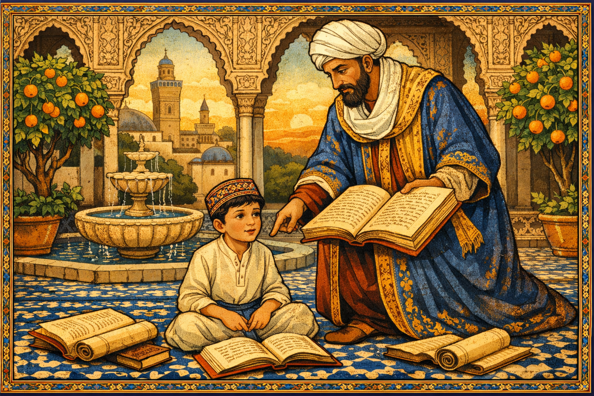
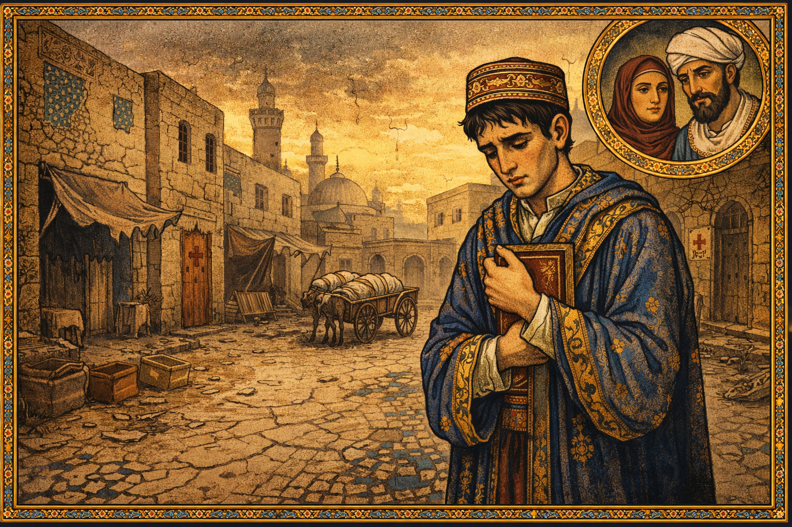
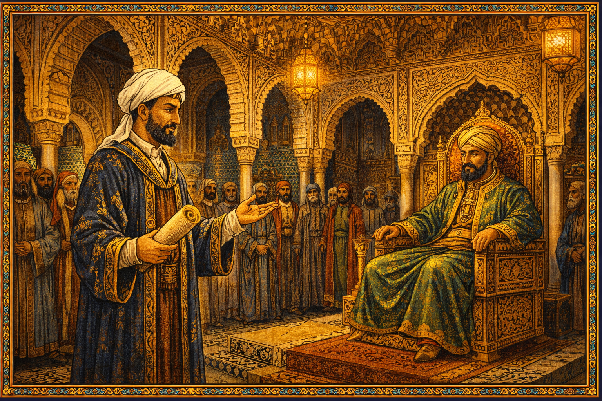

# The Muqaddimah: Ibn Khaldun — The First Economist

Cover Image Prompt

Please generate a new wide-landscape 16:9 cover image for a graphic novel titled "The Muqaddimah." The style should be Islamic Golden Age illuminated manuscript — rich geometric patterns, arabesques, and calligraphic flourishes in deep blues, burnished golds, and burgundies. The central figure is Ibn Khaldun — a distinguished North African man in his late 40s with a neatly trimmed beard, wearing a white turban and flowing scholarly robes in deep blue and gold — seated at a writing desk in a vaulted stone chamber, quill in hand, surrounded by manuscripts and books. Behind him, through an arched Moorish window, a sweeping landscape transitions from the deserts of North Africa to the minarets of Tunis and the palaces of Al-Andalus. Geometric tile patterns frame the scene like a manuscript border. The title "THE MUQADDIMAH" appears in elegant serif font across the top, with "The Story of Ibn Khaldun — The First Economist" in smaller text below. The mood is one of solitary genius and civilizational grandeur.
Generate the image now.

Narrative Prompt

This graphic novel tells the story of Ibn Khaldun (1332–1406), the Tunisian-born polymath who wrote the most sophisticated economic and sociological theory of the medieval world — centuries before the European Enlightenment. The narrative follows Ibn Khaldun from his childhood in a distinguished family of scholars, through decades of political intrigue and exile across North Africa and Al-Andalus, the devastating plague that killed his parents, his retreat to a castle in Algeria where he wrote the Muqaddimah, and his final years as a judge in Cairo. The art style should evoke Islamic Golden Age illuminated manuscripts — intricate geometric patterns, arabesques, rich blues and golds, vaulted arches, and the textures of parchment, ink, and tile. Ibn Khaldun should be depicted consistently as a dignified North African man with a neatly trimmed dark beard, wearing a white turban and scholarly robes in deep blue or burgundy with gold trim. The tone balances intellectual grandeur with human vulnerability, showing that the man who explained the rise and fall of civilizations was himself tossed by the very forces he described.

### Prologue – The Forgotten Father of Economics

In 1377, in a remote castle perched above the plains of Algeria, a man who had lost nearly everything sat down to write a book that would explain everything. He had survived plagues that killed his parents, shipwrecks, imprisonments, and exile from every court that had ever welcomed him. His name was Abd al-Rahman ibn Khaldun, and four centuries before Adam Smith picked up a quill, this North African scholar described supply and demand, the labor theory of value, the dangers of excessive taxation, and the rise and fall of civilizations as economic cycles. His masterwork, *The Muqaddimah*, was the most advanced work of social science the world had ever seen — and then it was largely forgotten by European economists for 500 years.

## Panel 1: A Scholar's Son in Tunis

Image Prompt

I am about to ask you to generate a series of images for a graphic novel.
Please make the images have a consistent style and consistent characters.
Do not ask any clarifying questions. Just generate the image immediately when asked to do so.

Please generate a 16:9 image in Islamic Golden Age illuminated manuscript style with rich blues, golds, and burgundies, depicting panel 1 of 14. The scene shows a prosperous courtyard home in Tunis, circa 1340. A boy of about eight — young Ibn Khaldun, with bright curious eyes and a small embroidered cap — sits cross-legged on a tiled floor covered in geometric patterns of blue and white, surrounded by open books and scrolls. His father, a tall dignified man in a white turban and scholarly robes, stands beside him, gesturing toward a passage in a large manuscript. Behind them, the courtyard features a central fountain, orange trees, and arched colonnades with intricate carved stucco. Through an archway, the minarets and rooftops of medieval Tunis are visible against a golden sunset. The color palette is warm gold, deep blue tiles, white plaster, and the green of citrus leaves. The emotional tone is intellectual nurturing — a boy being raised in a tradition of learning that stretches back generations.
Generate the image now.

Ibn Khaldun was born in 1332 in Tunis into one of the most distinguished intellectual families in North Africa. His ancestors had been scholars, diplomats, and administrators in Al-Andalus before migrating to Tunisia. His father and grandfather were both learned men who ensured young Abd al-Rahman received the finest education available — memorizing the Quran, studying Arabic grammar, jurisprudence, mathematics, and the hadith. The boy was brilliant, and everyone knew it. But the world he was born into was not stable. The great empires of the Islamic world were fragmenting, dynasties were rising and falling, and a catastrophe beyond anyone's imagination was approaching from the east.

## Panel 2: The Plague Takes Everything

Image Prompt

Please generate a 16:9 image in Islamic Golden Age illuminated manuscript style with rich blues, golds, and burgundies, depicting panel 2 of 14. Make the characters and style consistent with the prior panel. The scene shows the streets of Tunis in 1348–1349 during the Black Death. The mood is somber and devastating. Young Ibn Khaldun, now about 17, thin and grief-stricken, stands alone in a nearly empty street. Houses have their doors marked or shut. A cart passes in the background carrying shrouded bodies. The once-vibrant market stalls are abandoned, awnings torn. Ibn Khaldun clutches a small book to his chest — the last gift from his father. The sky is an ominous amber-gray. Geometric tile patterns on the buildings are cracked and fading, symbolizing civilizational decline. In the upper corner, a small medallion portrait shows his parents — dignified, loving — now lost. The color palette is muted golds, ashen grays, and deep sorrowful blues. The emotional tone is devastating loss and the solitude of survival.
Generate the image now.

In 1348, the Black Death swept across North Africa with apocalyptic fury. The plague killed Ibn Khaldun's mother, his father, and many of his teachers — the entire intellectual community that had shaped his young mind was shattered in a matter of months. He was just seventeen years old. The same catastrophe was simultaneously destroying a third of Europe's population and reshaping the entire medieval world. For Ibn Khaldun, the plague was not only a personal tragedy but a puzzle that would haunt his work for decades: Why do civilizations collapse? What forces build societies up, and what forces tear them apart? The answers, he would eventually argue, were economic.

## Panel 3: The Young Advisor

Image Prompt

Please generate a 16:9 image in Islamic Golden Age illuminated manuscript style with rich blues, golds, and burgundies, depicting panel 3 of 14. Make the characters and style consistent with the prior panels. The scene shows a grand throne room in Fez, Morocco, circa 1354. Ibn Khaldun, now in his early twenties — handsome, bearded, wearing a fine dark blue robe with gold embroidery and a white turban — stands before the sultan of the Marinid dynasty, who sits on an ornate throne beneath a magnificent carved wooden ceiling with muqarnas (honeycomb vaulting). Courtiers in rich robes line the walls. Ibn Khaldun holds a scroll and gestures with quiet confidence, advising the ruler. But in the shadows behind columns, other courtiers exchange jealous glances and whisper to each other. The architecture features horseshoe arches, zellige tilework in green and blue, and brass lanterns casting warm light. The color palette is regal — deep blues, emerald greens, gold, and the warm amber of lamplight. The emotional tone is ambition meeting danger — a brilliant young man entering a world of political intrigue.
Generate the image now.

Despite his losses, Ibn Khaldun's brilliance opened doors. By his early twenties, he was serving as a political advisor and secretary in the courts of North Africa. He moved from Tunis to Fez, the intellectual capital of the Marinid dynasty, where he gained access to one of the greatest libraries in the world. But the courts of 14th-century North Africa were treacherous. Sultans rose and fell with dizzying speed, and the scholars and advisors who served them were often caught in the crossfire. Ibn Khaldun was drawn into political schemes, sometimes willingly, sometimes not — and he quickly learned that intelligence without political skill could be fatal.

## Panel 4: Prison and Betrayal

Image Prompt

Please generate a 16:9 image in Islamic Golden Age illuminated manuscript style with rich blues, golds, and burgundies, depicting panel 4 of 14. Make the characters and style consistent with the prior panels. The scene shows Ibn Khaldun imprisoned in a dark stone cell in Fez, circa 1357. He sits on a simple mat on the stone floor, his fine robes now dusty and worn, his turban slightly askew. A single shaft of light falls through a small barred window high in the wall, illuminating his face as he reads a small book — even in prison, he studies. Iron chains hang from the wall. Through the window bars, a sliver of the ornate Marinid architecture is visible — the beauty of the civilization that has imprisoned him. On the wall, he has scratched notes and diagrams with a piece of stone. The color palette is dark stone grays and shadow blues, with the single beam of golden light creating a powerful contrast. The emotional tone is resilience in captivity — the mind refuses to be imprisoned even when the body is.
Generate the image now.

Ibn Khaldun backed the wrong political faction and paid the price. He was thrown into prison for nearly two years. It was a devastating blow for a young man accustomed to influence and prestige. But prison gave him something unexpected: time to think. Cut off from the political world, he began to reflect on the patterns he had already witnessed — how rulers rise to power through solidarity and courage, then grow soft with luxury, then fall to hungrier rivals. It was the first glimmer of the theory that would become the *Muqaddimah*. When he was finally released, Ibn Khaldun emerged more cautious, more observant, and more determined to understand the forces that governed the fates of kingdoms.

## Panel 5: The Courts of Al-Andalus

Image Prompt

Please generate a 16:9 image in Islamic Golden Age illuminated manuscript style with rich blues, golds, and burgundies, depicting panel 5 of 14. Make the characters and style consistent with the prior panels. The scene shows the Alhambra palace in Granada, Al-Andalus (Islamic Spain), circa 1363. Ibn Khaldun, now in his early thirties, walks through the Court of the Lions — the famous courtyard with its marble fountain supported by twelve stone lions, surrounded by slender columns and exquisite muqarnas arches. He is in conversation with Muhammad V, the Sultan of Granada, a refined young ruler in rich green and gold robes. Behind them, the intricate carved plaster walls of the Alhambra glow in the warm afternoon light. Through an archway, the snow-capped Sierra Nevada mountains are visible. Courtiers and poets linger in the background. The color palette is the Alhambra's own — warm terracotta, ivory plaster, gold calligraphy, and the blue of the sky through the arches. The emotional tone is the fleeting beauty of a civilization at its twilight — magnificent but doomed.
Generate the image now.

Ibn Khaldun's reputation as a brilliant scholar and diplomat sent him across the Mediterranean to Al-Andalus — Islamic Spain — where he served as an ambassador at the court of Granada. He walked the halls of the Alhambra, one of the most beautiful buildings ever constructed, and befriended Sultan Muhammad V. He even conducted a diplomatic mission to Pedro the Cruel, the Christian king of Castile, who offered him a position at his own court. Ibn Khaldun declined — he sensed that Al-Andalus, for all its beauty, was a civilization in decline, and he was beginning to understand why. The patterns of rise and fall he had observed in North Africa were repeating themselves here, and they were driven not by divine will alone but by economics and social cohesion.

## Panel 6: Exile After Exile

Image Prompt

Please generate a 16:9 image in Islamic Golden Age illuminated manuscript style with rich blues, golds, and burgundies, depicting panel 6 of 14. Make the characters and style consistent with the prior panels. The scene is a composite showing Ibn Khaldun's years of wandering and exile across North Africa, circa 1365–1375. The image is divided into flowing sections like panels within a manuscript page, bordered by geometric arabesques. In one section, Ibn Khaldun rides a horse across a vast desert landscape under a burning sun. In another, he sits in a modest room writing by lamplight in a small North African town. In a third, he stands at the prow of a small sailing vessel crossing choppy Mediterranean waters, his robes blowing in the wind. In a fourth, he is turned away at the gates of a walled city by armed guards. Each section shows him slightly older, slightly more weathered, but always carrying books and manuscripts. The color palette transitions across the sections — desert golds, Mediterranean blues, twilight purples, and the warm amber of lamplight. The emotional tone is restless wandering and accumulated wisdom — each exile adds another layer to his understanding.
Generate the image now.

For the next decade, Ibn Khaldun was a man without a permanent home. He served and was dismissed by sultan after sultan across North Africa — in Bougie, Biskra, Fez, and Tlemcen. He was welcomed as an invaluable advisor, then exiled when political winds shifted. He was caught in sieges, survived dangerous sea voyages, and watched alliances form and shatter around him. Each court, each betrayal, each collapse added data to the theory forming in his mind. He was not just living through history — he was collecting evidence. The rise and fall of dynasties was not random, he realized. It followed a pattern as predictable as the seasons, driven by group solidarity, economic prosperity, and inevitable decay.

## Panel 7: The Castle at Ibn Salama

Image Prompt

Please generate a 16:9 image in Islamic Golden Age illuminated manuscript style with rich blues, golds, and burgundies, depicting panel 7 of 14. Make the characters and style consistent with the prior panels. This is the central panel of the story. The scene shows Ibn Khaldun writing the Muqaddimah in the Qalat Ibn Salama, a castle perched on a hillside in Algeria, circa 1377. He sits at a large wooden writing desk in a vaulted stone chamber with a high arched window looking out over a vast, golden plain stretching to distant mountains. Stacks of manuscripts and books surround him. He writes with intense focus, his quill moving rapidly across a long scroll. The light pouring through the window is golden and almost divine in quality. On the pages visible before him, Arabic calligraphy and diagrams are visible — charts showing the cycles of civilization, notes on trade and taxation. His face shows a man possessed by inspiration — everything he has suffered and observed is pouring out of him. The geometric patterns on the chamber walls echo the patterns of history he is describing. The color palette is warm gold light, deep blue shadows, parchment cream, and the rich burgundy of his robe. The emotional tone is the eureka moment extended — a mind on fire, writing the most important work of social science the medieval world would produce.
Generate the image now.

In 1375, exhausted by decades of political turmoil, Ibn Khaldun retreated to the Qalat Ibn Salama — a remote castle in the hills of Algeria, under the protection of a local tribe. And there, in four extraordinary years of solitary work, he wrote the *Muqaddimah* — the "Introduction" to what he planned as a universal history. But the introduction became the masterwork itself. Everything he had experienced — the plagues, the betrayals, the collapsing dynasties, the economics of trade routes and taxation — crystallized into a single, breathtaking theory of how civilizations are born, grow, and die. No one in the world was writing anything remotely this advanced. It would take Europe four more centuries to catch up.

## Panel 8: Supply, Demand, and the Labor Theory of Value

Image Prompt

Please generate a 16:9 image in Islamic Golden Age illuminated manuscript style with rich blues, golds, and burgundies, depicting panel 8 of 14. Make the characters and style consistent with the prior panels. The scene is a visual representation of Ibn Khaldun's economic theories. The image is composed like an illuminated manuscript page. In the center, a bustling North African marketplace (souk) — merchants selling spices, textiles, metalwork, and grain under colorful awnings, with customers haggling, scales weighing goods, and coins changing hands. Above the marketplace, like scholarly annotations, float elegant diagrams in gold ink showing Ibn Khaldun's concepts: arrows showing supply and demand forces meeting at a price, a flow diagram showing labor creating value, and a curve showing how tax revenue rises then falls as tax rates increase (anticipating the Laffer Curve by 600 years). Ibn Khaldun stands at the edge of the marketplace, observing and writing in his notebook, connecting what he sees to the theories floating above. The geometric border of the manuscript page contains small medallions showing different trades — farming, weaving, smithing, scholarship. The color palette is the rich warmth of the souk — saffron yellows, cinnamon browns, indigo blues, and gold — framed by the deep blue and gold of the manuscript border. The emotional tone is intellectual revelation grounded in everyday life — grand theory emerging from the observation of ordinary commerce.
Generate the image now.

The *Muqaddimah* contained economic ideas that would not appear in European thought for centuries. Ibn Khaldun described how prices are determined by the interaction of supply and demand — 500 years before Alfred Marshall drew his famous curves. He argued that the value of goods comes from the labor required to produce them — anticipating Adam Smith and Karl Marx. Most remarkably, he described how excessive taxation destroys an economy: when rulers demand too much, merchants stop trading, farmers stop planting, and tax revenue actually *falls*. This insight — that there is an optimal tax rate beyond which revenue declines — would not be formally proposed in Western economics until Arthur Laffer drew his famous curve on a napkin in 1974, nearly 600 years later.

## Panel 9: Asabiyyah — The Rise and Fall of Civilizations

Image Prompt

Please generate a 16:9 image in Islamic Golden Age illuminated manuscript style with rich blues, golds, and burgundies, depicting panel 9 of 14. Make the characters and style consistent with the prior panels. The scene is a sweeping visual allegory of Ibn Khaldun's theory of asabiyyah (group solidarity) and civilizational cycles. The image is arranged as a great wheel or spiral. At the bottom, desert nomads — tough, unified, sharing resources — ride together on horseback across harsh terrain, bound by strong solidarity (asabiyyah). Moving clockwise and upward, they conquer a city and establish a dynasty — building palaces, mosques, and markets. At the top of the wheel, the dynasty is at its peak — luxury, art, grand architecture — but the rulers are growing soft, surrounded by servants and excess. Moving down the other side, the dynasty decays — corruption, heavy taxation, crumbling walls — and at the bottom, a new group of hungry, unified outsiders prepares to begin the cycle again. In the center of the wheel, Ibn Khaldun stands writing, his calm scholarly figure the still point around which history turns. The color palette follows the cycle — harsh desert golds at the bottom, rich imperial blues and golds at the top, fading ashen tones in decline. The emotional tone is the grandeur and tragedy of historical cycles — beautiful, inevitable, and deeply human.
Generate the image now.

At the heart of the *Muqaddimah* is the concept of *asabiyyah* — group solidarity or social cohesion. Ibn Khaldun argued that civilizations rise when a group of people bound by strong asabiyyah — shared identity, mutual loyalty, willingness to sacrifice for each other — conquers and builds. But success breeds luxury, luxury breeds softness, and softness erodes the very solidarity that made conquest possible. Within three or four generations, the ruling dynasty loses its cohesion, overtaxes its people, and falls to a new group with stronger bonds. This cycle, Ibn Khaldun argued, is driven by economics: the way wealth is produced, distributed, and consumed determines whether a society holds together or falls apart. It was the first true theory of economic history.

## Panel 10: The Shipwreck

Image Prompt

Please generate a 16:9 image in Islamic Golden Age illuminated manuscript style with rich blues, golds, and burgundies, depicting panel 10 of 14. Make the characters and style consistent with the prior panels. The scene shows a dramatic Mediterranean shipwreck, circa 1382. A wooden sailing vessel is being torn apart by a violent storm — waves crash over the deck, the mast is cracking, lightning illuminates the dark sky. Ibn Khaldun, now about 50, clings to the deck railing with one arm while holding a leather satchel of manuscripts above the water with the other — he will save his life's work even at the risk of his own life. Other passengers and crew struggle in the churning water around the breaking ship. The sea is rendered in deep, turbulent blues and blacks with white foam. Through a break in the storm clouds, a faint light suggests the distant coast of Egypt. The geometric border of the image is disrupted and broken on the edges, as if the storm is breaking through the manuscript page itself. The color palette is dramatic — deep ocean blues, black storm clouds, white lightning, and the gold of Ibn Khaldun's manuscript satchel gleaming against the darkness. The emotional tone is peril and determination — a man who has already lost everything once refusing to lose his greatest creation.
Generate the image now.

Even after completing the *Muqaddimah*, Ibn Khaldun's trials were not over. Traveling by sea to Egypt, his ship was caught in a terrible storm and nearly destroyed. He survived, clutching his precious manuscripts, but the voyage cost him dearly — his family, who had been traveling separately to join him, was lost at sea. His wife and children drowned in a shipwreck off the coast of Egypt. For the second time in his life, Ibn Khaldun lost nearly everyone he loved. The man who had written with such clinical precision about the rise and fall of civilizations was himself being crushed by the very forces of fate and fortune he had described.

## Panel 11: The Judge of Cairo

Image Prompt

Please generate a 16:9 image in Islamic Golden Age illuminated manuscript style with rich blues, golds, and burgundies, depicting panel 11 of 14. Make the characters and style consistent with the prior panels. The scene shows the interior of a grand Mamluk-era courthouse in Cairo, circa 1385. Ibn Khaldun, now in his fifties, sits as chief Maliki judge on an elevated platform beneath an ornate wooden canopy with muqarnas decoration. He wears the formal robes of a judge — dark burgundy with gold trim and a large white turban. Before him, petitioners and lawyers present their cases. The courthouse is magnificent — soaring pointed arches, elaborate geometric stonework, brass hanging lamps, and marble floors with inlaid patterns. Through the arched windows, the skyline of Mamluk Cairo is visible — domes and minarets and the distant pyramids on the horizon. But Ibn Khaldun's expression is contemplative, almost melancholy — he has achieved status and security, but his mind is still wrestling with the theories in his great book. The color palette is the grandeur of Mamluk Cairo — warm stone, rich burgundy, gold accents, and the soft blue of the Egyptian sky. The emotional tone is authority tempered by sorrow — a man who understands power from both sides.
Generate the image now.

Ibn Khaldun spent his final decades in Cairo, the greatest city of the medieval Islamic world. He was appointed chief Maliki judge — one of the highest legal positions in the Mamluk Sultanate — and became a celebrated teacher whose lectures drew crowds of students. But he was a reformer in a system resistant to reform, and he was dismissed and reappointed as judge six times as political tides shifted. Even in his old age, the pattern of his life repeated the patterns of his theory: those who challenge the established order, no matter how brilliant, will face resistance from those who benefit from the status quo.

## Panel 12: Face to Face with Tamerlane

Image Prompt

Please generate a 16:9 image in Islamic Golden Age illuminated manuscript style with rich blues, golds, and burgundies, depicting panel 12 of 14. Make the characters and style consistent with the prior panels. The scene shows a dramatic meeting outside the walls of Damascus, circa 1401. Ibn Khaldun, now nearly 70 — his beard white, his bearing still dignified — stands before Tamerlane (Timur), the fearsome Central Asian conqueror, inside an elaborate military tent. Tamerlane sits on a raised platform covered in rich carpets, a powerful broad-shouldered man with sharp eyes, wearing ornate armor and a fur-trimmed robe. Between them, maps and manuscripts are spread on a low table. Guards with curved swords stand in the background. Outside the tent, the massive army camps stretch to the horizon with hundreds of tents, fires, and banners. The walls of Damascus are visible, under siege. Despite the terrifying context, Ibn Khaldun appears calm and intellectually engaged — he is explaining his theories of civilization to one of history's most destructive conquerors. The color palette is martial — steel grays, blood reds, and gold, contrasted with the scholarly blue of Ibn Khaldun's robes. The emotional tone is tension and intellectual courage — a scholar standing before a warlord, armed only with ideas.
Generate the image now.

In 1401, one of the most extraordinary meetings in history took place. The Mongol-Turkic conqueror Tamerlane besieged Damascus, and Ibn Khaldun — then 69 years old — was lowered over the city walls in a basket to negotiate with him. Instead of a brief diplomatic exchange, Tamerlane kept the scholar for over a month, fascinated by his theories. Ibn Khaldun explained the cycles of civilization to one of history's greatest destroyers of civilizations. Tamerlane asked him to write a detailed description of North Africa. Ibn Khaldun complied, but later said he was careful about what information he shared — even in the tent of a conqueror, the scholar maintained his independence of mind.

## Panel 13: The Rediscovery

Image Prompt

Please generate a 16:9 image in Islamic Golden Age illuminated manuscript style with rich blues, golds, and burgundies, depicting panel 13 of 14. Make the characters and style consistent with the prior panels, however this one has much more bright colors showing the transition to a positive energy modern era. The scene shows a montage spanning centuries of the Muqaddimah's journey. On the left, the original manuscript sits on a shelf in a dusty Ottoman library, partially forgotten, circa 1600 — muted tones. In the center, a 19th-century European scholar — perhaps Silvestre de Sacy or Joseph von Hammer-Purgstall — opens the manuscript in a Parisian study, eyes widening with astonishment, surrounded by bright warm lamplight. On the right, in bright vivid colors, a modern university classroom where diverse students of many backgrounds study economics — on the whiteboard behind them, a timeline shows "Ibn Khaldun 1377" connected by an arrow to "Adam Smith 1776" connected to "Modern Economics." A portrait of Ibn Khaldun hangs on the wall beside portraits of Smith, Marx, and Keynes — where he belongs. Books titled "The Muqaddimah" in multiple languages sit on the desk. The color palette transitions from muted dusty tones on the left through warm discovery in the center to bright, vibrant modern colors on the right — blues, oranges, greens, and golds. The emotional tone is justice delayed but finally delivered — a genius reclaiming his rightful place in history.
Generate the image now.

After Ibn Khaldun's death in 1406, his masterwork suffered the fate he might have predicted: it was admired in the Islamic world but largely ignored by the European intellectual tradition that would come to dominate the global conversation about economics. For centuries, the *Muqaddimah* sat in Ottoman libraries while European economists reinvented ideas Ibn Khaldun had articulated generations earlier. It was not until the 19th century that European scholars began translating and recognizing the work — and not until the 20th century that historians began acknowledging Ibn Khaldun as, in the words of Arnold Toynbee, the author of "the greatest work of its kind that has ever been created by any mind in any time or place." Today, his face appears on the Tunisian ten-dinar note, and his ideas are finally being woven back into the story of economics where they belong.

## Panel 14: Whose Story Is Missing?

Image Prompt

Please generate a 16:9 image in Islamic Golden Age illuminated manuscript style blending into modern style, depicting panel 14 of 14. Make the characters and style consistent with the prior panels. The scene is a creative split with super bright colors. On the left, 14th-century Ibn Khaldun sits writing in his castle chamber, candlelight illuminating his manuscript, geometric patterns surrounding him. On the right, the same composition mirrored in a modern setting — a young diverse student (perhaps a young woman wearing a hijab, or a young man of African descent) sits in a bright modern library or study space, laptop open, researching economics, with the same intense curiosity Ibn Khaldun wore. Between them, a bridge of golden geometric light — arabesques that transform into digital network patterns — connects past and present. On Ibn Khaldun's side, floating annotations show his concepts: "Asabiyyah," "Supply & Demand," "Tax Revenue Curve," "Cycles of Civilization." On the student's side, modern terms appear: "Economic Development," "Social Cohesion," "Tax Policy," "Institutional Economics." Behind both figures, a vast mosaic of faces from every culture and era suggests all the thinkers whose contributions have been overlooked. The color palette blends warm Islamic manuscript golds and blues on the left with clean, bright modern tones on the right, unified by the golden geometric bridge. The emotional tone is inspiring and challenging — the history of ideas is bigger than any one culture, and it is your job to find who is missing.
Generate the image now.

Ibn Khaldun's greatest legacy is not just what he wrote — it is the question his story forces us to ask: *Who else has been left out?* The history of economics, as it is usually taught, begins in 18th-century Scotland. But the history of economic *thinking* stretches back millennia and spans every civilization on earth. Scholars in China, India, the Islamic world, and sub-Saharan Africa were analyzing trade, taxation, labor, and the wealth of nations long before Europeans claimed to have invented the discipline. Ibn Khaldun's story is a reminder that intellectual history belongs to everyone — and that the next great economic insight might come from a tradition, a language, or a perspective that the mainstream has not yet bothered to hear.

### Epilogue – What Made Ibn Khaldun Different?

| Challenge | How Ibn Khaldun Responded | Lesson for Today |
|-----------|--------------------------|------------------|
| Lost his parents and teachers to the Black Death at age 17 | Channeled grief into a lifelong quest to understand why civilizations collapse | The hardest questions often come from the deepest pain |
| Imprisoned and exiled by rulers he had served | Used each exile as an opportunity to observe new societies and gather evidence for his theories | Every setback is data — if you are paying attention |
| Lost his wife and children in a shipwreck | Continued his work with extraordinary resilience, pouring his understanding of human suffering into his scholarship | Resilience is not the absence of grief but the refusal to let it silence you |
| His ideas were ignored by Western economists for 500 years | The truth of his insights eventually forced the world to acknowledge them | Great ideas do not expire — they wait for the world to catch up |
| Needed to explain the rise and fall of entire civilizations | Combined economics, sociology, history, and psychology into a single unified theory | The biggest problems require thinking across boundaries, not within them |

### Call to Action

Ibn Khaldun did not have a university department, a research grant, or a global platform. He had his eyes, his memory, a quill, and the hard-won wisdom of a life spent watching empires rise and fall. He asked questions that the scholars around him were not asking: Why do some societies prosper while others decline? Why does excessive taxation destroy the very wealth it tries to capture? Why do the bonds that hold communities together weaken with luxury and success? These questions are as urgent today as they were in 1377. If you have ever wondered why some nations are rich and others poor, why communities lose their cohesion, why economic policies that sound good on paper fail in practice — you are asking Ibn Khaldun's questions. The history of economics is not finished, and it is not the property of any single culture. Whose ideas are still waiting to be heard?

---

*"When civilization reaches a certain degree of luxury, the people become accustomed to refinement and ease. They lose the qualities of courage and endurance that originally made their civilization possible."*
— Ibn Khaldun, *The Muqaddimah* (1377)

---

*"At the beginning of the dynasty, taxation yields a large revenue from small assessments. At the end of the dynasty, taxation yields a small revenue from large assessments."*
— Ibn Khaldun, *The Muqaddimah* (1377)

---

*"The past resembles the future more than one drop of water resembles another."*
— Ibn Khaldun, *The Muqaddimah* (1377)

---

## References

1. [Ibn Khaldun (Wikipedia)](https://en.wikipedia.org/wiki/Ibn_Khaldun) - Comprehensive biography covering Ibn Khaldun's life, works, and legacy as a historian, economist, and social scientist.

2. [Muqaddimah (Wikipedia)](https://en.wikipedia.org/wiki/Muqaddimah) - Overview of Ibn Khaldun's 1377 masterwork, including its groundbreaking theories on economics, sociology, and the rise and fall of civilizations.

3. [Asabiyyah (Wikipedia)](https://en.wikipedia.org/wiki/Asabiyyah) - The concept of group solidarity or social cohesion that Ibn Khaldun placed at the center of his theory of civilizational cycles.

4. [Laffer Curve (Wikipedia)](https://en.wikipedia.org/wiki/Laffer_curve) - The modern economic concept that tax revenue declines when tax rates are too high — an idea Ibn Khaldun described nearly 600 years before Arthur Laffer.

5. [Marinid Dynasty (Wikipedia)](https://en.wikipedia.org/wiki/Marinid_dynasty) - The North African dynasty whose courts Ibn Khaldun served in during his early career, providing firsthand observations of political rise and decline.

6. [Timur (Wikipedia)](https://en.wikipedia.org/wiki/Timur) - The Central Asian conqueror whom Ibn Khaldun met face to face during the siege of Damascus in 1401, in one of history's most remarkable encounters between scholar and warlord.
