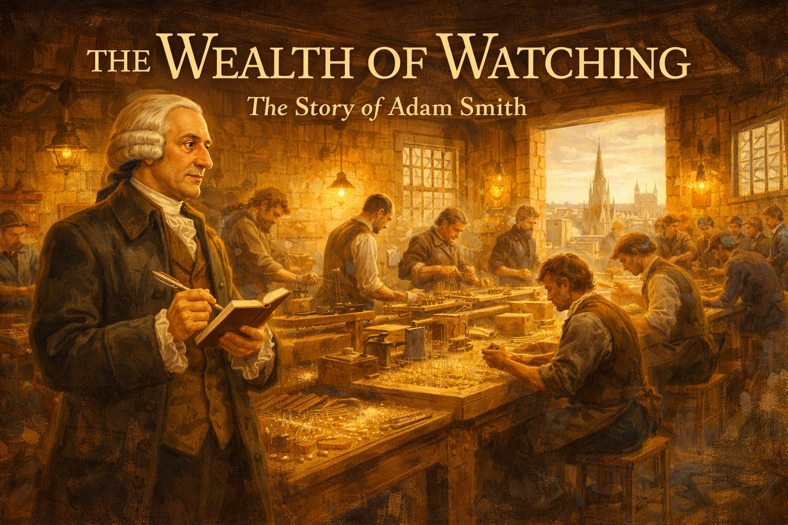
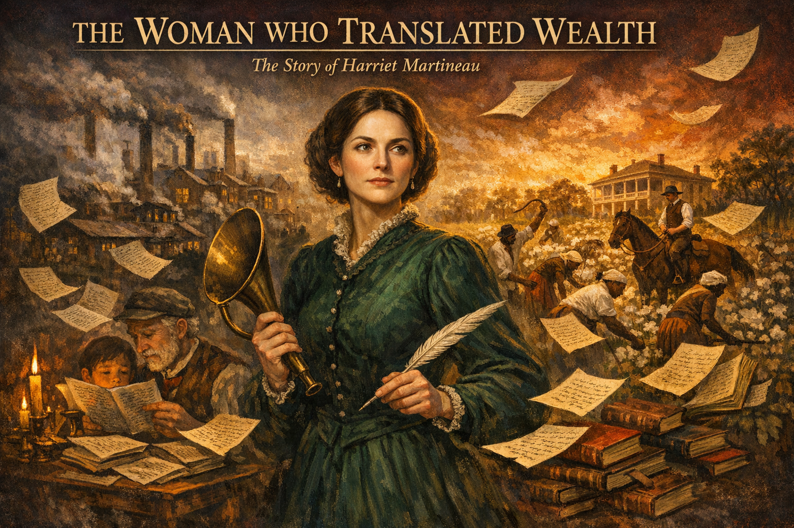
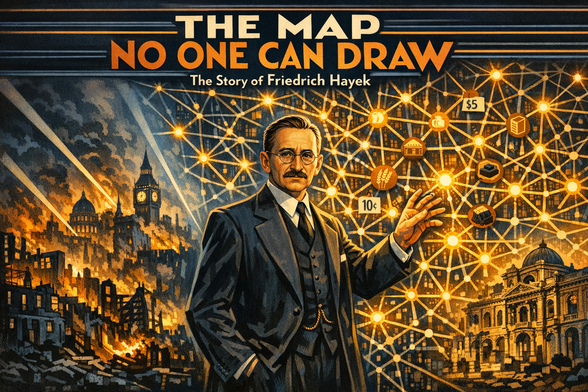
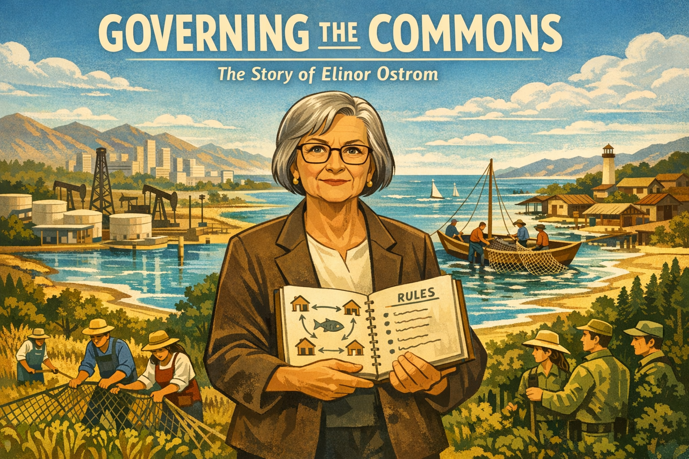
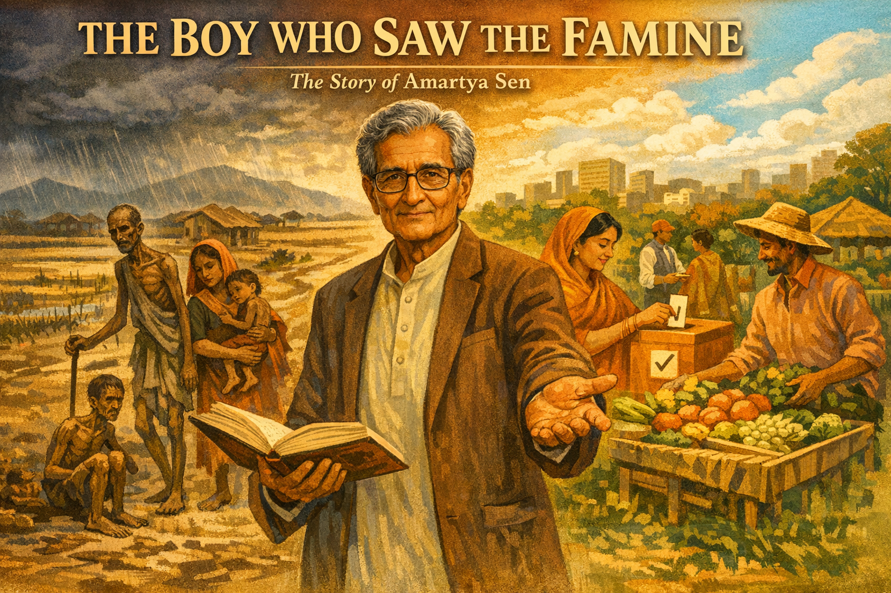
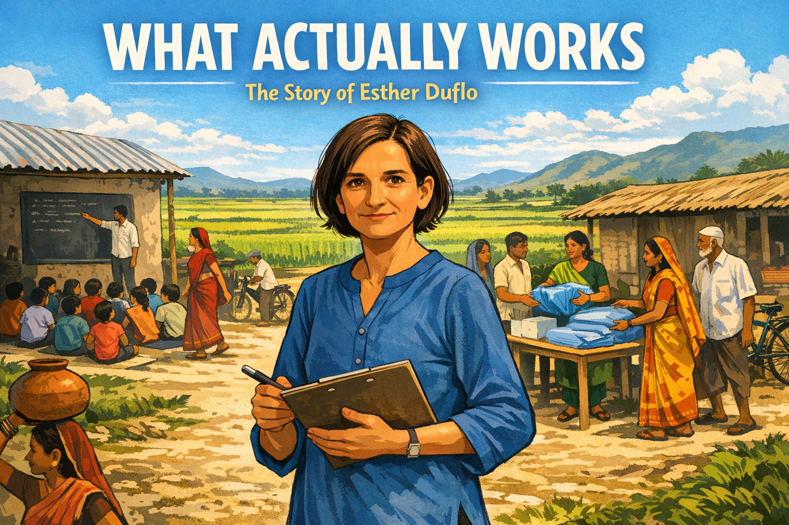
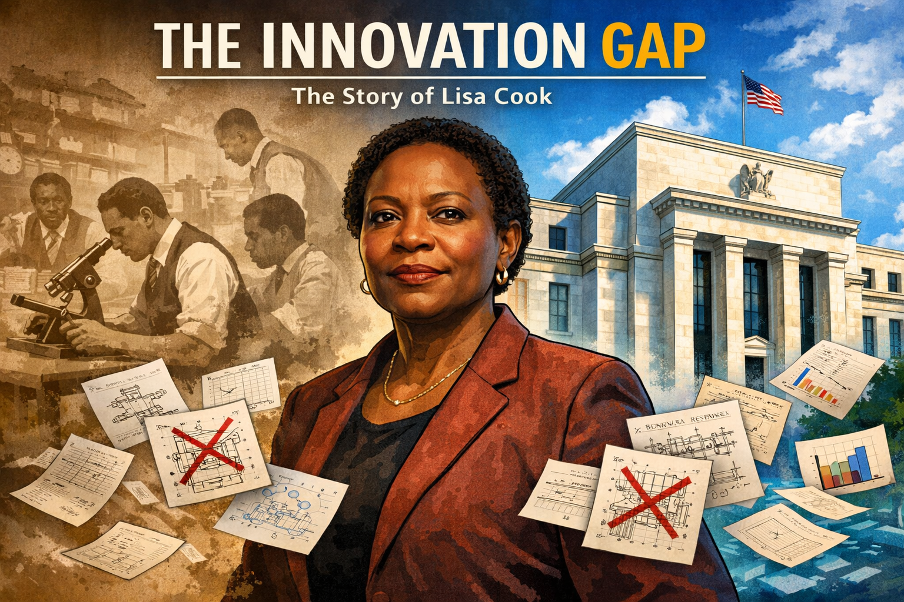

# Stories of Economics Pioneers

These graphic novel stories bring to life the people who shaped economics through bold ideas, personal courage, and creative thinking. Each story is designed to inspire you to see economics as a living, evolving field that connects to ecology, human behavior, systems thinking, and everyday life.

- **[The Muqaddimah](ibn-khaldun/index.md)**

    

    Four centuries before Adam Smith, a North African scholar named Ibn Khaldun wrote the most advanced economic theory the world had ever seen. Exiled, shipwrecked, and surviving plagues, he described supply and demand, taxation theory, and the rise and fall of civilizations.

- **[The Wealth of Watching](adam-smith/index.md)**

    

    A shy, absent-minded Scottish professor walks into a pin factory and discovers the hidden engine of prosperity. Adam Smith's story reveals that the father of economics was first and foremost a student of human empathy — and his greatest lesson was simply to pay attention.

- **[The Woman Who Translated Wealth](harriet-martineau/index.md)**

    

    Nearly deaf and told women had no place in intellectual life, Harriet Martineau wrote stories that explained economics to ordinary people — and outsold Charles Dickens. She traveled to America and exposed slavery as an economic and moral catastrophe.

- **[The Map No One Can Draw](friedrich-hayek/index.md)**

    

    Friedrich Hayek saw a fatal flaw in central planning: no single person can know enough to run an economy. His insight that prices are a communication system carrying distributed knowledge became foundational to information economics and complexity science.

- **[The Consequences of Peace](john-maynard-keynes/index.md)**

    

    Keynes quit the Versailles Peace Conference in protest, predicted economic collapse, and was mocked — then proven devastatingly right. When the Great Depression hit, he developed the revolutionary idea that governments should spend more during recessions, not less.

- **[Every Block, Every Door](web-du-bois/index.md)**

    

    W.E.B. Du Bois was given an impossible task: document the economic life of Black Philadelphia. The establishment expected him to confirm racist stereotypes. Instead, he conducted the most rigorous urban economic study ever attempted and created pioneering data visualizations.

- **[Governing the Commons](elinor-ostrom/index.md)**

    

    Told she couldn't study economics because she was a woman, Elinor Ostrom spent decades proving that communities can successfully manage shared resources through cooperation and local rules — overturning the "Tragedy of the Commons." She became the first woman to win the Nobel Prize in Economics.

- **[Basic Economics](thomas-sowell/index.md)**

    

    From poverty in Harlem to dropping out of high school to the Marines, Thomas Sowell discovered economics as a framework for understanding the forces that shaped his own life. He became one of America's most widely read economists, cutting through complexity to reveal how incentives and trade-offs affect real people.

- **[The Boy Who Saw the Famine](amartya-sen/index.md)**

    

    Nine-year-old Amartya Sen watched people die in the Bengal Famine of 1943 even though there was enough food. This trauma drove him to discover that famines are caused not by lack of food but by lack of freedom — and that development should be measured by what people can actually do and be.

- **[Twenty-Seven Dollars](muhammad-yunus/index.md)**

    

    Professor Muhammad Yunus lent $27 of his own money to 42 villagers during a famine in Bangladesh. Every single one paid him back. This experiment became Grameen Bank and proved that the poorest people in the world are creditworthy — the banking system just never bothered to find out.

- **[The Green Belt](wangari-maathai/index.md)**

    

    Wangari Maathai watched the streams of her childhood dry up as forests were cleared. She founded the Green Belt Movement, paying rural women to plant over 51 million trees. Beaten, jailed, and tear-gassed, she proved that environmental destruction is an economic catastrophe — and won the Nobel Peace Prize.

- **[The Calmest Person in the Room](janet-yellen/index.md)**

    

    Janet Yellen spent her career studying why people lose jobs. When the 2008 financial crisis hit, she was one of the few who saw it coming. She became the first woman to chair the Federal Reserve and the first to serve as U.S. Secretary of the Treasury.

- **[What Actually Works?](esther-duflo/index.md)**

    

    Esther Duflo was frustrated that economists argued endlessly about poverty without running experiments. She pioneered randomized controlled trials in economics, producing surprising results that proved common sense is often wrong. At 46, she became the youngest Nobel laureate in economics.

- **[The Innovation Gap](lisa-cook/index.md)**

    

    Economist Lisa Cook asked what racial violence cost the American economy in lost innovation. By studying patent data, she discovered that lynchings caused a measurable, devastating drop in Black invention that lasted decades. Her research put a number on the economic cost of discrimination.

- **[The Border at Nogales](acemoglu-robinson/index.md)**

    

    Stand at the border fence in Nogales and look both ways: same geography, same people, radically different prosperity. Daron Acemoglu and James Robinson showed that it comes down to institutions — inclusive ones create wealth, extractive ones create poverty.

