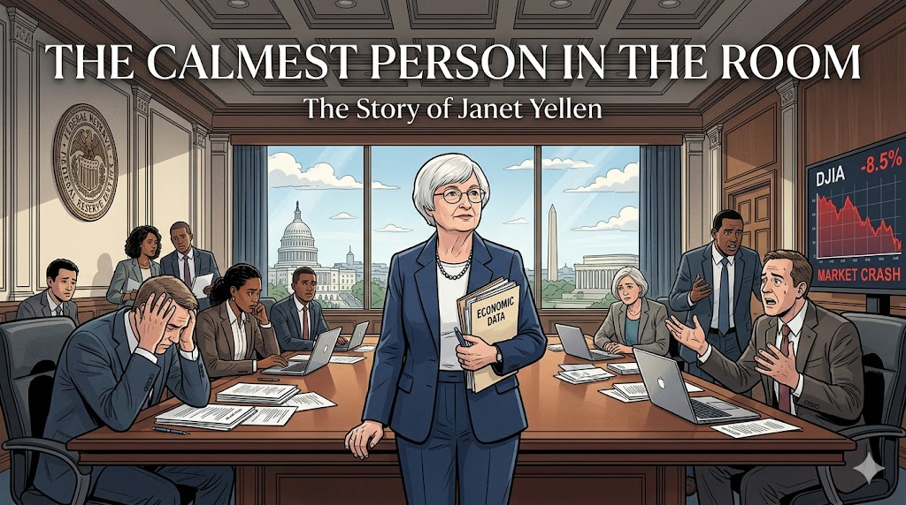
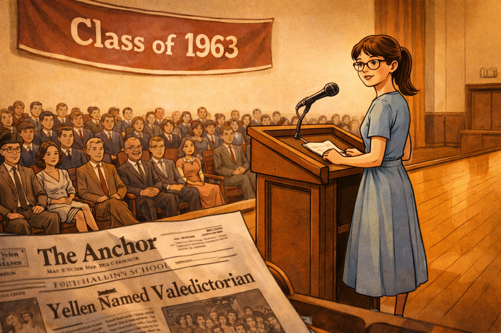
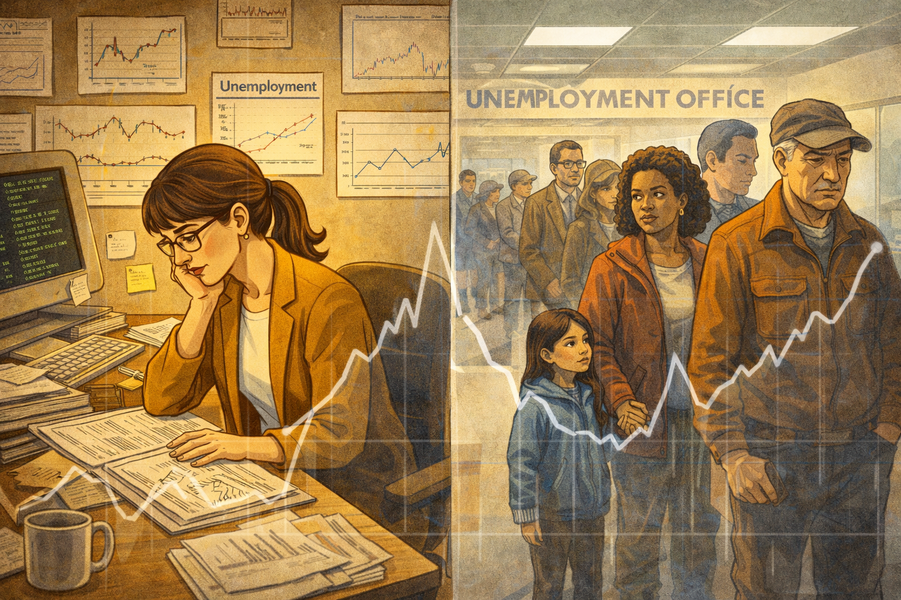
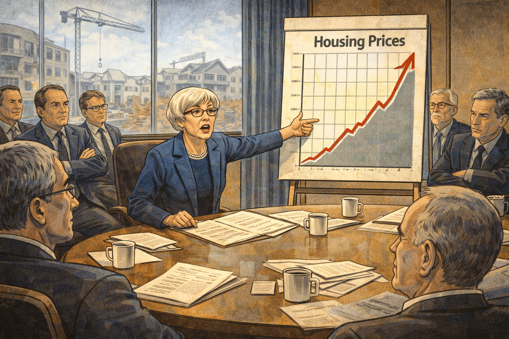
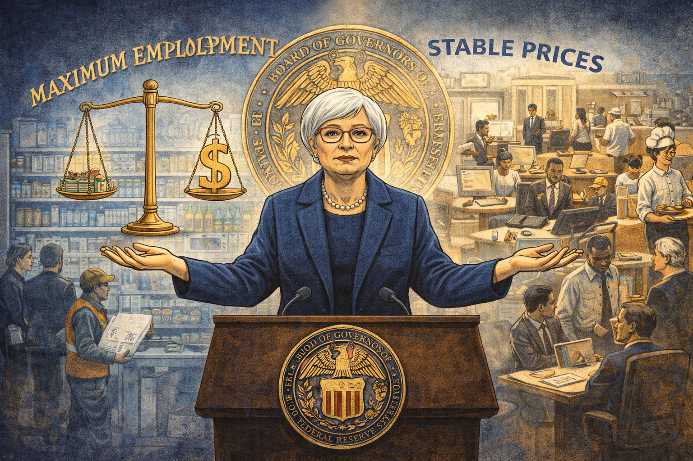
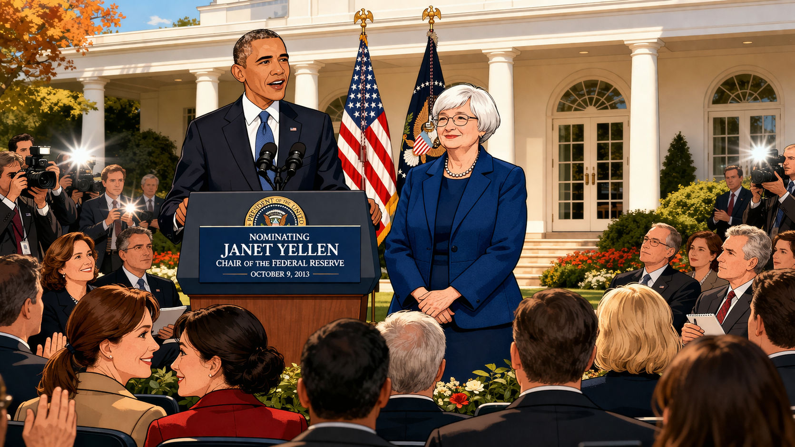

# The Calmest Person in the Room: Janet Yellen and the Crisis That Changed Everything

Cover Image Prompt

Please generate a new wide-landscape 16:9 cover image for a graphic novel titled "The Calmest Person in the Room." The style should be clean modern illustration with Washington D.C. architectural elements, using professional blues and grays. The central figure is Janet Yellen — a petite woman in her early 60s with short gray-white hair and glasses, wearing a professional dark blue suit — standing calmly in the ornate boardroom of the Federal Reserve. Behind her, through tall windows, the Washington D.C. skyline is visible with the Capitol dome and monuments. Around her, other officials look anxious and distressed, papers scattered, screens showing falling stock charts. Yellen alone is composed, holding a folder of data, her expression resolute and thoughtful. The title "THE CALMEST PERSON IN THE ROOM" appears in clean modern serif font across the top, with "The Story of Janet Yellen" in smaller text below. The mood is one of quiet determination amid chaos.
Generate the image now.

Narrative Prompt

This graphic novel tells the story of Janet Yellen (1946–present), the groundbreaking economist who became the first woman to chair the Federal Reserve and the first woman to serve as U.S. Secretary of the Treasury. The narrative follows Yellen from her working-class Brooklyn childhood, through her education at Brown and Yale, her academic career studying unemployment, her role at the Federal Reserve during the 2008 financial crisis, and her rise to the highest positions in American economic leadership. The art style should be clean modern illustration with Washington D.C. architectural elements — neoclassical columns, marble halls, and the institutional grandeur of the Federal Reserve. The color palette emphasizes professional blues, cool grays, warm ivory, and the deep green of U.S. currency. Yellen should be depicted consistently as a petite woman with short gray-white hair, glasses, and an expression of calm intelligence — someone who listens more than she speaks but whose quiet words carry enormous weight. The tone balances institutional drama with human warmth, showing that behind every interest rate decision is a question about real people and real jobs.

### Prologue – Behind Every Number, a Family

Behind every unemployment statistic is a family sitting at a kitchen table, wondering how they will pay rent. Behind every interest rate decision is a question that affects millions of lives: will there be jobs tomorrow? Most people never think about who makes these decisions, or what drives them. This is the story of a woman who never forgot that economics is about people — a quiet, methodical economist from Brooklyn who rose to become the most powerful economic policymaker in the world, and who did it by caring more about data and human suffering than about power or prestige.

## Panel 1: Brooklyn Beginnings

Image Prompt

I am about to ask you to generate a series of images for a graphic novel.
Please make the images have a consistent style and consistent characters.
Do not ask any clarifying questions. Just generate the image immediately when asked to do so.

Please generate a 16:9 image in clean modern illustration style with professional blues and grays depicting panel 1 of 14. The scene shows a working-class neighborhood in Bay Ridge, Brooklyn, in the early 1950s. A small girl with brown hair and glasses — young Janet Yellen, about 6 years old — sits on the front stoop of a modest row house, reading a book while the neighborhood bustles around her. Her father, Julius Yellen, a family doctor who makes house calls, is walking down the sidewalk carrying his black medical bag toward a neighbor's door. Her mother, Anna, stands in the doorway. The street is lined with brick row houses, laundry lines, and a few parked cars from the 1950s era. Other children play stickball in the street. The color palette is warm nostalgic tones — red brick, blue sky, warm sidewalk gray. The emotional tone is community, modesty, and quiet curiosity.
Generate the image now.

Janet Louise Yellen was born on August 13, 1946, in Brooklyn, New York — the daughter of a schoolteacher mother and a family doctor father who ran his practice out of the basement of their Bay Ridge home. Her father, Julius, treated patients regardless of their ability to pay, and young Janet watched families come through their front door worried about both their health and their finances. This early exposure to economic anxiety — to real people struggling with real problems — planted a seed that would shape her entire career. She grew up understanding that economics was never just about numbers on a page.

## Panel 2: The Brightest in the Room

Image Prompt

Please generate a 16:9 image in clean modern illustration style with professional blues and grays depicting panel 2 of 14. Make the characters and style consistent with the prior panel. The scene shows a young Janet Yellen, now about 17, at Fort Hamilton High School in Brooklyn, circa 1963. She stands at a podium in the school auditorium as class valedictorian, delivering a speech. She is thin, with brown hair pulled back, wearing a modest dress and glasses. The audience of students and parents fills the seats. On the wall behind her is a banner reading "Class of 1963." A copy of the school newspaper is visible in the foreground — she was the editor. The color palette is warm institutional tones — polished wood, cream walls, amber stage lighting. The emotional tone is quiet achievement — not flashy, but undeniably brilliant.
Generate the image now.

At Fort Hamilton High School, Janet was the kind of student who made everything look effortless. She served as editor of the school newspaper, graduated as class valedictorian, and earned admission to Brown University — no small feat for a girl from a working-class Brooklyn family in the early 1960s. Even then, she had an unusual combination of traits: intense intellectual curiosity paired with a modest, unassuming manner. Her teachers remembered her not as the loudest voice in the room, but as the most precise. She didn't need to shout to be right.

## Panel 3: Finding Economics at Brown

Image Prompt

Please generate a 16:9 image in clean modern illustration style with professional blues and grays depicting panel 3 of 14. Make the characters and style consistent with the prior panels. The scene shows the campus of Brown University, circa 1965. Janet Yellen, now about 19, walks across the ivy-covered quad carrying a stack of economics textbooks. She is in conversation with a professor who gestures enthusiastically while explaining a concept. In the background, the elegant Georgian-style buildings of Brown University are visible. Other students sit on the lawn studying. One of the textbooks visible in her arms reads "Economics" on the spine. The leaves on the trees are turning fall colors. The color palette is Ivy League autumn — deep reds, rich greens, warm stone, golden afternoon light. The emotional tone is intellectual awakening — the moment when a brilliant student finds her calling.
Generate the image now.

At Brown University, Janet initially considered philosophy and mathematics before discovering economics — a field that combined the rigor of math with questions about human welfare that she cared about deeply. She graduated summa cum laude in 1967, one of the few women in her economics classes. Her professors recognized something special: she had the rare ability to move fluidly between abstract mathematical models and the messy reality of how people actually live. Economics, she realized, was the discipline that could translate her father's kitchen-table compassion into policy that helped millions.

## Panel 4: Yale and the Old Boys' Club

Image Prompt

Please generate a 16:9 image in clean modern illustration style with professional blues and grays depicting panel 4 of 14. Make the characters and style consistent with the prior panels. The scene shows the interior of a Yale University economics seminar room, circa 1969. Janet Yellen, now in her early 20s with her hair in a practical style, sits at a long wooden table surrounded almost entirely by male graduate students in sport coats. She is the only woman in the room. At the head of the table, the Nobel laureate James Tobin — an older man with silver hair and kind eyes — leads the discussion, gesturing toward equations on a chalkboard. Yellen's hand is raised, her expression confident and focused. The male students look toward her with a mix of surprise and respect. The room has dark wood paneling, tall windows, and the gravitas of an elite institution. The color palette is Yale blue, dark wood, chalk white, and warm lamplight. The emotional tone is breaking barriers through sheer competence.
Generate the image now.

At Yale's graduate program, Yellen was often the only woman in the room — sometimes literally the only woman in the entire economics department. She studied under James Tobin, a Nobel Prize-winning economist who believed that government had a responsibility to fight unemployment. Tobin's influence was profound: he taught Yellen that monetary policy wasn't an abstract exercise but a tool that could determine whether millions of people had jobs or didn't. She earned her Ph.D. in 1971 with a dissertation on employment and wages. In a field dominated by men who rarely questioned their own assumptions, Yellen learned early that being underestimated could be an advantage.

## Panel 5: Meeting George Akerlof

Image Prompt

Please generate a 16:9 image in clean modern illustration style with professional blues and grays depicting panel 5 of 14. Make the characters and style consistent with the prior panels. The scene shows the economics department at the University of California, Berkeley, circa 1978. Janet Yellen, now in her early 30s, and George Akerlof — a tall, lanky man with curly hair, glasses, and an infectious grin — stand together at a chalkboard covered with equations. They are clearly in animated intellectual discussion, both gesturing at the board. Around them, the office is cluttered with papers and books. Through the window, the Berkeley hills and the bay are visible in golden California light. Coffee cups sit on the desk. The mood is warm and intellectually electric — two brilliant minds who are also clearly falling in love. The color palette is warm California tones — golden light, green hills, warm wood — contrasting with the cool precision of the equations. The emotional tone is partnership, both intellectual and personal.
Generate the image now.

After teaching at Harvard, Yellen joined the faculty at UC Berkeley, where she met George Akerlof — a brilliant, unconventional economist who would later win the Nobel Prize for his work on how imperfect information distorts markets. They married in 1978 and became one of the most remarkable intellectual partnerships in economics. They co-authored influential papers and challenged each other's thinking constantly. Together, they explored why wages don't fall during recessions the way simple models predict — work that would later inform Yellen's understanding of why unemployment is so devastating and so persistent. Their partnership proved that collaboration and love could coexist with rigorous scholarship.

## Panel 6: Understanding Unemployment

Image Prompt

Please generate a 16:9 image in clean modern illustration style with professional blues and grays depicting panel 6 of 14. Make the characters and style consistent with the prior panels. This is a pivotal panel. The scene is a split composition. On the left, Janet Yellen sits in her Berkeley office in the 1980s, surrounded by charts and data on unemployment, a computer terminal showing early economic models, papers spread across her desk. She studies the data with intense concentration. On the right, the human reality her data represents: a line of people at an unemployment office — diverse faces showing worry, frustration, and dignity under pressure. A mother holds a child's hand. An older factory worker in work clothes stares at the floor. Connecting both halves is a translucent overlay of a line graph showing unemployment rates rising. The color palette contrasts the warm academic office on the left with the harsh fluorescent institutional tones on the right. The emotional tone is the bridge between data and humanity — Yellen's defining insight that every data point is a person.
Generate the image now.

Throughout the 1980s and early 1990s, Yellen built her academic reputation on a simple but powerful conviction: unemployment is not just a number. Her research explored why companies don't simply cut wages during downturns, why workers who lose jobs often can't find equivalent ones, and why the human cost of unemployment — depression, family breakdown, loss of skills — compounds over time in ways that standard models ignore. She became one of the leading voices arguing that the Federal Reserve should care as much about employment as about inflation. In a profession that often treated joblessness as an acceptable trade-off, Yellen insisted on asking: acceptable to whom?

## Panel 7: Entering the Federal Reserve

Image Prompt

Please generate a 16:9 image in clean modern illustration style with professional blues and grays depicting panel 7 of 14. Make the characters and style consistent with the prior panels. The scene shows the imposing Eccles Building — the headquarters of the Federal Reserve in Washington, D.C. — on a crisp autumn day in 1994. Janet Yellen, now in her late 40s with graying hair and glasses, walks up the marble steps toward the entrance for the first time as a Federal Reserve Board Governor. She wears a professional navy blue suit and carries a leather briefcase. The building's neoclassical facade — massive marble columns, eagle sculptures, the inscription "Federal Reserve" — towers above her. A few staffers in suits hold the door. American flags flutter on either side. The color palette is institutional gravitas — marble white, navy blue, deep gray, polished brass. The emotional tone is crossing a threshold — a lifetime of preparation meeting the seat of monetary power.
Generate the image now.

In 1994, President Clinton appointed Yellen to the Federal Reserve Board of Governors, bringing her from the classroom to the center of American monetary policy. The Fed was an institution steeped in tradition, hierarchy, and a certain kind of masculine confidence — a world of dark suits, mahogany tables, and carefully guarded authority. Yellen entered this world with her characteristic calm, her briefcase full of data, and a determination to ensure that the Fed's decisions reflected the real economy, not just financial markets. She quickly earned a reputation as the most prepared person at every meeting — someone who read every memo, questioned every assumption, and never lost sight of the workers behind the statistics.

## Panel 8: The Warning No One Wanted to Hear

Image Prompt

Please generate a 16:9 image in clean modern illustration style with professional blues and grays depicting panel 8 of 14. Make the characters and style consistent with the prior panels. The scene shows a Federal Reserve meeting room in 2005. Janet Yellen, now president of the San Francisco Federal Reserve, sits at a large conference table surrounded by other Fed officials — mostly men in dark suits. She is speaking urgently, pointing to a chart showing the explosive growth of housing prices. On the chart, a housing price line shoots upward at an alarming angle. Other officials around the table look skeptical or dismissive — some lean back with arms crossed, others exchange glances. Through the window behind them, a construction crane and new housing development are visible. The color palette is institutional blues and grays with the alarming red of the rising chart line. The emotional tone is Cassandra-like frustration — seeing the danger clearly while others refuse to listen.
Generate the image now.

As president of the San Francisco Federal Reserve Bank starting in 2004, Yellen had a front-row seat to the housing bubble inflating across the American West. She saw the reckless lending, the exotic financial products no one fully understood, and the homeowners taking on mortgages they could never repay. In Fed meetings, she warned repeatedly that the housing market was dangerously overheated and that the financial system was more fragile than it appeared. Many of her colleagues dismissed these concerns — the prevailing wisdom held that markets were self-correcting and that sophisticated financial instruments had made the system safer. Yellen's data told a different story, and history would prove her right.

## Panel 9: The Crisis Hits

Image Prompt

Please generate a 16:9 image in clean modern illustration style with professional blues and grays depicting panel 9 of 14. Make the characters and style consistent with the prior panels. The scene shows the Federal Reserve operations center in September 2008 during the peak of the financial crisis. Multiple screens on the walls show plunging stock markets, red numbers, and news tickers with headlines about Lehman Brothers' collapse. Officials rush between desks, phone receivers pressed to ears, papers in hand. In the center of the chaos, Janet Yellen stands at a table studying a thick report, her expression grave but focused — the calmest person in the room. A coffee cup sits untouched beside her. The lighting is harsh fluorescent mixed with the blue glow of screens. The color palette is crisis colors — screen blues, alarming reds on the tickers, the cold gray of the room, contrasted with Yellen's steady navy suit. The emotional tone is controlled urgency — the moment when decades of preparation meet the worst financial crisis in 80 years.
Generate the image now.

In September 2008, the American financial system collapsed. Lehman Brothers fell. Banks froze. Credit markets seized. Millions of Americans began losing their homes, their jobs, their savings. The crisis Yellen had warned about arrived with devastating force. In the rooms where the response was being crafted, panic was palpable — even seasoned officials were shaken by the speed and scale of the meltdown. Yellen drew on everything she had studied for thirty years. She pushed for aggressive action: slashing interest rates, flooding the system with liquidity, using every tool available to prevent a second Great Depression. Her calm, data-driven voice became an anchor in the storm.

## Panel 10: The Dual Mandate

Image Prompt

Please generate a 16:9 image in clean modern illustration style with professional blues and grays depicting panel 10 of 14. Make the characters and style consistent with the prior panels. The scene is a visual essay showing the Federal Reserve's dual mandate. In the center, Janet Yellen stands at a podium with the Federal Reserve seal behind her. On her left side, a visual metaphor for price stability: a balanced scale with a dollar sign, prices steady, grocery store shelves full. On her right side, a visual metaphor for maximum employment: a bustling workplace with diverse workers — a construction site, an office, a restaurant — people earning and providing for their families. Yellen holds both sides in balance, her hands outstretched. Above her, the text "MAXIMUM EMPLOYMENT" and "STABLE PRICES" arc like the two sides of a coin. The color palette is Federal Reserve blue and gold, with warm human tones on the employment side and precise cool tones on the stability side. The emotional tone is the weight of responsibility — balancing two vital goals that sometimes pull in opposite directions.
Generate the image now.

The Federal Reserve has two mandates from Congress: maintain stable prices and promote maximum employment. For decades, many economists and Fed officials prioritized inflation control, sometimes treating unemployment as a necessary cost of keeping prices steady. Yellen challenged this imbalance throughout her career. She argued that both mandates deserve equal weight — that a world with low inflation but mass unemployment is not a success. During the recovery from 2008, she advocated for keeping interest rates low long enough for the labor market to truly heal, even when critics warned about inflation. Her patience proved prescient: unemployment fell steadily while inflation remained contained. The recovery she helped engineer, though painfully slow, prevented catastrophe.

## Panel 11: Shattering the Glass Ceiling

Image Prompt

Please generate a 16:9 image in clean modern illustration style with professional blues and grays depicting panel 11 of 14. Make the characters and style consistent with the prior panels. The scene shows the White House Rose Garden on October 9, 2013. President Barack Obama stands at a podium announcing Janet Yellen's nomination as Chair of the Federal Reserve — the first woman ever nominated for the position. Yellen stands beside him, composed and dignified, with a slight smile. Behind them, the White House colonnade is visible. In the audience, reporters, officials, and staff watch the historic moment. A few women in the crowd exchange looks of pride. Camera flashes illuminate the scene. The color palette is White House formal — green lawn, white columns, autumn sky, dark suits with Yellen's signature blue. The emotional tone is historic breakthrough — quiet triumph after decades of proving herself in rooms full of men who underestimated her.
Generate the image now.

On October 9, 2013, President Obama nominated Janet Yellen to chair the Federal Reserve — the most powerful economic policy position in the world. She would be the first woman to hold the job in the Fed's hundred-year history. The nomination was not a gesture; it was the recognition of decades of brilliance, preparation, and results. When she was confirmed and took office in February 2014, she brought something new to the role: a deep, research-backed empathy for working people. In her first speech as Chair, she told the stories of individual unemployed Americans by name. The message was clear: the Chair of the Federal Reserve would never forget that behind every statistic was a human being.

## Panel 12: Navigating the Recovery

Image Prompt

Please generate a 16:9 image in clean modern illustration style with professional blues and grays depicting panel 12 of 14. Make the characters and style consistent with the prior panels. The scene shows a montage of Yellen's tenure as Fed Chair, 2014-2018. In the center, Yellen sits at the head of the Federal Open Market Committee table, presiding over a meeting. Around her in spiral vignettes: a factory reopening with a "NOW HIRING" banner, a family moving into a new home, a stock market ticker showing steady gains, a press conference where Yellen patiently explains policy to reporters. At the edges, political critics from both sides — hawks who wanted higher rates and doves who wanted more stimulus — pull in opposite directions, but Yellen holds the center with steady hands. The color palette shows gradual warming — from the cool crisis grays of earlier panels toward warmer, more optimistic tones. The emotional tone is steady leadership — the unglamorous, patient work of guiding an economy back to health.
Generate the image now.

As Fed Chair, Yellen navigated one of the most complex economic recoveries in history. She faced relentless pressure from all sides: conservatives demanded she raise interest rates immediately to prevent inflation, while progressives urged even more aggressive stimulus. Yellen chose a middle path guided by data, not ideology. She began gradually raising rates in 2015 — the first increase in nearly a decade — but only after confirming that the labor market had genuinely strengthened. During her tenure, unemployment fell from 6.7% to 4.1%, the economy added over 8 million jobs, and inflation remained historically low. It was not dramatic or headline-grabbing work. It was patient, careful, and effective.

## Panel 13: A New Chapter at Treasury

Image Prompt

Please generate a 16:9 image in clean modern illustration style with professional blues and grays depicting panel 13 of 14. Make the characters and style consistent with the prior panels, however this one has much more bright colors showing the transition to a positive energy modern era. The scene shows Janet Yellen being sworn in as the 78th Secretary of the Treasury on January 26, 2021 — the first woman in that role as well. She raises her right hand, her left on a book, in a ceremonial room. Vice President Kamala Harris — another glass-ceiling breaker — administers the oath. Behind them, the Treasury Building's grand architecture is visible. In the background, bright visual elements suggest the challenges ahead: COVID-19 economic recovery, climate finance, global economic coordination. Young women and girls of diverse backgrounds watch from the gallery with inspired expressions. The color palette shifts to brighter, more hopeful tones — sky blue, warm gold, vibrant greens — while maintaining the professional foundation. The emotional tone is historic achievement and forward momentum — another ceiling shattered, more work to be done.
Generate the image now.

In January 2021, at the age of 74, Janet Yellen was confirmed as the 78th United States Secretary of the Treasury — making her the first person in American history to have led the Federal Reserve, served on the Fed's Board of Governors, and headed the Treasury Department. She was also, once again, the first woman in the role. Sworn in during a pandemic that had thrown tens of millions out of work, Yellen brought the same approach she had used her entire career: study the data, listen to the people behind the data, and act with calm determination. Her career had come full circle — from the Brooklyn girl who watched her father treat patients regardless of ability to pay, to the woman responsible for the economic welfare of an entire nation.

## Panel 14: Your Turn to Listen

Image Prompt

Please generate a 16:9 image in clean modern illustration style blending into a bright contemporary style, depicting panel 14 of 14. Make the characters and style consistent with the prior panels. The scene is a creative split: on the left, the Federal Reserve boardroom during the 2008 crisis — screens showing falling markets, officials in distress, and Janet Yellen standing calm with her data folder. On the right, the same composition mirrored in a modern setting with super bright colors — a young diverse student sitting in an economics classroom or at a community meeting, holding a laptop showing economic data, looking up with the same thoughtful, determined expression Yellen wears. Between them, a bridge of steady blue light connects past and present. Both figures are surrounded by floating annotations — Yellen's side shows "Unemployment Rate," "Interest Rates," "Dual Mandate," while the student's side shows "Student Debt," "Housing Costs," "Climate Economy," "AI and Jobs." The color palette blends the institutional blues and grays on the left with bright, hopeful modern tones on the right, unified by the blue bridge. The emotional tone is inspiring — you can bring the same calm, data-driven compassion to the economic challenges of your generation.
Generate the image now.

Janet Yellen's greatest lesson isn't about interest rates or monetary policy — it's about *listening*. She listened to the data when others were listening to ideology. She listened to the unemployed when others were listening to the markets. She listened to the warning signs of crisis when others were listening to the cheerful hum of a bubble. And she did all of this while being told, again and again, that she didn't belong in the room. You have the same capacity. The next great economic insight won't come from someone who shouts the loudest — it will come from someone who listens the most carefully, who looks at the data with clear eyes, and who never forgets that behind every number is a person. What are you listening for?

### Epilogue – What Made Janet Yellen Different?

| Challenge | How Yellen Responded | Lesson for Today |
|-----------|---------------------|------------------|
| Working-class background in a field dominated by privilege | Used her roots as motivation — never lost sight of ordinary families struggling with economic forces beyond their control | Your background isn't a limitation; it can give you insight that privilege misses |
| Only woman in the room for most of her career | Let her preparation and data speak louder than any bias — became the most prepared person at every table | Competence is the most powerful answer to prejudice |
| Warned about the housing bubble when others dismissed her | Trusted her analysis over the consensus and kept pushing | Having the courage to be right when everyone else is wrong is a rare and vital skill |
| Navigating the worst financial crisis in 80 years | Stayed calm, relied on evidence, and advocated for aggressive action to protect jobs | In a crisis, the person who keeps thinking clearly while others panic becomes indispensable |
| Balancing the Fed's dual mandate under political pressure | Refused to sacrifice employment for ideology, held steady until the data supported change | Good leadership means resisting pressure to act before the evidence is ready |

### Call to Action

Janet Yellen didn't come from wealth or power. She came from a Brooklyn row house where her father treated sick neighbors in the basement. She succeeded not by being the loudest or the most connected, but by being the most prepared, the most patient, and the most willing to see the human story inside the data. Economics is not a game played by elites in marble buildings — it is the study of how societies decide who gets what, who works, who thrives, and who gets left behind. If you've ever wondered why your parents worry about interest rates, why some people can't find jobs even when companies are hiring, why a crisis on Wall Street can close a factory in your hometown, or why it matters who sits in the chair at the Federal Reserve — you're already asking the questions Janet Yellen spent her life trying to answer. The chair is waiting. Who will sit in it next?

---

*"While we have made good progress, we have farther to go. Too many Americans remain unemployed, and the unemployment rate is still well above the level that most economists think is sustainable in the long run."*
— Janet Yellen, Testimony before Congress (2014)

---

*"If the Federal Reserve is going to be effective in its mission, it needs to understand the economic lives of all Americans — not just the wealthy."*
— Janet Yellen

---

*"There are still too many who aren't working, who want to work, and I hear their stories all the time. When I meet with people in communities throughout this country, it's really hard not to be moved by their stories."*
— Janet Yellen, Interview as Fed Chair (2016)

---

## References

1. [Janet Yellen (Wikipedia)](https://en.wikipedia.org/wiki/Janet_Yellen) - Comprehensive biography covering Yellen's life, career, and historic roles as Federal Reserve Chair and Treasury Secretary.

2. [Federal Reserve (Wikipedia)](https://en.wikipedia.org/wiki/Federal_Reserve) - Overview of the central banking system of the United States, its structure, dual mandate, and role in monetary policy.

3. [Financial Crisis of 2007–2008 (Wikipedia)](https://en.wikipedia.org/wiki/Financial_crisis_of_2007%E2%80%932008) - Detailed account of the global financial crisis that defined Yellen's career, including causes, responses, and aftermath.

4. [Monetary Policy (Wikipedia)](https://en.wikipedia.org/wiki/Monetary_policy) - The economic tools central banks use to influence interest rates, money supply, and employment — the core of Yellen's professional work.

5. [United States Secretary of the Treasury (Wikipedia)](https://en.wikipedia.org/wiki/United_States_Secretary_of_the_Treasury) - History and role of the Treasury Secretary position, where Yellen became the first woman to serve.

6. [George Akerlof (Wikipedia)](https://en.wikipedia.org/wiki/George_Akerlof) - Nobel Prize-winning economist and Yellen's husband, whose work on information asymmetry and labor markets deeply influenced her thinking.
