# The Consequences of Peace: John Maynard Keynes and the Revolution in Economics

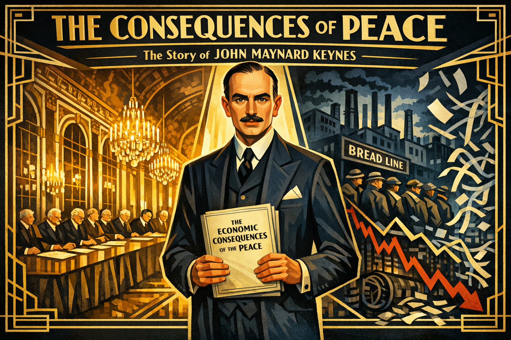

Cover Image Prompt

Please generate a new wide-landscape 16:9 cover image for a graphic novel titled "The Consequences of Peace." The style should be Art Deco / Modernist with sharp geometric lines and a 1920s-1930s aesthetic. The central figure is John Maynard Keynes — a tall, elegant man in his mid-30s with a thin mustache, high forehead, and penetrating dark eyes, wearing a finely tailored three-piece suit. He stands at the center of the composition holding a manuscript titled "The Economic Consequences of the Peace." Behind him, the composition splits: on the left, the ornate Hall of Mirrors at Versailles with world leaders signing the Treaty; on the right, a dark vision of economic collapse — bread lines, shuttered factories, and falling stock ticker tape. The color palette uses bold Art Deco golds, deep navy blues, and stark blacks with sharp geometric borders. The title "THE CONSEQUENCES OF PEACE" appears in bold Art Deco typeface across the top, with "The Story of John Maynard Keynes" in smaller text below. The mood is one of prophetic warning and intellectual courage.
Generate the image now.

Narrative Prompt

This graphic novel tells the story of John Maynard Keynes (1883–1946), the British economist who transformed how the world thinks about government, recessions, and the role of spending in an economy. The narrative follows Keynes from his privileged Cambridge upbringing, through his devastating experience at the Versailles Peace Conference, his years as a prophet ignored, and his revolutionary response to the Great Depression with The General Theory. The art style should be Art Deco / Modernist — sharp geometric lines, bold contrasts, angular compositions, and the sophisticated aesthetic of the 1920s-1930s. The color palette emphasizes deep navy blues, Art Deco golds, stark blacks, cream whites, and occasional flashes of crimson for moments of crisis. Keynes should be depicted consistently as a tall, elegant, long-limbed man with a high forehead, thin mustache, penetrating dark eyes, and an air of aristocratic confidence tempered by genuine moral urgency. He dresses impeccably in tailored suits. The tone balances intellectual drama with human stakes, showing that behind the equations was a man who believed passionately that economic ideas could save — or destroy — millions of lives.

### Prologue – The Prophet They Laughed At

In 1919, a young British Treasury official walked out of the most important peace conference in history. He had watched the victors of World War I impose economic penalties on Germany so severe that he believed they would lead to financial ruin, political extremism, and another war. He went home and wrote a book saying so. The world laughed at him. Within fifteen years, every prediction he made came true. His name was John Maynard Keynes, and his superpower was the courage to say what no one wanted to hear — and then to build a new economics from the wreckage.

## Panel 1: A Mind Forged at Cambridge

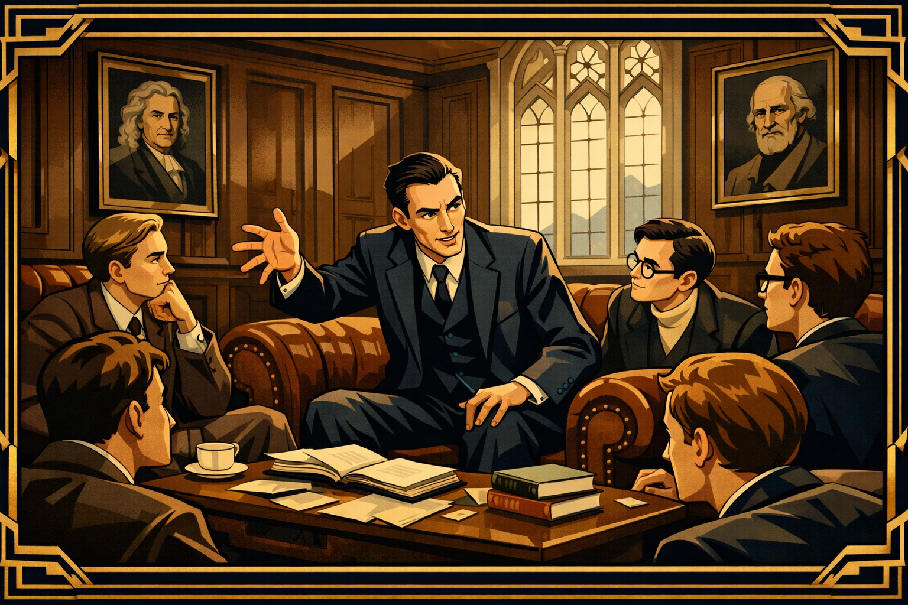

Image Prompt

I am about to ask you to generate a series of images for a graphic novel.
Please make the images have a consistent style and consistent characters.
Do not ask any clarifying questions. Just generate the image immediately when asked to do so.

Please generate a 16:9 image in Art Deco / Modernist style with sharp geometric lines and 1920s-1930s aesthetic, depicting panel 1 of 14. The scene shows the interior of King's College, Cambridge, circa 1902. A young John Maynard Keynes — 19 years old, tall and lanky with a high forehead, dark hair, and an intense gaze — sits in a richly paneled common room surrounded by brilliant peers. He is leaning forward in animated discussion, one long arm gesturing emphatically. Around him sit members of the Cambridge Apostles, an elite intellectual society, in leather armchairs beneath portraits of Newton and other great thinkers. Books and papers are scattered on a low table. Gothic windows let in pale English light. The color palette is rich wood browns, deep navy, cream, and gold accents in geometric Art Deco borders framing the scene. The emotional tone is intellectual confidence and the excitement of young minds discovering their power.
Generate the image now.

John Maynard Keynes was born in 1883 into the intellectual aristocracy of Cambridge, England. His father was an economist, his mother would become the city's mayor, and young Maynard — as everyone called him — was brilliant from the start. At King's College, Cambridge, he joined the Apostles, a secret society of the university's finest minds, and fell under the influence of the philosopher G.E. Moore, who taught that the pursuit of truth and beauty was life's highest purpose. Keynes absorbed this completely. He would spend his life believing that ideas — the right ideas, at the right moment — could change the course of history.

## Panel 2: The Treasury's Brightest Mind

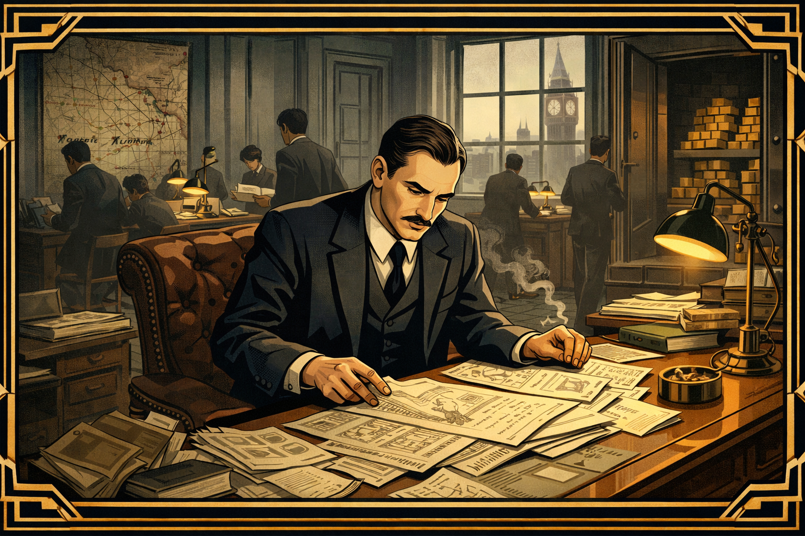

Image Prompt

Please generate a 16:9 image in Art Deco / Modernist style with sharp geometric lines and 1920s-1930s aesthetic, depicting panel 2 of 14. Make the characters and style consistent with the prior panels. The scene shows the British Treasury offices in London, 1915. Keynes, now in his early 30s with a thin mustache and wearing a dark suit, sits at a large desk covered with financial documents, currency charts, and telegrams. He is working intensely, a cigarette burning in an ashtray beside him. Around him, civil servants in similar attire move with urgency — this is wartime. Through tall windows, the London skyline is visible, including Big Ben. A map on the wall shows the Western Front with pins marking battle lines. Stacks of gold bars are visible in an open vault behind him, representing Britain's war finances. The color palette is muted wartime grays, institutional greens, and the warm amber of desk lamps, with sharp Art Deco geometric framing. The emotional tone is focused intensity — a brilliant mind applied to the machinery of war finance.
Generate the image now.

When World War I erupted in 1914, Keynes was recruited into the British Treasury. He was just thirty-one, but his mathematical brilliance and grasp of international finance made him indispensable. He managed the complex problem of financing Britain's war effort — how to pay for guns, ships, and soldiers without bankrupting the nation. He negotiated currency deals with allied governments and became one of the most important financial minds in Whitehall. By the war's end, there was no one in Britain who understood the economics of Europe better than Keynes. It was this expertise that earned him a seat at the table that would change his life — and the world.

## Panel 3: The Hall of Mirrors

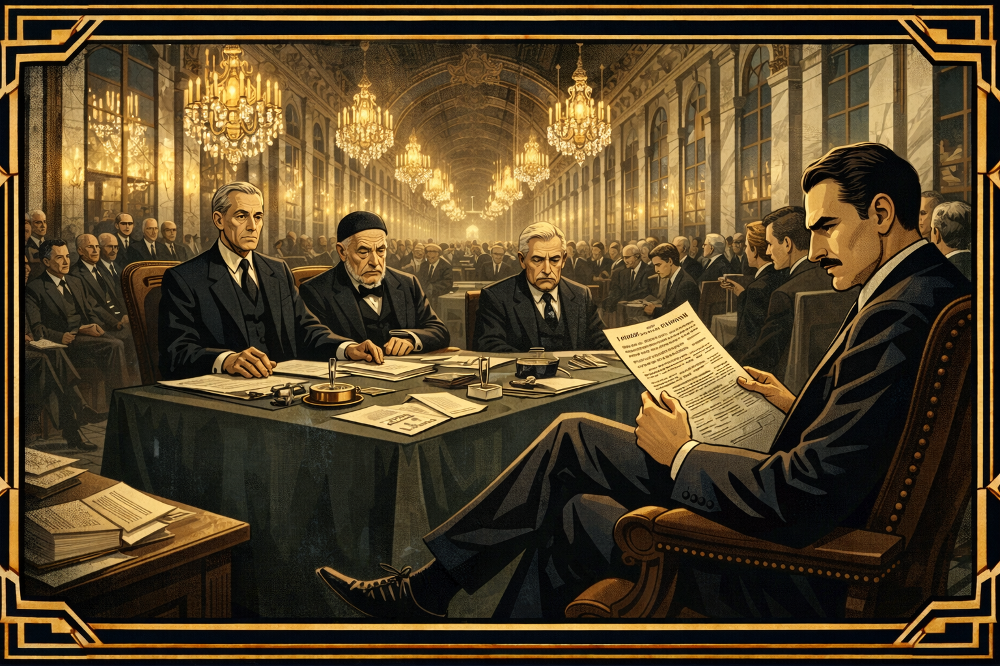

Image Prompt

Please generate a 16:9 image in Art Deco / Modernist style with sharp geometric lines and 1920s-1930s aesthetic, depicting panel 3 of 14. Make the characters and style consistent with the prior panels. The scene shows the Hall of Mirrors at the Palace of Versailles, January 1919. The vast hall stretches into the distance, its hundreds of mirrors reflecting chandeliers and the gathered diplomats. At the center table sit the "Big Three" — Woodrow Wilson (tall, bespectacled, idealistic), Georges Clemenceau (old, fierce, in a black skull cap), and David Lloyd George (shrewd, mustachioed). Keynes sits at a secondary table slightly behind the British delegation, his long legs crossed, observing with growing alarm. His face shows a mixture of horror and disbelief as he reads a document outlining the proposed reparations. The color palette is the cold grandeur of Versailles — crystalline chandelier light, marble white, mirror silver, and deep diplomatic black, with sharp geometric Art Deco borders. The emotional tone is ominous — beauty masking catastrophe.
Generate the image now.

In January 1919, Keynes arrived at the Versailles Peace Conference as the chief Treasury representative of the British Empire. He expected statesmanship. What he found was vengeance. France's Prime Minister Clemenceau — "The Tiger" — wanted Germany crushed. Woodrow Wilson, who had arrived promising justice, proved vague and easily manipulated. Lloyd George shifted with the political winds. Keynes watched in mounting horror as the Allies drew up reparation demands so enormous that Germany could never realistically pay them. He ran the numbers obsessively. The math was clear: the treaty would not bring peace. It would bring economic ruin.

## Panel 4: The Numbers Don't Lie

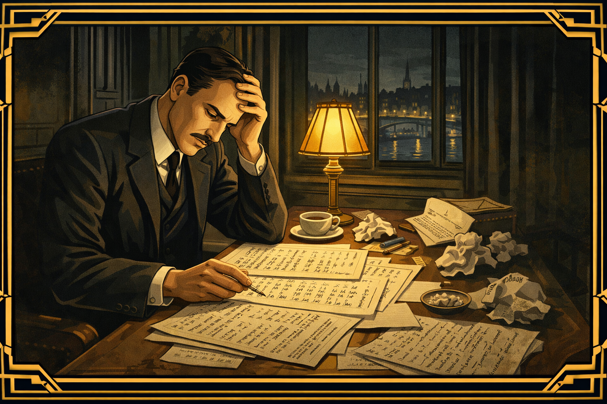

Image Prompt

Please generate a 16:9 image in Art Deco / Modernist style with sharp geometric lines and 1920s-1930s aesthetic, depicting panel 4 of 14. Make the characters and style consistent with the prior panels. The scene shows Keynes alone in a hotel room in Paris, late at night, 1919. He sits at a small writing desk beneath a single lamp, surrounded by crumpled papers and calculations. His face is drawn and anguished. On the papers before him, visible numbers and calculations show impossible sums — the reparations figures dwarfing Germany's total economic output. Through the window, Paris is dark except for distant streetlamps along the Seine. On the desk, a half-written letter of resignation is visible. A cup of cold tea sits untouched. The color palette is stark — the warm pool of lamplight against surrounding darkness, with cream paper, black ink, and the deep blue of a Parisian night. Art Deco geometric frames emphasize the isolation. The emotional tone is moral crisis — a man who sees catastrophe coming and must decide whether to speak or stay silent.
Generate the image now.

Night after night in his Paris hotel room, Keynes worked through the calculations that the Allied leaders refused to face. Germany was being asked to pay 132 billion gold marks — a sum so vast it would take generations to repay, crippling the German economy and impoverishing its people. Keynes argued passionately within the British delegation: reduce the demands, make them realistic, or face the consequences. He was ignored. The politicians needed to show their voters that Germany was being punished. Economic reality was less important than political theater. For Keynes, this was the moment when he understood something that would shape his entire career: bad economics driven by bad politics could destroy civilizations.

## Panel 5: The Resignation

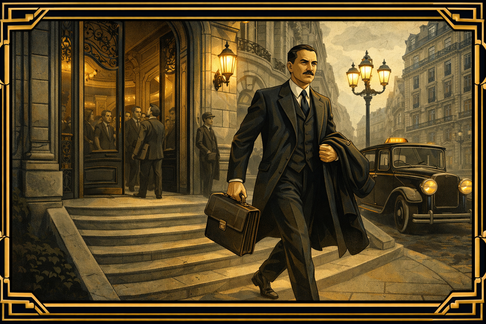

Image Prompt

Please generate a 16:9 image in Art Deco / Modernist style with sharp geometric lines and 1920s-1930s aesthetic, depicting panel 5 of 14. Make the characters and style consistent with the prior panels. The scene shows Keynes striding out of the grand entrance of the Hotel Majestic in Paris, the headquarters of the British delegation, in June 1919. He carries a briefcase and his coat over one arm, walking with long determined strides down the steps. Behind him, through the ornate doorway, other delegates are visible going about their business, unaware of the significance of his departure. A taxi waits at the curb. Keynes's face shows a mixture of relief and grim determination. The Art Deco architecture of Paris — lampposts, wrought iron balconies, Haussmann buildings — frames the scene with geometric precision. The color palette is cool Parisian grays and creams with sharp black geometric borders, and a single splash of warm gold light on Keynes himself, suggesting that truth walks out with him. The emotional tone is principled defiance — a quiet but seismic act of conscience.
Generate the image now.

On June 7, 1919, Keynes resigned from the British Treasury in protest. He was physically ill — the stress had left him bedridden for days — and morally devastated. He wrote to Lloyd George: "I can do no more good here." It was an extraordinary act. He was walking away from one of the most powerful positions in government, destroying his career prospects, because he believed the treaty was an economic catastrophe in the making. His colleagues thought he was overreacting. Some thought he was arrogant. But Keynes went home to Cambridge with a burning purpose: if the leaders wouldn't listen in private, he would make his case in public.

## Panel 6: The Economic Consequences of the Peace

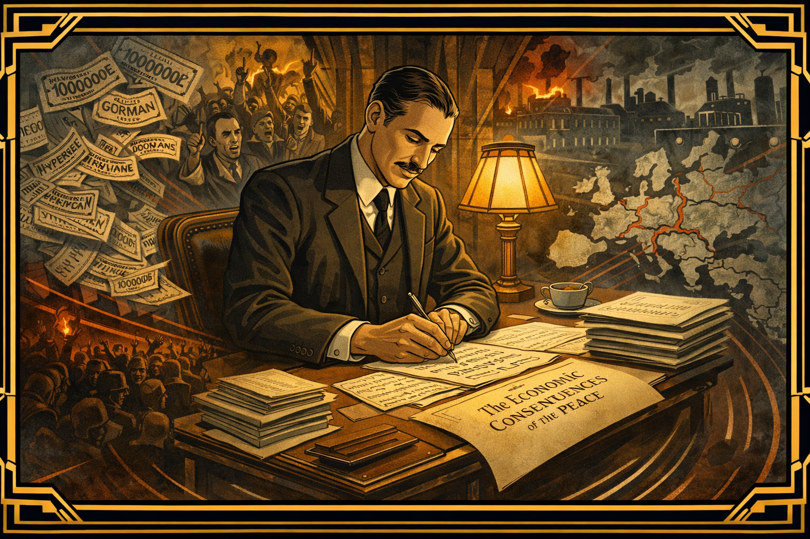

Image Prompt

Please generate a 16:9 image in Art Deco / Modernist style with sharp geometric lines and 1920s-1930s aesthetic, depicting panel 6 of 14. Make the characters and style consistent with the prior panels. This is a central panel of the story. The scene shows a dramatic composition: Keynes sitting in his study at King's College, Cambridge, late 1919, writing furiously. Around him, like a swirling Art Deco vision, the consequences he is predicting materialize as ghostly images — German currency inflating into worthless paper, angry crowds in the streets, factories going dark, a map of Europe cracking apart. The manuscript title "The Economic Consequences of the Peace" is visible on the desk. In contrast to the chaos around him, Keynes himself is calm and focused, his pen moving with precision. Stacks of finished pages sit beside him. The color palette contrasts Keynes's warm, ordered study — amber lamplight, rich wood, deep green leather — with the cold, fractured grays and reds of the visions of collapse. Art Deco geometric lines radiate outward from the manuscript like shock waves. The emotional tone is prophetic urgency — a man racing to warn the world.
Generate the image now.

In just two months, Keynes wrote *The Economic Consequences of the Peace*, one of the most explosive books of the twentieth century. In vivid, devastating prose, he dismantled the treaty's economic logic, showed that the reparations were unpayable, and predicted that the result would be economic chaos, political extremism, and the collapse of European civilization. He also wrote brilliant, merciless portraits of the leaders he had watched up close — Wilson as a "blind and deaf Don Quixote," Clemenceau as a man who saw France's security in Germany's destruction. The book was published in December 1919 and became an international sensation, selling over 100,000 copies. It made Keynes famous — and made him many enemies.

## Panel 7: The Prophet Mocked

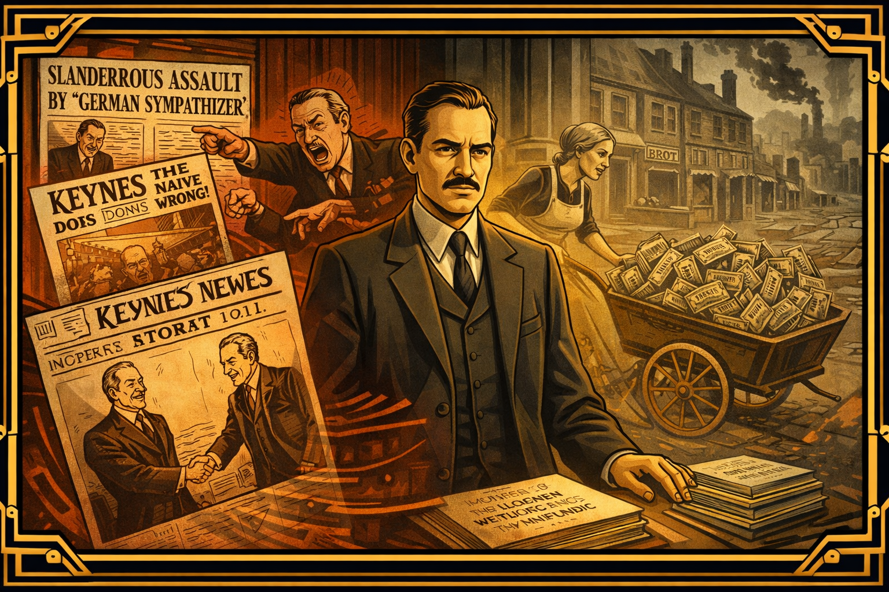

Image Prompt

Please generate a 16:9 image in Art Deco / Modernist style with sharp geometric lines and 1920s-1930s aesthetic, depicting panel 7 of 14. Make the characters and style consistent with the prior panels. The scene shows a montage of reactions to Keynes's book, circa 1920-1923. On one side, hostile newspaper headlines and political cartoons caricaturing Keynes as a German sympathizer and a naive academic — one cartoon shows him shaking hands with the Kaiser. Angry politicians gesture dismissively in Parliament. On the other side, the reality unfolding: a German woman pushing a wheelbarrow full of worthless banknotes to buy bread during the hyperinflation of 1923, the Weimar Republic crumbling. Keynes stands in the center, caught between ridicule and vindication, his expression resolute but pained. The color palette contrasts the sharp blacks and reds of angry newsprint with the sickly yellows and grays of economic collapse. Art Deco geometric frames separate the panels-within-the-panel like a newspaper layout. The emotional tone is the bitter experience of being right when everyone wants you to be wrong.
Generate the image now.

The establishment struck back. Keynes was called a German sympathizer, a traitor to the Allied cause, an ivory-tower academic who didn't understand the real world. French economists attacked his numbers. British politicians questioned his loyalty. He was excluded from government circles. But history was already proving him right. By 1923, German hyperinflation had destroyed the middle class — people burned banknotes for fuel because they were worth less than firewood. The political extremism Keynes predicted was growing. A failed artist named Adolf Hitler was already giving speeches blaming Germany's humiliation on the treaty. The vindication was devastating, because it came at a cost measured in human suffering that Keynes had desperately tried to prevent.

## Panel 8: The Bloomsbury Years

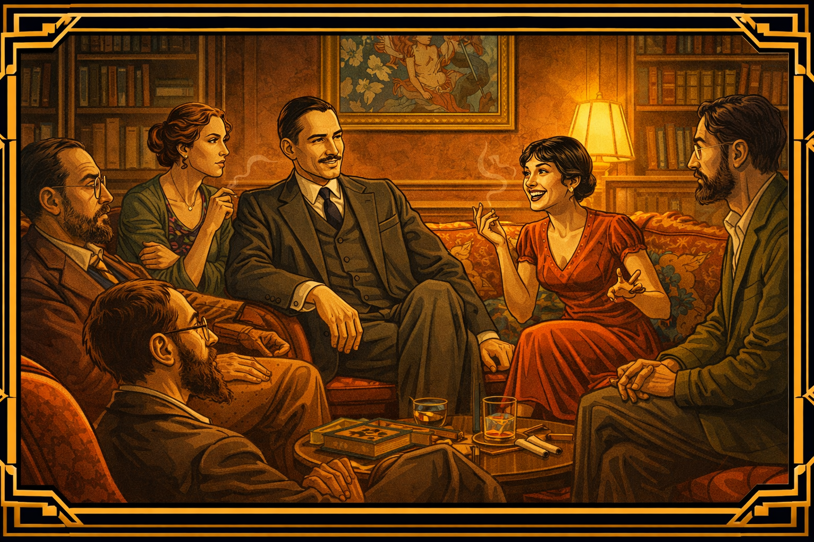

Image Prompt

Please generate a 16:9 image in Art Deco / Modernist style with sharp geometric lines and 1920s-1930s aesthetic, depicting panel 8 of 14. Make the characters and style consistent with the prior panels. The scene shows a lively gathering in a Bloomsbury townhouse, London, circa 1925. Keynes, in his early 40s, impeccably dressed, sits in an elegant drawing room surrounded by the Bloomsbury Group — Virginia Woolf (angular, intense, holding a cigarette), Vanessa Bell (artistic, colorful), Lytton Strachey (bearded, lounging), Duncan Grant (paint-stained hands). Keynes's wife, the Russian ballerina Lydia Lopokova, sits beside him — small, vivacious, dark-haired, laughing at something she's said that has startled the intellectuals. Books, art, and conversation fill the room. A painting by one of the group hangs on the wall. The color palette is the warm, bohemian richness of Bloomsbury — jewel tones, deep reds, artistic greens, gold frames, with Art Deco geometric accents. The emotional tone is the creative vitality that fueled Keynes's mind — he was never just an economist, but a man who lived surrounded by art and ideas.
Generate the image now.

Keynes was never only an economist. He was a central figure in the Bloomsbury Group — the circle of writers, artists, and thinkers that included Virginia Woolf, E.M. Forster, and Lytton Strachey. He was a patron of the arts, a collector of rare books and paintings, and a gifted financial speculator who made fortunes (and lost them, and made them again) in the currency markets. In 1925, he married the Russian ballerina Lydia Lopokova, scandalizing his Bloomsbury friends who found her too exuberant and not intellectual enough. But Keynes adored her, and she brought a warmth and humor into his life that sustained him through the brutal intellectual battles ahead.

## Panel 9: The Crash

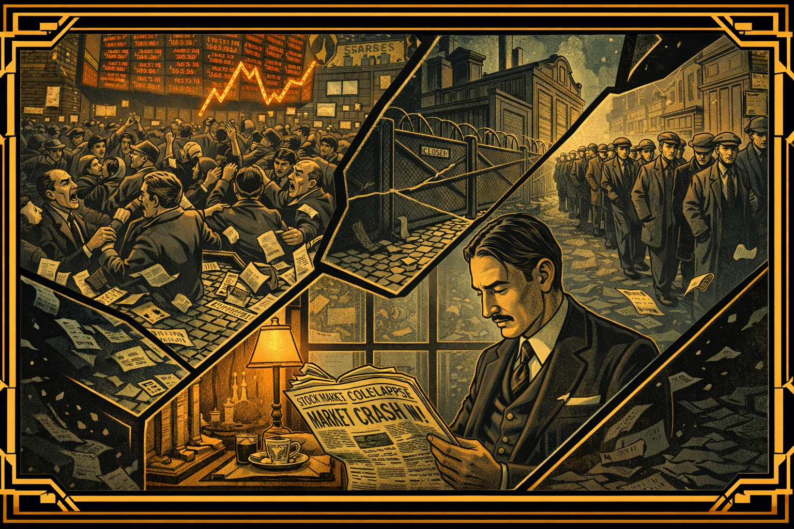

Image Prompt

Please generate a 16:9 image in Art Deco / Modernist style with sharp geometric lines and 1920s-1930s aesthetic, depicting panel 9 of 14. Make the characters and style consistent with the prior panels. The scene shows the Wall Street Crash of October 1929 and its aftermath. The composition is dramatic and angular: a stylized view of the New York Stock Exchange floor in chaos — traders shouting, ticker tape flooding the floor, a giant stock board showing plummeting numbers. This image dissolves into scenes of the Great Depression rippling across the world — a shuttered American factory, a British dole queue stretching around a block, unemployed men in flat caps standing idle on street corners. At the bottom of the composition, Keynes is shown reading newspaper headlines about the crash, his face grave but his eyes already calculating — the wheels of a new theory visibly turning in his mind. The color palette is crash-dark: blacks, grays, sickly yellows of ticker tape, with cold blue shadows of depression. Art Deco geometric lines fracture the composition like breaking glass. The emotional tone is catastrophe — the old economic order shattering.
Generate the image now.

On October 29, 1929, the American stock market collapsed, triggering the worst economic disaster in modern history. The Great Depression spread across the globe like a contagion. Factories closed. Banks failed. Unemployment in Britain reached 25 percent. In the United States, it was even worse. And the world's leading economists and politicians responded with the conventional wisdom of the time: cut government spending, balance the budget, let wages fall, and wait for the market to correct itself. It was the economic equivalent of telling a bleeding patient to walk it off. Keynes watched millions suffer under policies he knew were making things worse, and he began formulating the most radical idea of his career.

## Panel 10: The Paradox of Thrift

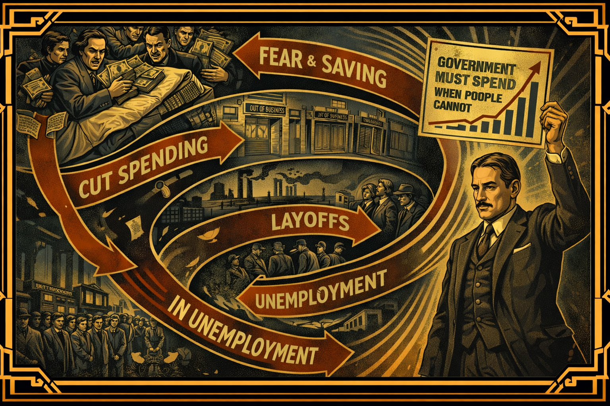

Image Prompt

Please generate a 16:9 image in Art Deco / Modernist style with sharp geometric lines and 1920s-1930s aesthetic, depicting panel 10 of 14. Make the characters and style consistent with the prior panels. The scene is a visual explanation of Keynes's paradox of thrift. The composition uses Art Deco geometric design to show a vicious cycle: at the top, frightened workers hoard their wages in a mattress. Arrows flow downward to show how this reduces spending, which leads to shops closing (a row of shuttered storefronts), which leads to factory layoffs (idle smokestacks), which leads to more unemployment, which leads to more fear and more saving — completing a downward spiral. In the center of this spiral, Keynes stands like a figure breaking the cycle, holding up a chart that shows the solution: "Government Must Spend When People Cannot." The overall design resembles an Art Deco poster — bold, graphic, with strong typography integrated into the image. The color palette is the stark contrasts of a propaganda poster — deep blues, golds, blacks, and crimsons. The emotional tone is intellectual breakthrough — the moment when a counterintuitive truth becomes visible.
Generate the image now.

Keynes identified a devastating paradox at the heart of the Depression. When times are bad, every individual acts rationally by saving money and spending less. But when *everyone* saves and no one spends, demand for goods collapses, businesses fail, workers lose their jobs, and the economy spirals deeper into depression. This is the "paradox of thrift" — what is rational for each person is catastrophic for the whole. The conventional economists said: wait. The markets will fix themselves. Keynes answered with a question that shattered orthodoxy: *What if they don't?* What if an economy can get stuck in a depression, with millions of people willing and able to work but no jobs to be found, and no market mechanism to pull them out?

## Panel 11: The General Theory

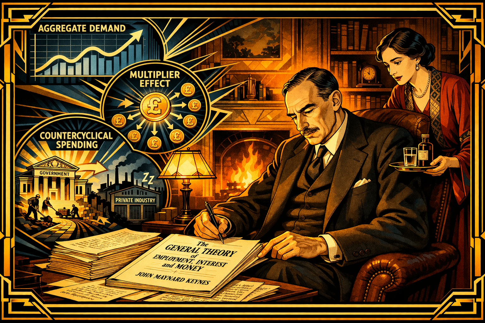

Image Prompt

Please generate a 16:9 image in Art Deco / Modernist style with sharp geometric lines and 1920s-1930s aesthetic, depicting panel 11 of 14. Make the characters and style consistent with the prior panels. The scene shows Keynes in his study at King's College, Cambridge, 1935-1936, working on The General Theory. He is visibly older now, in his early 50s, his face showing the strain of his heart condition — but his eyes burn with intellectual fire. He sits in a leather chair beside a fireplace, manuscript pages spread across a table. The manuscript title reads "The General Theory of Employment, Interest and Money." Around him, like Art Deco thought-bubbles rendered in geometric style, float the key concepts: "AGGREGATE DEMAND" in bold letters over a flowing graph, "MULTIPLIER EFFECT" shown as one coin spawning many, "COUNTERCYCLICAL SPENDING" depicted as government building roads while private industry sleeps. His wife Lydia stands nearby, bringing him medicine, her face showing both concern for his health and admiration for his determination. The color palette is warm study amber and gold against cool blue concept-illustrations. The emotional tone is heroic intellectual labor against failing health — a race to finish the work that could save the world.
Generate the image now.

In 1936, despite increasingly serious heart problems, Keynes published *The General Theory of Employment, Interest and Money* — the book that revolutionized economics. His central argument was breathtakingly simple: in a recession, when private spending collapses, the government must step in and spend. Build roads. Build schools. Build hospitals. It doesn't matter if the budget isn't balanced in the short run — what matters is putting money in people's pockets so they can spend it, which creates demand, which creates jobs, which creates more spending. This is "countercyclical spending" — the government should push against the economic cycle, spending more in bad times and less in good. The orthodox economists were appalled. Keynes didn't care. People were starving.

## Panel 12: The Battle of Ideas

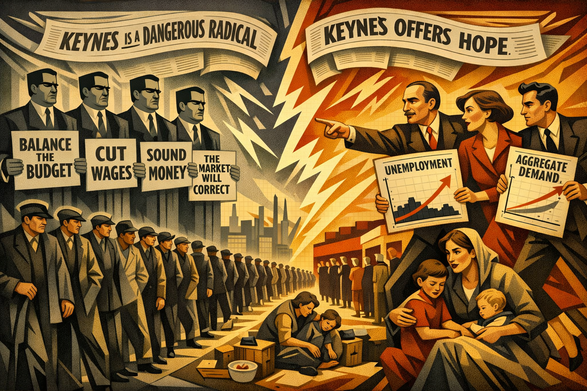

Image Prompt

Please generate a 16:9 image in Art Deco / Modernist style with sharp geometric lines and 1920s-1930s aesthetic, depicting panel 12 of 14. Make the characters and style consistent with the prior panels. The scene shows a dramatic visual debate. On the left, the orthodox economists — stern men in dark suits represented as rigid geometric columns, holding signs reading "Balance the Budget," "Cut Wages," "Sound Money," "The Market Will Correct." On the right, Keynes and his young followers — energetic Cambridge economists like Joan Robinson and Richard Kahn — pushing forward with dynamic angular motion, carrying charts showing unemployment data and aggregate demand curves. Between them, the stakes: a line of unemployed workers stretching into the distance, families in breadlines, children in poverty. Above the scene, newspaper headlines from both sides swirl — "Keynes is a Dangerous Radical" vs. "Keynes Offers Hope." The color palette pits cold institutional grays and blacks of orthodoxy against warm golds and dynamic reds of the Keynesian revolution. Art Deco lightning bolts of conflict crackle between the two sides. The emotional tone is ideological warfare with human lives in the balance.
Generate the image now.

The response to *The General Theory* was volcanic. Orthodox economists accused Keynes of destroying fiscal responsibility, encouraging reckless government spending, and undermining the self-correcting power of free markets. Friedrich Hayek, the Austrian economist, became his most formidable intellectual opponent, warning that government intervention would lead to tyranny. But a generation of younger economists rallied to Keynes's banner. Joan Robinson, Richard Kahn, and others at Cambridge developed and refined his ideas. Slowly, painfully, governments began to listen. Franklin Roosevelt's New Deal in America, though imperfect and incomplete, was moving in the direction Keynes advocated. The intellectual tide was turning — but for millions who suffered through the Depression, it turned too slowly.

## Panel 13: Architect of a New World

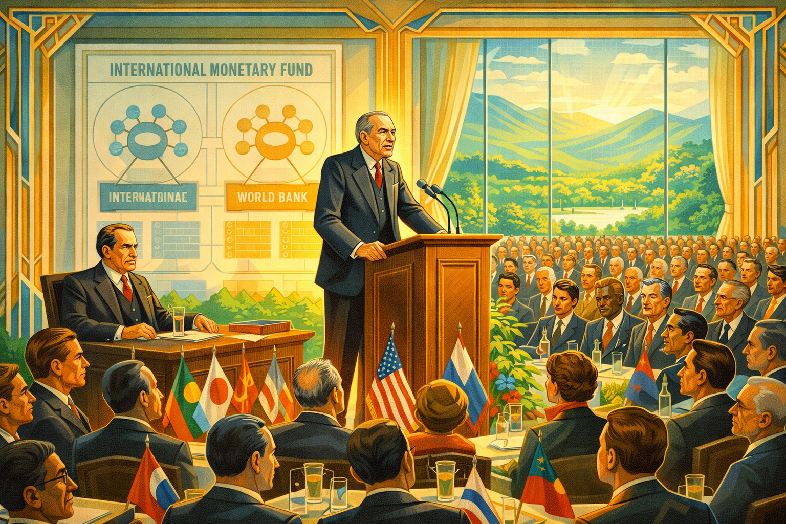

Image Prompt

Please generate a 16:9 image in Art Deco / Modernist style with sharp geometric lines and 1920s-1930s aesthetic, depicting panel 13 of 14. Make the characters and style consistent with the prior panels, however this one has much more bright colors showing the transition to a positive energy modern era. The scene shows the Bretton Woods Conference, 1944 — a grand hotel ballroom in New Hampshire filled with delegates from 44 nations. Keynes, now 61, visibly frail but commanding, stands at a podium addressing the assembly. His tall frame is slightly stooped, but his voice carries authority. Behind him, a large diagram shows the proposed International Monetary Fund and World Bank structures. The American delegate Harry Dexter White sits nearby, an uneasy ally. Through the hotel's large windows, the White Mountains are visible under summer sunshine. The assembled delegates represent the diversity of the Allied nations. The color palette transitions dramatically: the dark Art Deco blues and blacks of war give way to bright hopeful colors — sunny golds, optimistic greens, clear sky blues. Geometric Art Deco borders bloom into more open, lighter designs. The emotional tone is hard-won hope — a sick man designing a better world while he still can.
Generate the image now.

Even as World War II raged, Keynes was already working to ensure the peace would not repeat the catastrophe of Versailles. In July 1944, despite his failing heart — he had suffered multiple heart attacks — Keynes led the British delegation to the Bretton Woods Conference in New Hampshire, where forty-four nations gathered to design a new international economic order. Keynes fought for a system that would prevent the competitive devaluations and trade wars that had deepened the Depression. The result was the creation of the International Monetary Fund and the World Bank — institutions that, for all their imperfections, helped maintain global economic stability for decades. It was Versailles done right — or at least, done better — and it was Keynes's last great achievement.

## Panel 14: The Ideas That Outlived Him

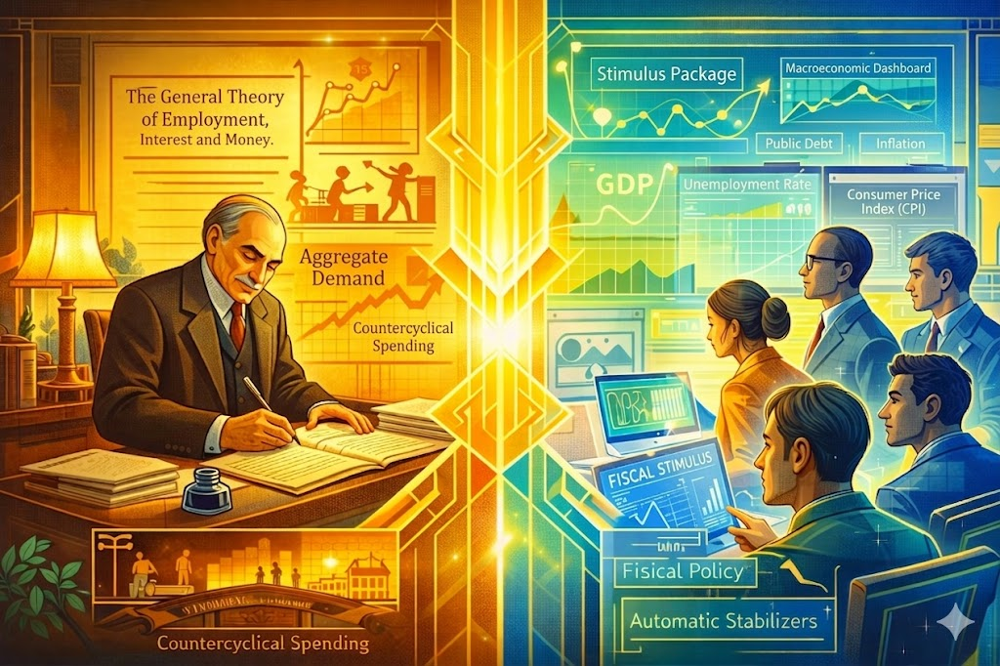

Image Prompt

Please generate a 16:9 image in Art Deco / Modernist style blending into modern style, depicting panel 14 of 14. Make the characters and style consistent with the prior panels. The scene is a creative split with super bright colors: on the left, Keynes in 1936, sitting in his Cambridge study, writing The General Theory by lamplight, his face showing the strain of illness but illuminated by conviction. On the right, the same composition mirrored in a contemporary setting — a diverse group of young economists and policymakers in a modern government office, studying data on screens showing GDP, unemployment rates, and fiscal stimulus plans during a modern economic crisis. Charts on their screens echo Keynes's aggregate demand curves. Between the two scenes, a bridge of bold geometric golden light connects past and present. Floating annotations link both sides — "Aggregate Demand" and "Countercyclical Spending" on Keynes's side transform into modern terms like "Stimulus Package," "Fiscal Policy," "Automatic Stabilizers" on the modern side. The color palette blends warm Art Deco gold on the left with clean, bright modern tones — electric blues, vibrant greens, warm oranges — on the right, unified by the golden geometric bridge. The emotional tone is deeply inspiring — the ideas of a man who died in 1946 are still saving economies today.
Generate the image now.

John Maynard Keynes died on April 21, 1946, at the age of sixty-two, his heart finally giving out after decades of strain. He did not live to see how completely his ideas would reshape the world. For the next thirty years — the longest sustained economic boom in history — governments across the globe followed Keynesian principles: spending during recessions, taxing during booms, managing aggregate demand to maintain employment. Every time a government passes a stimulus package during a recession, every time a central bank cuts interest rates to fight unemployment, every time a politician argues that austerity during a downturn is self-defeating, they are channeling the insights of the man who watched the Treaty of Versailles and understood, before anyone else, that economic ideas have consequences measured in human lives.

### Epilogue – What Made John Maynard Keynes Different?

| Challenge | How Keynes Responded | Lesson for Today |
|-----------|---------------------|------------------|
| Watched leaders impose impossible reparations at Versailles | Resigned in protest and wrote a book warning the world | Sometimes courage means walking away from power to tell the truth |
| Ridiculed as a German sympathizer and naive academic | Stood by his analysis and let history prove him right | Being mocked for your ideas doesn't mean your ideas are wrong |
| Faced entrenched economic orthodoxy during the Depression | Developed revolutionary theory showing why governments must act | When the conventional wisdom is causing suffering, it's time for new thinking |
| Fought serious heart disease through his most productive years | Continued working on Bretton Woods despite multiple heart attacks | Urgency about your mission can carry you through physical adversity |
| Needed to prevent another Versailles after World War II | Helped design the IMF and World Bank at Bretton Woods | Learn from history's mistakes — don't just study the past, use it to build a better future |

### Call to Action

John Maynard Keynes showed that economics is not an abstract science — it is the study of human prosperity and human suffering. When he looked at the Treaty of Versailles, he didn't see a political document; he saw millions of families who would go hungry because leaders refused to do the math. When he looked at the Great Depression, he didn't see an unavoidable natural disaster; he saw a problem that human intelligence could solve. You live in an era of economic challenges that Keynes would have recognized instantly — debates about government spending, arguments over stimulus versus austerity, questions about how to respond to economic crises. The tools he built are still in use. The question he spent his life answering — *what should governments do when the economy fails?* — is still the most important question in economics. What's your answer?

---

*"The difficulty lies not so much in developing new ideas as in escaping from old ones."*
— John Maynard Keynes, *The General Theory of Employment, Interest and Money* (1936)

---

*"The ideas of economists and political philosophers, both when they are right and when they are wrong, are more powerful than is commonly understood. Indeed, the world is ruled by little else."*
— John Maynard Keynes, *The General Theory of Employment, Interest and Money* (1936)

---

*"The long run is a misleading guide to current affairs. In the long run we are all dead."*
— John Maynard Keynes, *A Tract on Monetary Reform* (1923)

---

## References

1. [John Maynard Keynes (Wikipedia)](https://en.wikipedia.org/wiki/John_Maynard_Keynes) - Comprehensive biography covering Keynes's life, works, and revolutionary impact on modern economics and government policy.

2. [The Economic Consequences of the Peace (Wikipedia)](https://en.wikipedia.org/wiki/The_Economic_Consequences_of_the_Peace) - Overview of Keynes's 1919 polemic against the Treaty of Versailles, which predicted economic collapse and political extremism in Europe.

3. [The General Theory of Employment, Interest and Money (Wikipedia)](https://en.wikipedia.org/wiki/The_General_Theory_of_Employment,_Interest_and_Money) - Summary of Keynes's 1936 masterwork that revolutionized macroeconomics and introduced the concepts of aggregate demand and countercyclical spending.

4. [Bretton Woods Conference (Wikipedia)](https://en.wikipedia.org/wiki/Bretton_Woods_Conference) - The 1944 conference where Keynes helped design the post-war international monetary system, including the IMF and World Bank.

5. [Keynesian Economics (Wikipedia)](https://en.wikipedia.org/wiki/Keynesian_economics) - The school of macroeconomic thought based on Keynes's ideas, emphasizing the role of government spending and demand management in stabilizing economies.

6. [Treaty of Versailles (Wikipedia)](https://en.wikipedia.org/wiki/Treaty_of_Versailles) - The 1919 peace treaty that ended World War I and imposed the reparations on Germany that Keynes warned would lead to economic and political catastrophe.
