# The Innovation Gap: Lisa Cook and the Price of Lost Innovation

Cover Image Prompt

Please generate a new wide-landscape 16:9 cover image for a graphic novel titled "The Innovation Gap." The style should be modern documentary illustration, contrasting historical sepia tones with vibrant contemporary color. The central figure is Lisa Cook — a Black woman in her 50s with warm brown skin, short natural hair, and an expression of determined intelligence, wearing a professional blazer. She stands at the intersection of two worlds: behind her left shoulder, a sepia-toned scene of early 20th-century Black inventors at workbenches, their images fading like ghosts. Behind her right shoulder, in vivid full color, the marble columns of the Federal Reserve building in Washington, D.C. In the foreground, scattered patent documents and data charts float between the two worlds, some marked with red X's showing inventions that were never made. The title "THE INNOVATION GAP" appears in bold modern sans-serif font across the top, with "The Story of Lisa Cook" in smaller text below. The mood is one of uncovering hidden truth and reclaiming lost potential.
Generate the image now.

Narrative Prompt

This graphic novel tells the story of Lisa Cook (born 1964), an American economist whose groundbreaking research quantified the economic cost of racial violence on Black innovation in the United States. The narrative follows Cook from her childhood in rural Georgia during the Civil Rights era, through her education at Spelman College and Oxford University, her years of painstaking research with patent data, her struggle for academic recognition, and her historic appointment to the Federal Reserve Board of Governors in 2022. The art style should use modern documentary illustration — contrasting historical sepia and muted earth tones for scenes of the past with vibrant, saturated contemporary colors for scenes of the present. Cook should be depicted consistently as a Black woman with warm brown skin, short natural hair, bright observant eyes, and an expression that combines scholarly intensity with deep empathy. Historical scenes of Jim Crow America should be rendered in desaturated browns and grays to convey weight and loss. Research and data scenes should feature clean lines, charts, and patent documents. Federal Reserve scenes should use the gravitas of marble and institutional architecture. The tone balances moral urgency with scientific rigor, showing that Cook's power lies in letting the data speak truths that rhetoric alone could not.

### Prologue – The Question No One Had Asked

In the early 2000s, an economist at Michigan State University sat in her office surrounded by stacks of patent records stretching back over a century. She was hunting for something that most economists had never thought to look for: the inventions that were never invented, the businesses that were never built, the ideas that died before they were born — all because of racial terror. Her name was Lisa Cook, and her superpower was the ability to count what had been deliberately erased, and to prove that the cost of racism was not just moral, but economic.

## Panel 1: A Child of the Movement

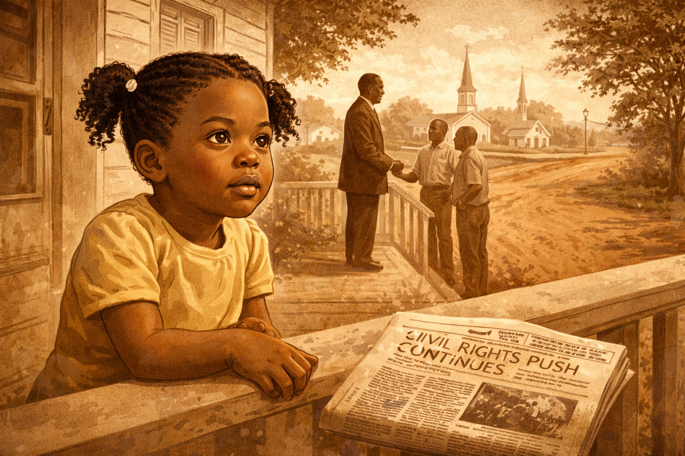

Image Prompt

I am about to ask you to generate a series of images for a graphic novel.
Please make the images have a consistent style and consistent characters.
Do not ask any clarifying questions. Just generate the image immediately when asked to do so.

Please generate a 16:9 image in modern documentary illustration style depicting panel 1 of 14. The scene shows Milledgeville, Georgia, in the late 1960s. A young Black girl, about five years old — Lisa Cook as a child, with bright curious eyes and pigtails — sits on the front porch of a modest but well-kept house, watching the world with intense attention. Her father, a minister, stands nearby in a dark suit speaking earnestly with neighbors. In the background, a small Southern town is visible — church steeples, red clay roads, pecan trees. On the porch railing, a newspaper headline about the Civil Rights movement is partially visible. The color palette is warm sepia tones with hints of green from the Georgia landscape — muted and nostalgic but not bleak. The emotional tone is watchfulness and quiet determination forming in a child's mind.
Generate the image now.

Lisa Cook was born in 1964 in Milledgeville, Georgia — the same year the Civil Rights Act was signed into law. She grew up in a family that valued education as both a right and a weapon against injustice. Her father was a minister, and the rhythms of church life and community organizing shaped her earliest memories. Even as a child, Lisa noticed things: which families had opportunities and which didn't, which doors were open and which were closed, and the vast silence around the question of what had been lost during the generations of Jim Crow.

## Panel 2: The World of Spelman

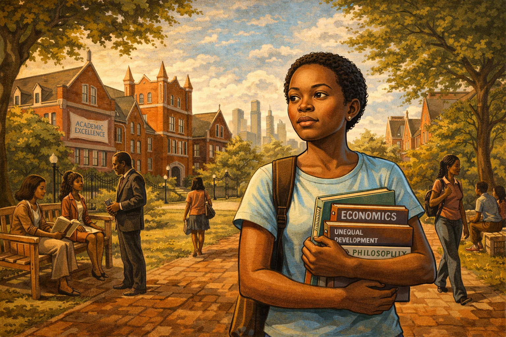

Image Prompt

Please generate a 16:9 image in modern documentary illustration style depicting panel 2 of 14. Make the characters and style consistent with the prior panels. The scene shows the campus of Spelman College in Atlanta, Georgia, circa 1982. A young Lisa Cook, now about 18, walks across a beautiful tree-lined quad with Gothic-style brick buildings. She carries an armload of economics and philosophy textbooks. Around her, other young Black women students move purposefully — studying under trees, debating on benches, heading to class. The atmosphere is intellectually vibrant. In the background, the Atlanta skyline is visible beyond the campus gates. A banner on a building reads something about academic excellence. The color palette shifts from the sepia of the previous panel to warmer, richer tones — burgundy brick, deep green foliage, golden afternoon light. The emotional tone is empowerment and intellectual awakening — a young woman discovering that her questions about economics have a home.
Generate the image now.

At Spelman College, one of the nation's historically Black colleges for women, Lisa Cook found her intellectual voice. Surrounded by brilliant women who shared her background and her ambitions, she dove into economics — not as abstract theory, but as a tool for understanding the disparities she had witnessed growing up. Her professors pushed her to think rigorously, to demand evidence, and to never accept "that's just the way things are" as an explanation. Spelman gave her something crucial: the confidence that a Black woman from Georgia belonged in the rooms where economic knowledge was made.

## Panel 3: Oxford and the Wider World

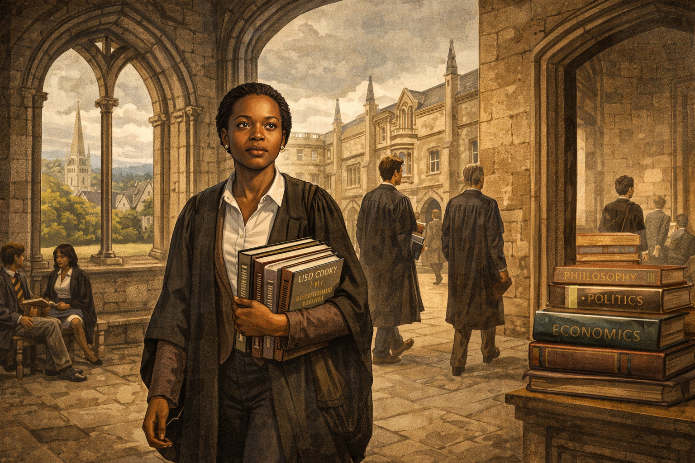

Image Prompt

Please generate a 16:9 image in modern documentary illustration style depicting panel 3 of 14. Make the characters and style consistent with the prior panels. The scene shows the dreaming spires of Oxford University, circa mid-1980s. Lisa Cook, now in her early 20s, walks through a medieval stone courtyard wearing a scholar's gown over modern clothes. She is one of very few people of color visible in the scene. Around her, other students — mostly white and male — move through the ancient corridors. Lisa's expression is one of focused determination mixed with the discomfort of being an outsider. Through an arched stone window, the English countryside is visible under gray skies. On a desk visible through a doorway, books on philosophy, politics, and economics are stacked high. The color palette is cool English grays and ancient stone, with Lisa's presence bringing warmth to the scene. The emotional tone is intellectual ambition meeting institutional tradition — a brilliant mind navigating spaces not designed for her.
Generate the image now.

Cook's talent earned her a place at Oxford University as a Marshall Scholar — one of the most prestigious academic honors for American students. At Oxford, she studied philosophy, politics, and economics, sharpening her analytical tools while confronting the particular isolation of being a Black woman in one of the world's most traditional institutions. The experience broadened her horizons but also deepened her central question: why did so many economic models simply ignore race, as if centuries of exclusion had no measurable impact on productivity, innovation, or growth? She began to suspect that the silence itself was a kind of data.

## Panel 4: Russia and the Lesson of Institutions

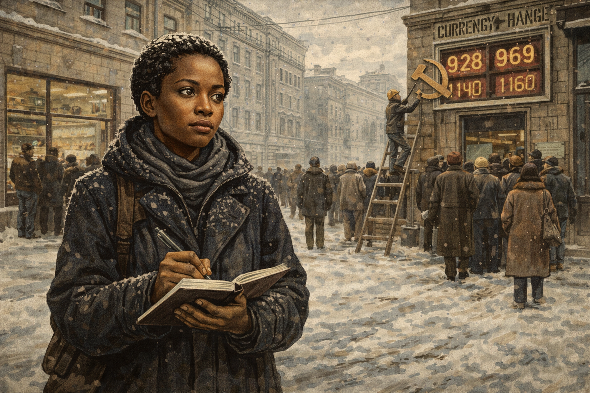

Image Prompt

Please generate a 16:9 image in modern documentary illustration style depicting panel 4 of 14. Make the characters and style consistent with the prior panels. The scene shows Moscow in the early 1990s during the collapse of the Soviet Union. Lisa Cook, now in her late 20s, stands in a snow-covered Russian street wearing a heavy winter coat, notebook in hand. Around her, a chaotic scene unfolds: long lines of people waiting outside shops with empty shelves visible through windows, a currency exchange booth with rapidly changing numbers, crumbling Soviet-era architecture. A hammer-and-sickle emblem is being removed from a building facade. Cook observes everything with keen analytical eyes, taking notes. The color palette is cold — steel grays, dirty whites, washed-out blues — with Cook's dark coat and alert eyes providing the focal warmth. The emotional tone is witnessing an economy unravel in real time and understanding that institutions matter more than ideology.
Generate the image now.

Before turning her full attention to American economic history, Cook spent time studying the Russian economy during and after the collapse of the Soviet Union. Working in Moscow, she witnessed firsthand what happens when institutions fail — when the rules that govern markets, property, and trust dissolve. She saw how quickly an economy can unravel when people lose faith in the systems meant to protect them. This experience would prove essential to her later work: she understood, in a visceral way, that economies depend not just on resources and technology, but on whether people believe the system will protect their rights and reward their effort.

## Panel 5: The Patent Puzzle

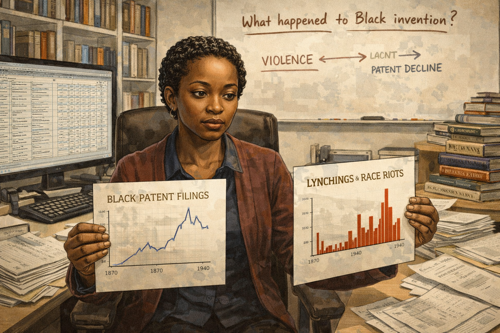

Image Prompt

Please generate a 16:9 image in modern documentary illustration style depicting panel 5 of 14. Make the characters and style consistent with the prior panels. The scene shows Lisa Cook's office at Michigan State University, early 2000s. She sits at a large desk covered with stacks of historical patent records, census data, and printed spreadsheets. Her computer screen shows a database of patent filings. She holds up two charts side by side: one showing a timeline of Black patent filings, the other showing a timeline of documented lynchings and race riots. Both cover roughly 1870-1940. Her expression is one of dawning realization — the two timelines mirror each other inversely. On a whiteboard behind her, she has written "What happened to Black invention?" with arrows connecting "violence" to "patent decline." Books on economic history and innovation line the shelves. The color palette is modern office neutrals — beige, white, steel — with the charts providing splashes of red and blue data. The emotional tone is the eureka moment — the data is revealing a story no one had told before.
Generate the image now.

At Michigan State University, Cook began the research that would define her career. She started with a deceptively simple question: what happened to Black invention in America? Using patent records — one of the few quantitative measures of innovation available across long time periods — she painstakingly tracked patenting activity by Black inventors from the post-Civil War era through the mid-20th century. What she found was stunning. There had been a surge of Black patenting after Reconstruction, as formerly enslaved people and their children gained access to education and markets. And then, violently, the numbers dropped.

## Panel 6: Counting the Terror

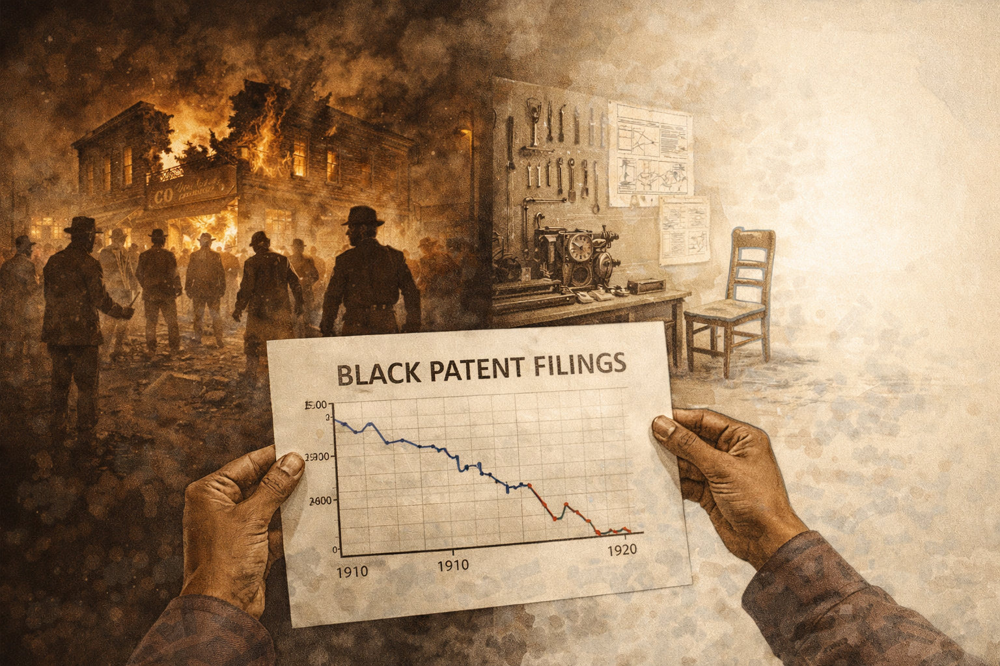

Image Prompt

Please generate a 16:9 image in modern documentary illustration style depicting panel 6 of 14. Make the characters and style consistent with the prior panels. This is a central panel of the story. The scene is a powerful split composition. On the left side, rendered in harsh sepia and shadow, a terrifying historical scene: a burning Black-owned business in a Southern town, circa 1910, with white mob figures visible in silhouette. Smoke rises into a dark sky. On the right side, rendered in the same sepia but fading to white emptiness, a Black inventor's workshop — tools laid out, a half-finished mechanical device on a workbench, blueprints on the wall — but the inventor's chair is empty. The workshop is slowly dissolving into blank white space, representing the innovation that was never created. In the center foreground, in modern full color, Lisa Cook's hands hold a chart showing the sharp decline in Black patent activity following periods of racial violence. The data line drops like a cliff. The color palette contrasts violent sepia darkness on the left with dissolving emptiness on the right, anchored by the modern clarity of Cook's data in the center. The emotional tone is devastating revelation — putting numbers to human devastation.
Generate the image now.

Cook's breakthrough was connecting the patent data to something that historians had documented but economists had ignored: racial violence. She meticulously compiled records of lynchings, race riots, and organized racial terror campaigns across the South and beyond. Then she overlaid the violence data onto the patent data. The correlation was unmistakable. After major episodes of racial violence — the 1898 Wilmington massacre, the 1906 Atlanta race riots, the 1921 Tulsa massacre — Black patenting plummeted and stayed down for years. Terror didn't just kill people. It killed ideas. It killed the willingness to invest, to experiment, to put your name on a public document like a patent when doing so could make you a target.

## Panel 7: The Invention That Wasn't

Image Prompt

Please generate a 16:9 image in modern documentary illustration style depicting panel 7 of 14. Make the characters and style consistent with the prior panels. The scene shows a visual metaphor for lost innovation. A ghostly gallery of inventions that were never made stretches into the distance — translucent blueprints, phantom machines, spectral light bulbs that never lit, medicines never formulated, buildings never designed. Each ghost-invention has a small empty nameplate where the inventor's name should be. In the foreground, Lisa Cook stands in modern professional attire, holding a patent document, looking into this gallery of absence with a mixture of grief and resolve. The floor is composed of data — numbers, charts, and patent filing forms. Above the gallery, in faint text, years are marked: 1890, 1900, 1910, 1920, showing decades of suppressed creativity. The color palette is ethereal — translucent whites and pale blues for the ghost inventions, with Cook in full solid color as the person making the invisible visible. The emotional tone is haunting — the viewer should feel the weight of what was lost.
Generate the image now.

What Cook was measuring was not just a historical curiosity — it was a massive, ongoing drag on the American economy. Every inventor who chose not to file a patent, every entrepreneur who abandoned a business plan, every scientist who left the South rather than risk violence represented an idea the world would never see. Cook estimated that the suppression of Black innovation represented a significant and measurable loss to total American economic output. Her work showed that discrimination is not just unjust — it is economically irrational. A society that terrorizes a portion of its population into silence is taxing its own capacity for growth.

## Panel 8: The Academic Battle

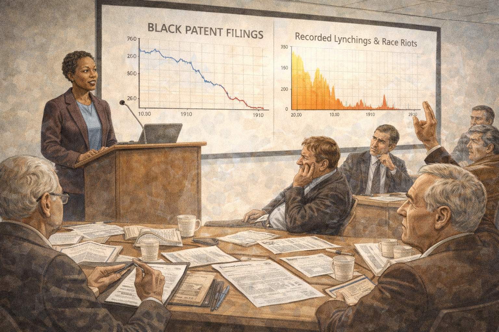

Image Prompt

Please generate a 16:9 image in modern documentary illustration style depicting panel 8 of 14. Make the characters and style consistent with the prior panels. The scene shows a tense academic seminar room at an economics conference, circa 2010. Lisa Cook stands at a podium presenting her research, with a large screen behind her showing charts of patent data and violence timelines. In the audience, reactions are mixed: some economists lean forward with interest, taking notes. Others sit with crossed arms, skeptical expressions, or dismissive body language. One older white male economist raises a hand aggressively. Cook's posture is confident and steady — she is accustomed to this resistance. Her presentation slides are crisp and data-driven. Papers and academic journals are scattered on the conference table. The color palette is institutional — fluorescent-lit beige and gray, with Cook's presentation providing the color through charts in red, blue, and gold. The emotional tone is intellectual combat — a researcher whose data is stronger than the resistance she faces.
Generate the image now.

Cook's research did not receive an easy reception in the economics profession. Some economists questioned whether racism could really be isolated as a causal factor in economic outcomes. Others dismissed the work as "not real economics" — a reaction that Cook noted was itself revealing about what the profession considered worthy of study. For years, her groundbreaking paper on violence and Black patenting circulated as a working paper, facing unusually long review processes at top journals. Cook persisted, refining her methodology, gathering more data, and presenting her findings at conference after conference. She understood that the resistance was itself part of the story — the same institutional barriers she was studying were present in the academy that studied them.

## Panel 9: The Data Speaks

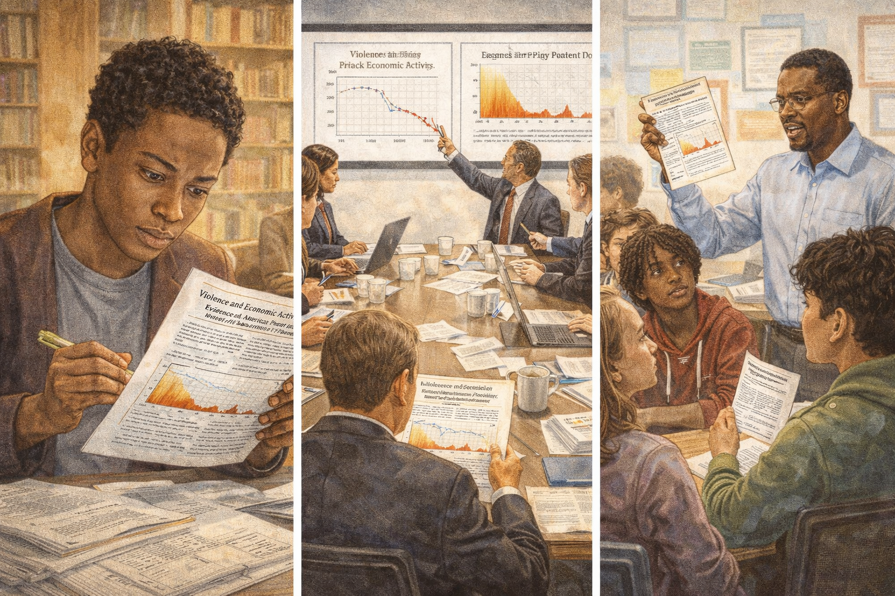

Image Prompt

Please generate a 16:9 image in modern documentary illustration style depicting panel 9 of 14. Make the characters and style consistent with the prior panels. The scene shows Lisa Cook's published paper being read and discussed across multiple settings, shown as a triptych. On the left panel, a young Black graduate student in a university library reads Cook's paper with wide eyes, highlighting passages. In the center panel, a policy meeting in Washington — staffers around a table with Cook's charts projected on the wall, pointing at the data. On the right panel, a high school economics teacher holds up a printed copy of Cook's research while diverse students listen intently. The paper's title and key chart — showing the sharp decline in Black patenting after racial violence — is visible in each scene. The color palette is warm and hopeful — golden library light, clean government office white, bright classroom colors. The emotional tone is ideas spreading and taking hold — truth finding its audience.
Generate the image now.

When Cook's research was finally published, its impact rippled far beyond academic journals. Her paper "Violence and Invention" provided something that had been missing from economic debates about racial inequality: hard, quantitative evidence that discrimination had a measurable cost to the entire economy, not just to its victims. Policy makers, educators, and fellow researchers began citing her work. Other economists started applying her methods to different contexts — studying how discrimination against women, immigrants, and other marginalized groups similarly constrained innovation and growth. Cook had opened a door that could not be closed: the economics of exclusion was now a legitimate and urgent field of study.

## Panel 10: Beyond Patents — The Broader Cost

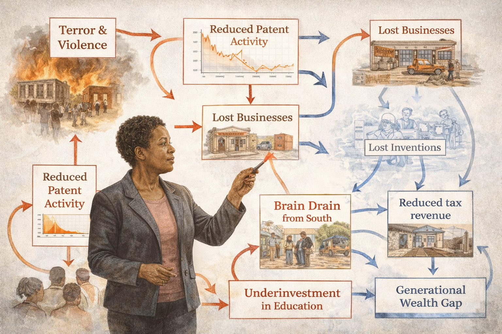

Image Prompt

Please generate a 16:9 image in modern documentary illustration style depicting panel 10 of 14. Make the characters and style consistent with the prior panels. The scene is a visual essay showing the broader economic costs of discrimination that Cook's work illuminated. In the center, Lisa Cook stands before a massive, complex flow chart that fills the background. The chart shows how racial violence creates cascading economic effects: arrows flow from "Terror & Violence" to "Reduced Patent Activity" to "Lost Businesses" to "Brain Drain from South" to "Reduced Tax Revenue" to "Underinvestment in Education" to "Generational Wealth Gap" — each node illustrated with a small vignette. Some arrows loop back, showing vicious cycles. The chart is rendered in clean modern infographic style with red for costs and blue for lost potential. Cook points to the interconnections with a laser pointer. The color palette is modern analytical — white background, clean lines, with emotional weight carried by the small historical vignettes at each node. The emotional tone is systemic understanding — seeing the full machinery of economic destruction.
Generate the image now.

Cook's work expanded beyond patents to examine the full architecture of economic exclusion. She studied how racial violence caused a "brain drain" as talented Black professionals and entrepreneurs fled the South, taking their skills, capital, and tax revenue with them. She showed how the destruction of prosperous Black communities — like the Greenwood district in Tulsa, known as "Black Wall Street" — eliminated not just existing wealth but future compounding returns on that wealth. Her research demonstrated that discrimination operates like a hidden tax on an economy: it doesn't just redistribute resources unfairly, it destroys resources entirely, making the whole economy smaller than it would otherwise be.

## Panel 11: Teaching and Mentoring

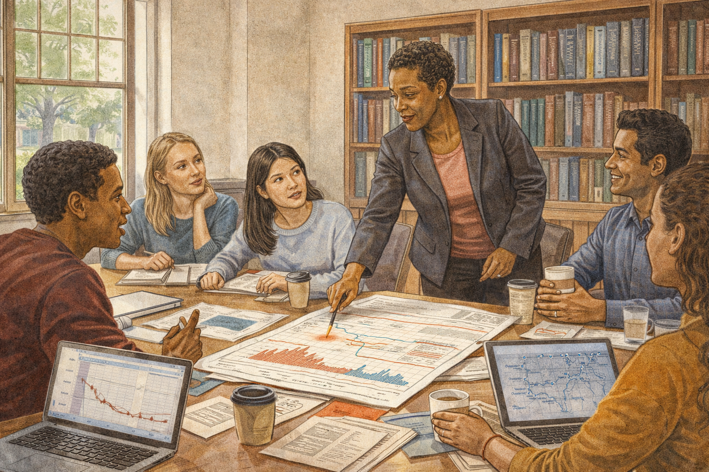

Image Prompt

Please generate a 16:9 image in modern documentary illustration style depicting panel 11 of 14. Make the characters and style consistent with the prior panels. The scene shows Lisa Cook in her element as a professor at Michigan State University. She stands at the front of a seminar room with a diverse group of graduate students gathered around a large table covered with data printouts, laptops, and coffee cups. Cook leans over the table, pointing at a chart while a student asks a question. The students include young people of various races and genders, all engaged and animated. On the walls, bookshelves hold economics texts alongside histories of the Civil Rights movement. A window shows the green MSU campus. One student's laptop screen shows patent data; another has a map of historical violence sites. The color palette is warm academic — wood tones, book spines in various colors, natural light from windows, the green of campus outside. The emotional tone is mentorship and intellectual generosity — Cook passing the tools of her trade to the next generation.
Generate the image now.

Throughout her career, Cook was not only a researcher but a dedicated teacher and mentor. At Michigan State, she trained a new generation of economists — many of them women and people of color — in the methods of rigorous empirical research. She insisted that her students learn to let data tell the story, to be skeptical of easy answers, and to ask the questions that others considered too uncomfortable or too unconventional. Many of her students went on to careers in academia, government, and policy, carrying forward the insight that economics without attention to justice is economics with a blind spot.

## Panel 12: The Call from Washington

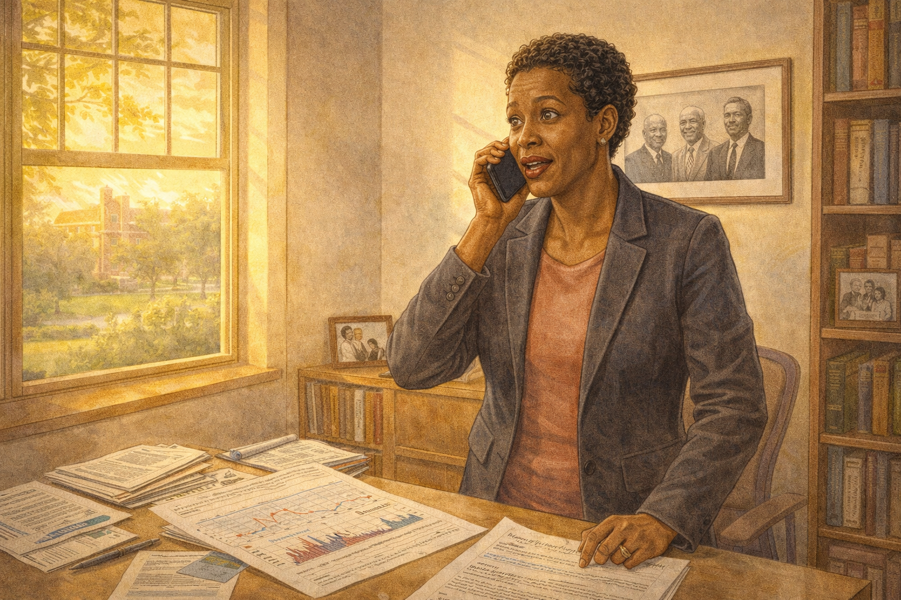

Image Prompt

Please generate a 16:9 image in modern documentary illustration style depicting panel 12 of 14. Make the characters and style consistent with the prior panels. The scene shows a dramatic moment: Lisa Cook receiving the phone call informing her of her nomination to the Federal Reserve Board of Governors, 2022. She stands in her Michigan State office, phone to her ear, eyes wide with emotion — not just personal triumph but the weight of history. On her desk, her published papers and research are visible. On the wall behind her, a framed photo shows historical Black economists and pioneers. Through the window, the campus is bathed in golden light. On a bookshelf, a small framed photo of her family is visible. The color palette transitions from the warm academic tones of her office to a golden, almost luminous quality suggesting a threshold moment. The emotional tone is the intersection of personal achievement and collective progress — one woman's appointment carrying the weight of generations of exclusion.
Generate the image now.

In 2022, President Biden nominated Lisa Cook to the Federal Reserve Board of Governors — the institution that oversees the entire American monetary system. Her confirmation was contentious; the same resistance she had faced in academia followed her to Washington. Critics questioned her qualifications despite her decades of published research, her Oxford education, and her expertise in innovation economics. The Senate confirmed her by the narrowest of margins. Cook became one of the first Black women ever to serve on the Fed's Board of Governors — bringing to the most powerful economic institution in the world a perspective it had never had before.

## Panel 13: At the Table

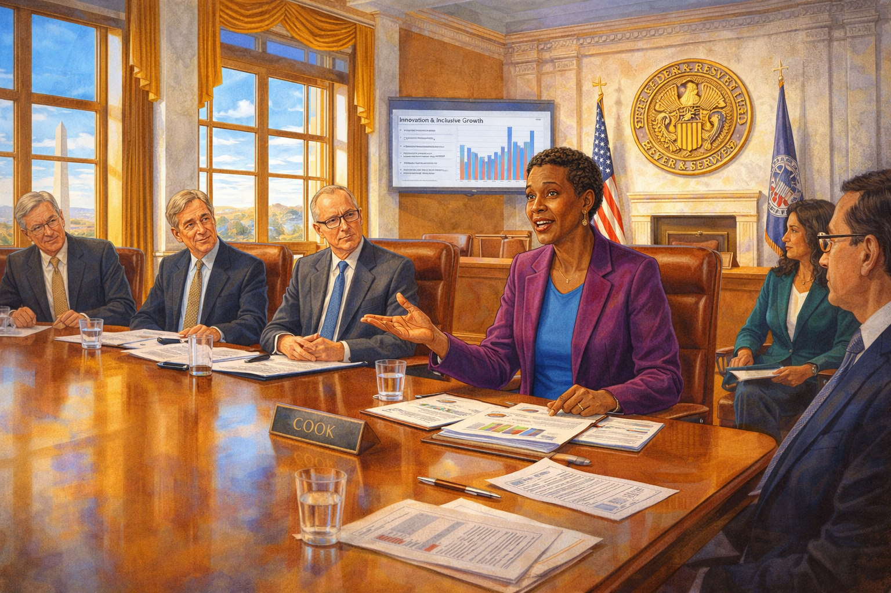

Image Prompt

Please generate a 16:9 image in modern documentary illustration style depicting panel 13 of 14. Make the characters and style consistent with the prior panels, however this one has much more bright colors showing the transition to a positive energy modern era. The scene shows the Federal Reserve Board room in Washington, D.C. — a grand, marble-columned space with the Fed's eagle seal on the wall. Lisa Cook sits at the massive mahogany boardroom table alongside other governors. She is speaking, and the other board members are listening attentively. Before her on the table are economic reports and data. Through tall windows, the Washington Monument is visible against a brilliant blue sky. The room's traditional gravitas — dark wood, marble, brass fixtures — contrasts with Cook's vibrant presence. On a screen behind her, economic data about innovation and inclusive growth is displayed. The color palette explodes with bright, vivid colors — royal blue sky, warm golden wood, Cook's clothing in a rich jewel tone — representing the arrival of new perspectives in an old institution. The emotional tone is historic and forward-looking — this is what it looks like when the door finally opens.
Generate the image now.

At the Federal Reserve, Cook brought her lifelong focus on innovation, inclusion, and institutional trust to bear on the nation's monetary policy. She argued that the Fed's decisions about interest rates and financial regulation affect different communities differently, and that truly understanding the economy requires understanding all of it — not just the parts that are easy to measure. Her research on how institutional failure destroys economic potential was no longer academic theory; it was informing decisions that affected every American. The girl from Milledgeville, Georgia, who had noticed which doors were open and which were closed, was now helping to set the rules for the entire economy.

## Panel 14: The Ideas We're Missing

Image Prompt

Please generate a 16:9 image in modern documentary illustration style blending into vibrant contemporary color, depicting panel 14 of 14. Make the characters and style consistent with the prior panels. The scene is a creative split with super bright colors: on the left, a sepia-toned historical scene — a Black inventor's empty workshop from the early 1900s, tools laid out but no one there, representing the lost innovations of the past. On the right, in explosively vibrant modern color, a diverse group of young people — Black, white, Latino, Asian, male, female, nonbinary — working together in a bright modern innovation lab, building prototypes, coding on laptops, sketching designs, filing patents. In the center, Lisa Cook stands as a bridge between the two worlds, one hand gesturing toward the empty past and the other toward the vibrant future. Above the scene, floating translucent patent documents transform from faded and crossed-out on the left to bright and newly issued on the right. The color palette transitions dramatically from muted sepia loss on the left to dazzling, saturated possibility on the right, unified by Cook's presence. The emotional tone is inspiring and urgent — the past cannot be changed, but the future is being built right now.
Generate the image now.

Lisa Cook's greatest contribution is not a single paper or a policy decision — it is a question that changes how you see the world. Every time a society puts up a barrier — whether through violence, discrimination, underfunded schools, or biased institutions — it is not just hurting the people behind that barrier. It is taxing its own future. Every child denied a quality education is a potential inventor lost. Every entrepreneur driven out by prejudice is a business the economy will never have. Every community destroyed by violence is a network of ideas that will never connect. Cook proved this with data, and then she took that proof to the highest levels of economic power. The question she leaves for you is: what ideas is the world missing right now — and what are you going to do about it?

### Epilogue – What Made Lisa Cook Different?

| Challenge | How Cook Responded | Lesson for Today |
|-----------|-------------------|------------------|
| Grew up in the segregated South during the Civil Rights era | Channeled her firsthand observations of inequality into rigorous economic questions | Personal experience can become the seed of world-changing research |
| Faced isolation as a Black woman in elite academic institutions | Built networks of support and refused to let exclusion define her boundaries | Persistence in unwelcoming spaces creates room for those who follow |
| Asked questions the economics profession dismissed as unmeasurable | Developed innovative methods using patent data to quantify the cost of discrimination | If the existing tools can't answer your question, invent new tools |
| Faced years of resistance getting her research published | Continued refining her evidence and presenting at every opportunity | Data that tells an uncomfortable truth will eventually find its audience |
| Confronted a contentious confirmation process for the Federal Reserve | Drew on decades of rigorous scholarship and unshakable conviction | The strongest answer to doubt is evidence |

### Call to Action

Lisa Cook didn't just study economics — she expanded what economics is allowed to study. She showed that the invisible costs of exclusion are just as real as the visible costs of inflation or recession, and that measuring injustice with the tools of science makes the case for change unanswerable. If you've ever wondered why some communities have fewer businesses than others, why certain groups are underrepresented in STEM fields, why "innovation hubs" seem to cluster in some places and not others, or what the economy would look like if everyone had an equal shot — you're asking Lisa Cook's questions. The data is out there. The tools are available. The barriers are still real. What will you measure?

---

*"Violence and the threat of violence have real economic consequences. You can see it in the data — in the patents not filed, the businesses not started, the ideas that never made it out of someone's mind."*
— Lisa Cook

---

*"I wanted to quantify something that people said couldn't be quantified. They said you can't measure the cost of racism to the economy. I said, let me show you the data."*
— Lisa Cook

---

*"Every barrier to someone's participation in the economy is a barrier to innovation for everyone."*
— Lisa Cook

---

## References

1. [Lisa Cook (economist) (Wikipedia)](https://en.wikipedia.org/wiki/Lisa_Cook) - Biography of Lisa Cook, covering her education, research on innovation and racial violence, and appointment to the Federal Reserve Board of Governors.

2. [Federal Reserve Board of Governors (Wikipedia)](https://en.wikipedia.org/wiki/Federal_Reserve_Board_of_Governors) - Overview of the governing body of the Federal Reserve System, where Cook serves as one of seven governors overseeing U.S. monetary policy.

3. [Tulsa race massacre (Wikipedia)](https://en.wikipedia.org/wiki/Tulsa_race_massacre) - The 1921 destruction of the Greenwood District, one of the wealthiest Black communities in the United States, a key case study in Cook's research.

4. [Patent (Wikipedia)](https://en.wikipedia.org/wiki/Patent) - Overview of the patent system, the primary data source Cook used to measure innovation activity and its suppression by racial violence.

5. [Lynching in the United States (Wikipedia)](https://en.wikipedia.org/wiki/Lynching_in_the_United_States) - History of racial terror lynchings in America, the central variable in Cook's research linking violence to declines in Black innovation.

6. [Innovation economics (Wikipedia)](https://en.wikipedia.org/wiki/Innovation_economics) - The field of economics studying how innovation drives growth, providing the theoretical framework for Cook's research on the costs of exclusion.
