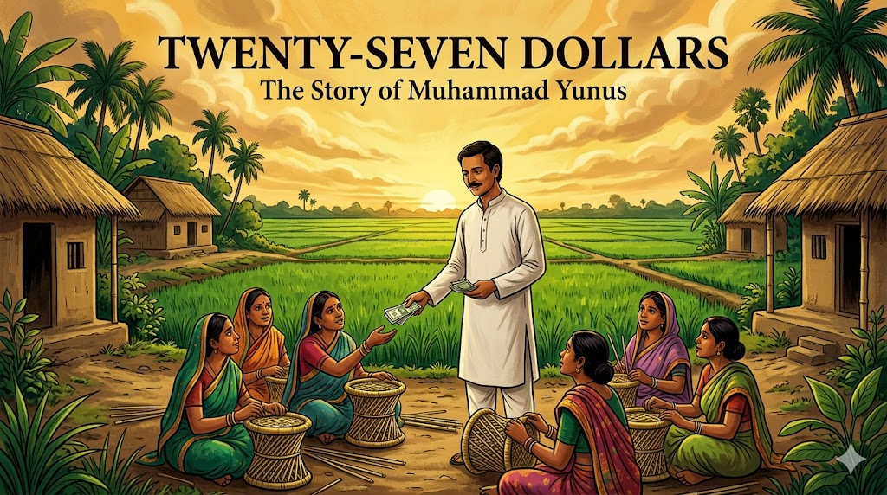

# Twenty-Seven Dollars: Muhammad Yunus and the Microfinance Revolution

Cover Image Prompt

Please generate a new wide-landscape 16:9 cover image for a graphic novel titled "Twenty-Seven Dollars." The style should be vibrant South Asian contemporary art with warm golden and emerald tones. The central figure is Muhammad Yunus — a slim, gentle-faced Bangladeshi man in his mid-30s with dark hair, a modest mustache, and warm brown eyes, wearing a simple white kurta — standing in a rural Bangladeshi village. He holds out a small handful of taka banknotes toward a group of village women sitting on the ground weaving bamboo stools. Behind them, lush green rice paddies stretch to the horizon under a dramatic golden sky. Thatched-roof homes and palm trees frame the scene. The title "TWENTY-SEVEN DOLLARS" appears in bold serif font across the top, with "The Story of Muhammad Yunus" in smaller text below. The mood is one of quiet revolution — a small gesture about to change the world.
Generate the image now.

Narrative Prompt

This graphic novel tells the story of Muhammad Yunus (born 1940), the Bangladeshi economist who invented microfinance and founded Grameen Bank. The narrative follows Yunus from his childhood in Chittagong, through his education in the United States, his return to a Bangladesh devastated by famine, his transformative encounter with Sufiya Begum in Jobra village, and his decades-long battle to prove that poor people are creditworthy. The art style should evoke vibrant South Asian contemporary art — lush landscapes, warm golden and emerald tones, the rich textures of rural Bangladesh. The color palette emphasizes deep emerald greens, warm golds and ambers, terracotta reds, and the brilliant whites of cotton clothing against sun-baked earth. Yunus should be depicted consistently as a slim, kind-faced man with dark hair, a modest mustache, and gentle brown eyes, dressed simply in white or cream kurta or modest Western clothing. The tone balances the harshness of poverty with the warmth of human dignity, showing that the man who revolutionized banking did so not with complex financial instruments but with trust in the poorest people on Earth.

### Prologue – The Smallest Loan

In 1976, an economics professor reached into his own pocket and lent twenty-seven dollars to forty-two people. It was not a donation. It was not charity. It was a loan — and every single borrower paid it back. That professor was Muhammad Yunus, and his experiment in a tiny Bangladeshi village would grow into a global revolution that challenged everything the banking world believed about poverty, risk, and who deserves credit. Sometimes the biggest economic innovation starts with the smallest loan.

## Panel 1: A Boy in Chittagong

Image Prompt

I am about to ask you to generate a series of images for a graphic novel.
Please make the images have a consistent style and consistent characters.
Do not ask any clarifying questions. Just generate the image immediately when asked to do so.

Please generate a 16:9 image in vibrant South Asian contemporary art style with warm golden and emerald tones depicting panel 1 of 14. The scene shows the port city of Chittagong, Bangladesh (then East Pakistan), circa 1950. A ten-year-old Muhammad Yunus — a slim, bright-eyed boy with dark hair — stands in his father's jewelry workshop, watching his father, a successful Muslim goldsmith, serve customers. The workshop is warm and detailed — glass cases filled with gold ornaments, a wooden counter polished smooth by years of use, scales for weighing gold. Through the open doorway, the busy streets of Chittagong are visible — rickshaws, market stalls, colonial-era buildings. Young Yunus's mother, visible in an adjacent room, is giving food to a poor neighbor. The color palette is warm amber and gold from the jewelry, deep wood tones, and the bright greens of tropical vegetation visible outside. The emotional tone is a childhood shaped by both commerce and compassion.
Generate the image now.

Muhammad Yunus was born on June 28, 1940, in the village of Bathua, near the busy port city of Chittagong in what was then British India. His father, Dula Mia, was a successful jewelry maker whose shop in the city hummed with customers. But it was his mother, Sufia Khatun, who shaped young Muhammad's moral compass. She never turned away anyone who came to their door asking for help. "She was the one who made me think about poverty," Yunus would later say. Growing up, he saw both the workings of commerce and the face of human need — and he could not stop wondering why one existed so close to the other.

## Panel 2: The Boy Scout and the Dreamer

Image Prompt

Please generate a 16:9 image in vibrant South Asian contemporary art style with warm golden and emerald tones depicting panel 2 of 14. Make the characters and style consistent with the prior panel. The scene shows teenage Muhammad Yunus, around 16 years old, in his Boy Scout uniform, leading a group of young scouts on a community service project in a Chittagong neighborhood, circa 1956. They are helping repair a damaged school building after monsoon flooding. Yunus is animated and enthusiastic, directing other scouts while rolling up his sleeves. In the background, the University of Chittagong campus is partially visible. A banner in Bengali script marks a cultural event. The landscape shows the lush green hills of Chittagong with tropical rain clouds gathering. The color palette features scout khaki against lush emerald vegetation, with warm afternoon light. The emotional tone is youthful idealism and early leadership — a young man discovering that organizing people to help each other is his calling.
Generate the image now.

Young Yunus was not a quiet bookworm. He was a Boy Scout who threw himself into community service with infectious energy, eventually leading scouting trips to West Pakistan, India, and even Canada and Japan. He excelled at school, won prizes in art and drama, and earned a place at Dhaka University, where he studied economics. But even as a student, Yunus was restless — he did not want to simply study poverty in the abstract. He wanted to understand it the way a doctor understands disease: by getting close to it, diagnosing it, and finding a cure. After earning his master's degree, he began teaching economics at Chittagong University, but a scholarship soon pulled him across the world.

## Panel 3: America and the Dream of Development

Image Prompt

Please generate a 16:9 image in vibrant South Asian contemporary art style with warm golden and emerald tones depicting panel 3 of 14. Make the characters and style consistent with the prior panels. The scene shows Muhammad Yunus, now in his late 20s, on the campus of Vanderbilt University in Nashville, Tennessee, circa 1969. He wears modest Western clothing — a button-down shirt and slacks — and carries an armful of economics textbooks. He walks across a green American campus with red-brick buildings and tall oak trees in autumn colors. Other students pass by. On a bench, he has left open a newspaper with headlines about the Vietnam War and civil rights protests. In his mind's eye — shown as a translucent overlay in the upper corner — he sees the green fields of Bangladesh, reminding him of home. The color palette contrasts the warm American autumn — reds, oranges, golden browns — with the translucent emerald green of his memories. The emotional tone is a man absorbing knowledge while feeling the pull of home and purpose.
Generate the image now.

In 1965, Yunus won a Fulbright scholarship to study economics at Vanderbilt University in Nashville, Tennessee. America in the late 1960s was a place of upheaval — civil rights marches, Vietnam War protests, the War on Poverty. Yunus absorbed it all, earning his PhD in economics while watching how Americans debated inequality and justice. He was a brilliant student, but the elegant theories of development economics troubled him. The models were beautiful on paper, but they seemed disconnected from the actual people he had grown up with in Chittagong. How could equations capture the desperation of a mother who could not feed her children? He completed his doctorate in 1971 — the same year his homeland erupted in war.

## Panel 4: A Nation Born in Blood

Image Prompt

Please generate a 16:9 image in vibrant South Asian contemporary art style with warm golden and emerald tones depicting panel 4 of 14. Make the characters and style consistent with the prior panels. The scene shows Muhammad Yunus in a small apartment in the United States, circa 1971, organizing the Bangladesh Liberation movement from abroad. He stands before a wall map of East Pakistan (soon to be Bangladesh), with pins and string marking key locations. Around him, fellow Bangladeshi expatriates — students and professionals — sit and stand in an urgent meeting. Someone holds a transistor radio broadcasting news of the war. Newspapers with headlines about the Bangladesh genocide are spread on a table. Through the window, an American city street is visible. Yunus's face shows determination mixed with anguish — his country is being born through terrible suffering and he is thousands of miles away. The color palette contrasts the muted interior — brown furniture, dim lamplight — with the bright red and green of a hand-painted Bangladeshi flag on the wall. The emotional tone is patriotic urgency and the pain of distance.
Generate the image now.

In 1971, East Pakistan fought a brutal war of independence against West Pakistan. The Bangladesh Liberation War killed an estimated three million people and created ten million refugees. From his base in the United States, Yunus threw himself into the independence movement, lobbying American politicians, organizing rallies, and setting up the Bangladesh Information Center in Washington, D.C. When Bangladesh finally won its independence in December 1971, Yunus knew he had to go home. He abandoned a comfortable academic career in America and returned to the newly born nation, taking a position as head of the economics department at Chittagong University. He arrived to find a country shattered by war — and worse was coming.

## Panel 5: The Famine

Image Prompt

Please generate a 16:9 image in vibrant South Asian contemporary art style with warm golden and emerald tones depicting panel 5 of 14. Make the characters and style consistent with the prior panels. The scene shows the devastating Bangladesh famine of 1974. Muhammad Yunus, now in his mid-30s wearing a simple white kurta, walks through the streets near Chittagong University. The scene is heartbreaking but depicted with dignity — emaciated people sit along the road, a mother holds a thin child, empty market stalls stand where food should be. Yunus's face shows deep anguish as he looks at the suffering around him. In stark contrast, the university campus is visible in the background — its clean buildings and green lawns a world apart from the hunger on its doorstep. The sky is overcast and heavy. The color palette shifts to muted, somber tones — dusty browns, faded greens, gray sky — but Yunus's white kurta remains bright, suggesting his refusal to look away. The emotional tone is the moral crisis that will change his life — the moment elegant economic theories became meaningless in the face of human starvation.
Generate the image now.

In 1974, Bangladesh was struck by a catastrophic famine. Floods destroyed the rice crop, prices skyrocketed, and an estimated one million people died of starvation. Yunus watched people dying on the streets outside his university, and something broke inside him. "I used to feel a thrill at teaching my students elegant economic theories," he later wrote. "But in 1974, I started to dread my own lectures. What good were these theories when people were dying of hunger on the sidewalk?" He began walking into the villages surrounding the university — not as a professor dispensing wisdom, but as a student trying to learn what the textbooks had never taught him: what does poverty actually look like up close?

## Panel 6: Jobra Village and Sufiya Begum

Image Prompt

Please generate a 16:9 image in vibrant South Asian contemporary art style with warm golden and emerald tones depicting panel 6 of 14. Make the characters and style consistent with the prior panels. This is the central panel of the story. The scene shows Muhammad Yunus sitting on the ground in Jobra village, Bangladesh, 1976, face to face with Sufiya Begum — a thin, determined woman in her early 20s wearing a worn but clean sari. She is surrounded by beautiful handmade bamboo stools, the product of her skilled labor. She holds up one stool to show Yunus. Between them on the ground are a few coins — representing the pitiful profit she earns. Yunus leans forward intently, his notebook on his knee, his expression shifting from academic curiosity to shocked realization. In the background, the modest homes of Jobra village — bamboo walls, tin and thatch roofs — and other women working at similar crafts. The golden afternoon light illuminates the scene, making Sufiya's stools glow. The color palette is warm earth tones — bamboo gold, terracotta, the green of nearby banana trees — with the emotional weight centered on the human connection between these two people. The emotional tone is the eureka moment: the instant Yunus realizes that poverty is not about laziness or inability, but about the structure of the financial system itself.
Generate the image now.

This is the moment that changed the world. In 1976, Yunus walked into the village of Jobra, next to his university, and met a woman named Sufiya Begum. She made beautiful bamboo stools — skilled, hard work that took all day. But she had no money to buy her own bamboo, so she borrowed from a trader who then required her to sell the finished stools back to him at a price he set. Her profit for a full day's labor: two cents. She needed just twenty-two cents to buy her own bamboo and sell on the open market. Twenty-two cents stood between Sufiya Begum and economic freedom — and no bank in the world would lend it to her.

## Panel 7: The List of Forty-Two

Image Prompt

Please generate a 16:9 image in vibrant South Asian contemporary art style with warm golden and emerald tones depicting panel 7 of 14. Make the characters and style consistent with the prior panels. The scene shows Yunus and his student Maimuna Begum sitting under a large banyan tree in Jobra village, compiling a list. Yunus holds a worn notebook where names are being written in neat rows — forty-two names visible on the page. Around them, village women have gathered, some curious, some hopeful, some skeptical. One woman counts on her fingers the amount she needs. The total "$27" is written and circled at the bottom of the notebook page. Yunus's expression is one of disbelief mixed with determination — he cannot believe how small the amounts are. His student looks at him with a mixture of admiration and shared outrage. Dappled golden light filters through the banyan tree's canopy. The color palette is lush greens of the tree canopy, warm gold light, the whites and colors of village women's saris, and the cream of notebook pages. The emotional tone is righteous anger transforming into practical action.
Generate the image now.

Yunus was stunned. He sent a graduate student, Maimuna Begum, door to door through the village to find every person trapped in this kind of debt bondage. She came back with a list of forty-two people. The total amount they needed to free themselves from the moneylenders and become independent entrepreneurs was twenty-seven dollars. Yunus stared at the number in disbelief. "I felt ashamed," he wrote. "I was a professor of economics, and here were forty-two people suffering for lack of twenty-seven dollars." He reached into his own pocket and lent them the money. Not as a gift — as a loan. Every single person paid him back.

## Panel 8: The Bankers Say No

Image Prompt

Please generate a 16:9 image in vibrant South Asian contemporary art style with warm golden and emerald tones depicting panel 8 of 14. Make the characters and style consistent with the prior panels. The scene shows Muhammad Yunus standing in the imposing marble lobby of a formal Bangladeshi bank in Dhaka, circa 1977. He faces a row of bank executives sitting behind a long polished desk — they are well-fed men in suits, some dismissive, some amused, one wagging a finger. Behind them, the bank's motto is carved in stone. Yunus holds up his notebook with the list of forty-two names and their perfect repayment record. The bankers' expressions range from condescension to outright contempt. One banker pushes away Yunus's papers. The architecture is grand — marble floors, brass fittings, colonial-era design — contrasting sharply with the poverty Yunus is trying to address. The color palette contrasts the cold marble whites and banking grays with Yunus's warm presence in his simple clothing. The emotional tone is David versus Goliath — one man with evidence against an entire system built on assumptions about who deserves money.
Generate the image now.

Emboldened by his success, Yunus went to the local bank and asked them to lend to the poor. The bank manager laughed. The poor have no collateral, he said. They cannot read or write. They will never repay. Yunus offered himself as a guarantor, and the bank reluctantly agreed to a small experiment. The borrowers — mostly women — repaid every loan. Yunus went to more banks, then to the central bank, then to government officials. Everywhere, he heard the same refrain: "This is charity, not banking. The poor are not creditworthy." But the data told a different story. The poor were repaying at rates higher than wealthy borrowers. The banking system had not discovered that the poor were bad risks — it had simply never bothered to find out.

## Panel 9: Grameen Bank Is Born

Image Prompt

Please generate a 16:9 image in vibrant South Asian contemporary art style with warm golden and emerald tones depicting panel 9 of 14. Make the characters and style consistent with the prior panels. The scene shows the founding of Grameen Bank, 1983. Muhammad Yunus stands before a modest village building that has been converted into the first Grameen Bank branch. A hand-painted sign reads "Grameen Bank" in Bengali and English. A line of village women — in colorful saris, some carrying children — wait to open accounts or receive loans. A female bank worker sits at a simple wooden desk under a tin-roof veranda, processing paperwork. Yunus shakes hands with a woman receiving her first loan, both smiling. In the background, the lush green landscape of rural Bangladesh — rice paddies, palm trees, a pond reflecting the sky. The color palette is celebratory — bright sari colors, the green and red of the new bank sign, golden sunlight, emerald fields. The emotional tone is triumph and new beginnings — an institution built on trust rather than collateral.
Generate the image now.

In 1983, after years of battling bureaucracy and skepticism, Yunus received a government charter to create Grameen Bank — "grameen" means "village" in Bengali. The bank's rules turned conventional banking upside down. There was no collateral. Borrowers formed small groups of five, and each group member's future borrowing depended on everyone repaying — creating social accountability instead of legal threats. The bank went to the borrowers, not the other way around. And Grameen deliberately targeted women, who made up 97% of its borrowers, because Yunus found that when women controlled money, the entire family benefited. Children were better fed, better educated, and healthier. Lending to women was not just fair — it was smart economics.

## Panel 10: The Revolution Spreads

Image Prompt

Please generate a 16:9 image in vibrant South Asian contemporary art style with warm golden and emerald tones depicting panel 10 of 14. Make the characters and style consistent with the prior panels. The scene is a visual montage showing the spread of microfinance across the world, circa 1990s. In the center, Muhammad Yunus stands before a large stylized map of the world. Radiating outward from Bangladesh in golden lines, the Grameen model reaches across continents. Vignettes around the borders show: an Indian woman at a self-help group meeting, an African woman selling goods at a market with her microloan, a Latin American farmer with new equipment, and — surprisingly — a woman in rural Arkansas, USA, at a Grameen America branch. Each vignette is framed like a photograph or postcard. Statistics float in the composition: "9 million borrowers," "97% women," "98% repayment rate." The color palette is warm and global — earth tones from different continents unified by the golden connecting lines. The emotional tone is expansion and validation — a village idea proving itself worldwide.
Generate the image now.

The idea spread like fire. By the 1990s, Grameen Bank had lent to millions of borrowers across Bangladesh, and its model was being replicated in dozens of countries — from Bolivia to Bosnia, from India to inner-city Chicago. Yunus even brought microfinance to the United States, founding Grameen America in 2008 to serve low-income entrepreneurs in New York City. The numbers were staggering: Grameen Bank lent over $30 billion in small loans, maintained a repayment rate above 98%, and lifted millions of families out of extreme poverty. Microfinance did not just help the poor survive — it proved they were entrepreneurs waiting for a chance. The banking establishment had been wrong for centuries.

## Panel 11: The Nobel Prize

Image Prompt

Please generate a 16:9 image in vibrant South Asian contemporary art style with warm golden and emerald tones depicting panel 11 of 14. Make the characters and style consistent with the prior panels. The scene shows Muhammad Yunus at the Nobel Peace Prize ceremony in Oslo, Norway, December 2006. He stands at the podium in the ornate Oslo City Hall, wearing a traditional Bangladeshi cream-colored Mujib coat. Before him, a distinguished audience in formal attire fills the grand hall — chandeliers, murals on the walls, the Norwegian royal family in the front row. In his hands, he holds the Nobel medal. Behind him, a large screen shows images of Grameen Bank borrowers — village women with their small businesses. Yunus's expression is humble but joyful. The color palette blends the formal European setting — rich blues, golds, and crimsons of the hall — with the warm South Asian tones of Yunus himself. The emotional tone is vindication — the world's highest recognition that banking on the poor was not charity but a path to peace.
Generate the image now.

In October 2006, Muhammad Yunus and Grameen Bank were jointly awarded the Nobel Peace Prize. The Norwegian Nobel Committee declared that "lasting peace cannot be achieved unless large population groups find ways in which to break out of poverty" and that "micro-credit is one such means." Standing at the podium in Oslo, Yunus did not talk about banking models or interest rates. He talked about Sufiya Begum and the forty-two villagers of Jobra. He talked about a world where poverty belongs in museums. "We create what we want," he told the audience. "If we want to create a poverty-free world, we can. The only thing that holds us back is the failure of our imagination."

## Panel 12: The Storm of Opposition

Image Prompt

Please generate a 16:9 image in vibrant South Asian contemporary art style with warm golden and emerald tones depicting panel 12 of 14. Make the characters and style consistent with the prior panels. The scene shows Muhammad Yunus, now in his 70s with graying hair, standing resolute against a storm — both literal and metaphorical. On one side, dark clouds and rain represent the political persecution he faced: government officials pointing accusatory fingers, legal documents and court summons swirling in the wind, newspaper headlines about his forced removal from Grameen Bank in 2011. On the other side, sunlight breaks through, representing the continued work: Grameen borrowers standing in solidarity, international supporters, students holding signs of support. Yunus stands in the center, older but unbowed, his white clothing bright against the dark storm. His expression is calm and determined. The color palette contrasts stormy dark grays and blues on the left with warm golden light on the right, with Yunus as the dividing line. The emotional tone is perseverance in the face of political power — a reminder that speaking truth to power always carries a cost.
Generate the image now.

Success brought enemies. As Grameen Bank grew powerful, the Bangladeshi government moved to take control. In 2011, Yunus was forcibly removed from his position as managing director of Grameen Bank on a legal technicality about his retirement age — a move widely seen as political retaliation for his brief consideration of entering politics. He faced over 100 legal cases, tax investigations, and a public smear campaign. Critics of microfinance also emerged, arguing that some imitators charged predatory interest rates and that microcredit alone could not solve structural poverty. Yunus acknowledged these criticisms honestly, but never wavered in his core belief: the poor are not the problem. The system that excludes them is.

## Panel 13: Social Business and the Future

Image Prompt

Please generate a 16:9 image in vibrant South Asian contemporary art style with warm golden and emerald tones depicting panel 13 of 14. Make the characters and style consistent with the prior panels, however this one has much more bright colors showing the transition to a positive energy modern era. The scene shows a modern Social Business Summit, circa 2020s. Muhammad Yunus, now elderly but energetic, stands on a sleek modern stage addressing a diverse international audience of young entrepreneurs. Behind him, a large digital screen displays the "Three Zeros" — Zero Poverty, Zero Unemployment, Zero Net Carbon Emissions. In the audience, young people of many nationalities hold tablets and phones, some livestreaming. Side panels show examples of Yunus's social business ventures: a joint venture with Danone to produce affordable yogurt for malnourished children, a solar energy company powering rural villages, young people running their own social enterprises. The venue is modern and bright with many vivid colors. The color palette is bright and optimistic — electric blues, vivid greens, warm oranges, clean whites — a dramatic shift from the muted poverty tones of earlier panels. The emotional tone is forward-looking inspiration — the microfinance pioneer now championing an even bigger vision.
Generate the image now.

Yunus did not stop at microfinance. He developed the concept of "social business" — companies designed to solve human problems rather than maximize profit. He partnered with multinational corporations like Danone to create affordable nutrition for the poor, launched solar energy companies for off-grid villages, and championed what he calls the "Three Zeros": zero poverty, zero unemployment, and zero net carbon emissions. Now in his eighties, Yunus travels the world urging young people to become social entrepreneurs. "The existing economic system is designed to create wealth concentration," he argues. "We need a new system designed to solve problems." His vision has grown from a single village to the entire planet — but the principle remains the same as that first twenty-seven-dollar loan: trust people, and they will prove you right.

## Panel 14: Your Twenty-Seven Dollars

Image Prompt

Please generate a 16:9 image in vibrant South Asian contemporary art style blending into modern style, depicting panel 14 of 14. Make the characters and style consistent with the prior panels. The scene is a creative split with super bright colors: on the left, the 1976 village of Jobra where Yunus sits with Sufiya Begum under the banyan tree, handing her the small loan that changed everything. On the right, the same composition mirrored in a modern setting — a diverse young student sits with a peer in a school courtyard or community space, sharing an idea for a social enterprise on a laptop screen. Between them, a bridge of warm golden light connects past and present, with small coins transforming into digital currency symbols as they cross the bridge. Both figures share the same expression of possibility and determination. Floating annotations surround each side — "22 cents," "Bamboo Stools," "Trust" on the Yunus side, and "Social Enterprise," "Crowdfunding," "Impact Investing" on the student's side. The color palette blends warm South Asian gold and emerald on the left with clean modern tones on the right, unified by the golden bridge. The emotional tone is deeply inspiring — you do not need a fortune to start a revolution, just the courage to believe in people.
Generate the image now.

Muhammad Yunus's greatest lesson was not about banking — it was about *seeing*. He walked through the same village that thousands of other professors, bankers, and politicians had driven past without stopping. He sat down on the ground with Sufiya Begum and asked a question no economist had thought to ask: "How much do you need?" The answer — twenty-two cents — revealed that the entire global financial system had a blind spot the size of half the human race. You do not need a bank charter or a Nobel Prize to follow Yunus's example. You need the willingness to look at the people the system has overlooked, ask what they actually need, and trust them with the answer. What problem is hiding in plain sight in your community — waiting for someone to ask the right question?

### Epilogue – What Made Muhammad Yunus Different?

| Challenge | How Yunus Responded | Lesson for Today |
|-----------|---------------------|------------------|
| Witnessed devastating famine while teaching elegant economic theories | Left the classroom and walked into the village to learn directly from the poor | The best insights come from getting close to problems, not theorizing from a distance |
| Banks refused to lend to the poor, calling them "not creditworthy" | Tested the assumption with his own money and proved the banks wrong with data | Challenge assumptions with evidence — the experts are not always right |
| The entire banking system was designed to exclude the poorest people | Invented a new system from scratch — group lending, no collateral, going to the borrower | When the existing system fails, do not try to fix it — build a better one |
| Critics called microfinance "charity, not economics" | Maintained rigorous repayment standards, proving that lending to the poor is sound business | Compassion and good economics are not opposites — they can reinforce each other |
| Faced political persecution after decades of service | Continued his work through social business, education, and global advocacy | Standing up for what is right will attract opposition — persist anyway |

### Call to Action

Muhammad Yunus did not need a billion-dollar budget or a team of financial engineers. He needed twenty-seven dollars and the humility to listen. Microfinance proved something that traditional economics had ignored for centuries: poor people are not poor because they lack ability — they are poor because they lack access. Access to credit, to markets, to the basic trust that every human being deserves. Today, the same principle applies to countless challenges — from climate change to education to healthcare. The solutions are not waiting for a genius to invent them. They are waiting for someone to sit down, listen to the people closest to the problem, and ask: "How much do you need?"

---

*"Poverty is not created by poor people. It is created by the system we have built, the institutions we have designed, and the concepts we have formulated."*
— Muhammad Yunus, *Creating a World Without Poverty* (2007)

---

*"All human beings are born entrepreneurs. Some get a chance to unleash that capacity. Some never got the chance, never knew that he or she has that capacity."*
— Muhammad Yunus, Nobel Peace Prize Lecture (2006)

---

*"One day our grandchildren will go to museums to see what poverty was like."*
— Muhammad Yunus

---

## References

1. [Muhammad Yunus (Wikipedia)](https://en.wikipedia.org/wiki/Muhammad_Yunus) - Comprehensive biography covering Yunus's life, the founding of Grameen Bank, his Nobel Prize, and his social business philosophy.

2. [Grameen Bank (Wikipedia)](https://en.wikipedia.org/wiki/Grameen_Bank) - Overview of the microfinance institution Yunus founded in 1983, its group lending model, and its impact on poverty reduction in Bangladesh and worldwide.

3. [Microfinance (Wikipedia)](https://en.wikipedia.org/wiki/Microfinance) - The financial services movement Yunus pioneered, providing small loans, savings, and insurance to people excluded from traditional banking.

4. [Nobel Peace Prize 2006 (Wikipedia)](https://en.wikipedia.org/wiki/2006_Nobel_Peace_Prize) - The award jointly given to Muhammad Yunus and Grameen Bank for their efforts to create economic and social development from below.

5. [Bangladesh Famine of 1974 (Wikipedia)](https://en.wikipedia.org/wiki/Bangladesh_famine_of_1974) - The devastating famine that killed an estimated one million people and catalyzed Yunus's decision to abandon theoretical economics for direct action.

6. [Social Business (Wikipedia)](https://en.wikipedia.org/wiki/Social_business) - The concept developed by Yunus for businesses designed to solve social problems rather than maximize shareholder profit.
