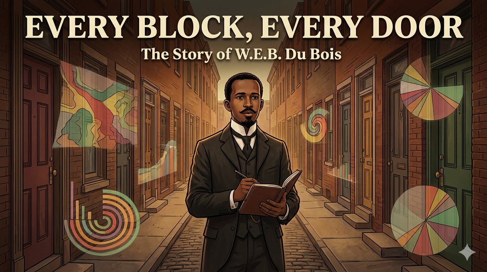

# Every Block, Every Door: W.E.B. Du Bois and the Data Revolution

Cover Image Prompt

Please generate a new wide-landscape 16:9 cover image for a graphic novel titled "Every Block, Every Door." The style should be late Victorian/early Modern with rich earth tones — deep browns, warm ambers, burgundy, and forest green — accented with bold geometric data visualization elements inspired by Du Bois's famous infographics. The central figure is W.E.B. Du Bois — a young Black man in his late 20s, impeccably dressed in a dark three-piece suit with a high starched collar, neatly trimmed mustache and goatee, carrying a leather-bound notebook and pen. He stands at the entrance to a narrow Philadelphia row-house street, the Seventh Ward, in the late 1890s. Behind him, the street stretches into the distance with dozens of doors on both sides. Overlaid on the scene, translucent geometric data visualizations — spiraling bar charts, radiating pie charts, and flowing color-coded maps in Du Bois's distinctive style — float like ghostly revelations emerging from the doorways. The title "EVERY BLOCK, EVERY DOOR" appears in bold modernist serif font across the top, with "The Story of W.E.B. Du Bois" in smaller text below. The mood is one of fierce intellectual determination and the power of truth-telling through data.
Generate the image now.

Narrative Prompt

This graphic novel tells the story of W.E.B. Du Bois (1868–1963), the pioneering Black sociologist, economist, and civil rights leader who conducted the first rigorous data-driven study of urban Black economic life. The narrative follows Du Bois from his childhood in Great Barrington, Massachusetts, through his education at Fisk, Harvard, and the University of Berlin, to his groundbreaking fieldwork in Philadelphia's Seventh Ward, the publication of The Philadelphia Negro (1899), and his lasting legacy as a data revolutionary. The art style should evoke the late Victorian/early Modern era — gas-lit row houses, university lecture halls, crowded urban streets — with rich earth tones of deep brown, warm amber, burgundy, and forest green. Bold geometric data visualization elements inspired by Du Bois's famous infographics for the 1900 Paris Exposition should appear throughout as a visual motif. Du Bois should be depicted consistently as a young Black man of medium height with an upright, dignified bearing, neatly trimmed mustache and goatee, impeccably dressed in dark suits with high starched collars — projecting quiet intensity and fierce intellectual pride. The tone balances scholarly rigor with moral courage, showing that the man who let data speak truth to power first had to survive a world determined not to listen.

### Prologue – The Man Who Counted Everything

In 1899, a book appeared that should have changed America. It was not written by a politician or a preacher, but by a twenty-nine-year-old Black scholar with a Harvard PhD and a burning conviction that the truth, carefully measured and honestly presented, could defeat prejudice. His name was William Edward Burghardt Du Bois, and his superpower was something revolutionary: he believed that if you counted everything — every family, every job, every dollar earned and every door slammed shut — the data itself would destroy the lies that racism depended on.

## Panel 1: A Boy in the Berkshires

Image Prompt

I am about to ask you to generate a series of images for a graphic novel.
Please make the images have a consistent style and consistent characters.
Do not ask any clarifying questions. Just generate the image immediately when asked to do so.

Please generate a 16:9 image in late Victorian/early Modern style with rich earth tones and bold data visualization accents, depicting panel 1 of 14. The scene shows the small town of Great Barrington, Massachusetts, circa 1878. A ten-year-old Black boy — young W.E.B. Du Bois, small and neatly dressed in a worn but clean suit — stands in a one-room schoolhouse among white classmates. He is at the front of the room, proudly holding up a perfect examination paper while a white teacher looks on with genuine admiration. Through the schoolhouse windows, the gentle Berkshire Hills are visible, covered in autumn foliage of gold and crimson. The other children show mixed reactions — some impressed, a few uncomfortable. The color palette is warm New England autumn — golden light, red and orange leaves, weathered wood. The emotional tone is early confidence meeting its first shadow — the boy excels but is beginning to sense the invisible barriers ahead.
Generate the image now.

W.E.B. Du Bois was born in 1868 in Great Barrington, Massachusetts — a small New England town where he was one of very few Black residents. His mother, Mary Silvina Burghardt, raised him largely alone after his father left the family. Young Willie, as he was called, was brilliant and knew it. He excelled in the local public school, outperforming his white classmates, and the town largely supported his education. But even in this relatively tolerant place, Du Bois experienced moments that cut deep — a white classmate refusing his visiting card, the sudden realization that in America, his color was a *problem*. He resolved early that he would prove, through sheer excellence, that the problem was not his.

## Panel 2: Fisk and the South

Image Prompt

Please generate a 16:9 image in late Victorian/early Modern style with rich earth tones and bold data visualization accents, depicting panel 2 of 14. Make the characters and style consistent with the prior panel. The scene shows the campus of Fisk University in Nashville, Tennessee, circa 1886. A young W.E.B. Du Bois, now 17, impeccably dressed in a dark suit with a high collar, walks across a campus green surrounded by other Black students — young men and women carrying books, engaged in animated discussion. The brick buildings of Fisk rise behind them. But in the background, beyond the campus gates, the Jim Crow South is visible: segregation signs on a streetcar, a white overseer watching Black laborers in a field. Du Bois's expression mixes intellectual exhilaration with growing anger. The color palette contrasts the warm amber and green of the campus with the harsh, bleached tones of the segregated world beyond. The emotional tone is awakening — a brilliant young man discovering both the richness of Black culture and the brutality of American racism.
Generate the image now.

At seventeen, Du Bois traveled south for the first time to attend Fisk University in Nashville, Tennessee. The experience transformed him. For the first time, he was surrounded by other ambitious Black students and brilliant Black professors. He discovered the richness of Black intellectual life, Black music, Black community. But he also encountered the Jim Crow South in all its cruelty — the segregated streetcars, the sharecropper poverty, the casual violence. During summers, he taught in rural Tennessee schools where Black children studied in shacks with no books. Du Bois left Fisk with a degree, a fierce pride in Black culture, and a question that would drive his life's work: Why are Black people poor — is it their failing, or America's?

## Panel 3: Harvard and the Veil

Image Prompt

Please generate a 16:9 image in late Victorian/early Modern style with rich earth tones and bold data visualization accents, depicting panel 3 of 14. Make the characters and style consistent with the prior panels. The scene shows the interior of a Harvard University lecture hall, circa 1890. W.E.B. Du Bois, now in his early twenties, sits in a front-row seat taking meticulous notes. He is the only Black student in a large hall full of white students. At the lectern, the philosopher William James — a middle-aged man with a full beard and kind, penetrating eyes — lectures with animated gestures. James looks directly at Du Bois with evident respect. The hall has dark wood paneling, tall windows, and portraits of white scholars on the walls. Du Bois's posture is ramrod straight, his expression intensely focused — he is simultaneously absorbing knowledge and proving his right to be there. The color palette is Harvard crimson and dark oak, with golden lamplight. The emotional tone is intellectual determination behind a veil of social isolation.
Generate the image now.

Du Bois entered Harvard in 1888, and once again, he was often the only Black person in the room. He was not invited to join clubs or social events. But he found mentors who recognized his genius — above all, the philosopher William James, who became a lifelong influence. James taught Du Bois that ideas must be tested against reality, that philosophy without evidence is empty talk. Du Bois threw himself into his studies with ferocious discipline, earning his bachelor's degree, then a master's, and ultimately becoming the first Black person to earn a PhD from Harvard. His doctoral dissertation was a meticulous historical study of the suppression of the African slave trade. The pattern was set: Du Bois would fight racism not with rhetoric alone, but with research.

## Panel 4: Berlin and the Science of Society

Image Prompt

Please generate a 16:9 image in late Victorian/early Modern style with rich earth tones and bold data visualization accents, depicting panel 4 of 14. Make the characters and style consistent with the prior panels. The scene shows a seminar room at the University of Berlin, circa 1893. Du Bois, now 25, sits at a large wooden table with German students and professors in a graduate seminar. The renowned economist Gustav von Schmoller — an older man with spectacles and a white beard — leads the discussion, pointing to statistical charts and maps pinned to the wall. Du Bois leans forward eagerly, his notebook filled with precise handwriting. The room has high ceilings, tall bookshelves, and maps of industrial Europe. On the table, economic data tables and early statistical charts are spread out. The color palette is warm wood, cream paper, and the muted greens and grays of a Berlin winter visible through frosted windows. The emotional tone is intellectual liberation — in Germany, Du Bois experiences being judged primarily by his mind rather than his skin.
Generate the image now.

A scholarship took Du Bois to the University of Berlin, and it changed everything. In Germany, he studied under the greatest social scientists in the world — economists and sociologists who were pioneering the use of statistics, surveys, and fieldwork to understand society. For the first time in his life, Du Bois was treated as a scholar first and a Black man second. He absorbed the German method: if you want to understand poverty, go count it. If you want to understand inequality, go measure it. Don't theorize from an armchair — walk the streets, knock on doors, collect the numbers. Du Bois returned to America armed with the most advanced social science training available anywhere on earth, and a burning desire to aim it at the most important problem in American life.

## Panel 5: The Impossible Assignment

Image Prompt

Please generate a 16:9 image in late Victorian/early Modern style with rich earth tones and bold data visualization accents, depicting panel 5 of 14. Make the characters and style consistent with the prior panels. The scene shows a formal office at the University of Pennsylvania, 1896. Du Bois, now 28, dressed in his finest dark suit, sits across a desk from a white university administrator — a portly man in a high-backed chair who regards Du Bois with condescending skepticism. The administrator gestures toward a large wall map of Philadelphia with one neighborhood circled in red — the Seventh Ward. On the desk between them lies a letter of appointment with a notably low salary figure visible. Through the office window, the towers of the University of Pennsylvania campus are visible. Du Bois's expression is controlled but his eyes burn with understanding — he knows they expect him to fail, to produce a study confirming Black inferiority. The color palette is institutional — dark wood, brass fixtures, green leather — with the red circle on the map drawing the eye. The emotional tone is a deliberate insult being transformed into an opportunity.
Generate the image now.

In 1896, the University of Pennsylvania made Du Bois an offer that was both an opportunity and an insult. They hired him to study the Black population of Philadelphia's Seventh Ward — but gave him no office, no staff, no real academic standing, and a salary far below what any white scholar would accept. The university's white leaders assumed the study would confirm what they already believed: that Black poverty was caused by Black people's own moral failures. Du Bois understood the game perfectly. They expected a document of condemnation. Instead, he would give them science so rigorous, so thorough, so undeniable that the data itself would put racism on trial. He accepted the position and moved into the heart of the Seventh Ward.

## Panel 6: Every Door

Image Prompt

Please generate a 16:9 image in late Victorian/early Modern style with rich earth tones and bold data visualization accents, depicting panel 6 of 14. Make the characters and style consistent with the prior panels. This is the central panel of the story. The scene shows W.E.B. Du Bois standing on a narrow cobblestone street in Philadelphia's Seventh Ward, 1897. He is knocking on the door of a row house while holding his leather notebook and a sheaf of survey questionnaires. The street stretches in both directions, lined with dozens of identical brick row houses, each door representing another family to interview. A Black woman in a worn dress opens her door cautiously, a child peeking from behind her skirt. Other residents watch from windows and stoops — some curious, some wary. The street is both crowded and worn: laundry hangs between buildings, a street vendor pushes a cart, children play in the gutter. Du Bois's expression is focused and respectful — he treats each interview as sacred data. The color palette is urban earth — brick red, brown cobblestone, weathered wood, with the golden light of a late afternoon. The emotional tone is the quiet heroism of empirical work — truth discovered one doorbell at a time.
Generate the image now.

For over a year, Du Bois walked every block of the Seventh Ward — the largest and oldest Black neighborhood in Philadelphia. He knocked on nearly every door. He personally conducted over five thousand interviews, asking about income, employment, education, housing, health, family structure, church membership, and daily expenses. No one had ever attempted anything like this before — not for any community, Black or white. Du Bois didn't send assistants or mail surveys. He went himself, face to face, treating every person he interviewed as a source of valuable evidence. He mapped every household, every business, every institution. He was building, brick by brick, the most detailed portrait of urban economic life ever assembled.

## Panel 7: The Data Speaks

Image Prompt

Please generate a 16:9 image in late Victorian/early Modern style with rich earth tones and bold data visualization accents, depicting panel 7 of 14. Make the characters and style consistent with the prior panels. The scene shows Du Bois working late at night in a small, cramped apartment that doubles as his office in the Seventh Ward, circa 1897. He sits at a desk overflowing with handwritten survey forms, statistical tables, and hand-drawn charts. He is creating one of his famous data visualizations — a large, colorful spiral chart showing income distribution among Black Philadelphians, rendered in bold geometric shapes of red, green, gold, and black. The walls around him are covered with pinned-up maps of the Seventh Ward, each block color-coded by income level. A single gas lamp illuminates the scene. His wife, Nina Gomer Du Bois — a young, elegant Black woman — brings him tea, looking at the charts with quiet awe. The color palette is warm lamplight against deep shadows, with the vivid geometric colors of the data visualizations providing striking contrast. The emotional tone is obsessive devotion to truth — a man turning raw human stories into undeniable evidence.
Generate the image now.

Night after night, Du Bois transformed thousands of interviews into something the world had never seen. He created data visualizations of stunning originality — bold geometric charts, color-coded maps, spiraling diagrams that told the economic story of Black Philadelphia at a glance. His charts showed that Black workers were concentrated in the lowest-paying jobs not because they lacked skill but because employers refused to hire them. His maps revealed that Black families paid higher rent for worse housing than white families on the same block. His tables demonstrated that Black-owned businesses thrived when given fair access to markets and credit. Every chart was a weapon against the lie that Black poverty was natural or deserved.

## Panel 8: The Philadelphia Negro

Image Prompt

Please generate a 16:9 image in late Victorian/early Modern style with rich earth tones and bold data visualization accents, depicting panel 8 of 14. Make the characters and style consistent with the prior panels. The scene shows a book-lined study or library, circa 1899. A freshly printed copy of "The Philadelphia Negro" lies open on a polished wooden table, its pages showing Du Bois's data visualizations and dense text. Du Bois stands beside the table, one hand resting on the book, his expression a mixture of pride and defiance. Around him, ghostly floating data visualizations from the book emerge and expand — a color-coded map of the Seventh Ward, bar charts of occupational exclusion, income spirals — filling the air like projected evidence in a courtroom. In the background, shadowy figures represent the establishment: white academics, politicians, and newspaper editors turning away or looking uncomfortable. The color palette is the rich dark wood and leather of a Victorian library, pierced by the vivid geometric colors of Du Bois's visualizations. The emotional tone is truth confronting power — the data is irrefutable, but the audience does not want to hear it.
Generate the image now.

*The Philadelphia Negro* was published in 1899 and it was a masterpiece — the first great work of empirical urban sociology in America. Du Bois proved, with overwhelming evidence, that Black poverty in Philadelphia was not caused by Black inferiority. It was caused by systemic exclusion: hiring discrimination that locked Black workers out of skilled trades, housing segregation that trapped families in overcrowded neighborhoods, unequal access to education and capital, and the compounding effects of generations of slavery and racism. The book should have revolutionized American social science. Instead, white academia largely ignored it. The evidence was undeniable, so the establishment chose not to deny it — they simply looked away.

## Panel 9: The Paris Exposition

Image Prompt

Please generate a 16:9 image in late Victorian/early Modern style with rich earth tones and bold data visualization accents, depicting panel 9 of 14. Make the characters and style consistent with the prior panels. The scene shows the interior of the American Negro Exhibit at the 1900 Paris Exposition Universelle. Du Bois, now 32, stands proudly beside an elaborate display of his hand-drawn data visualizations mounted on exhibition boards. The charts are large, colorful, and geometrically bold — spiral income charts, radiating bar graphs showing Black property ownership over time, comparative population charts — all rendered in striking blacks, reds, greens, and golds. Elegant Parisian visitors in fashionable clothes study the exhibits with evident fascination. The exhibition hall has high ceilings, iron framework, and Art Nouveau decorative elements. Photographs of Black businesses, schools, and families are displayed alongside the charts. The color palette combines the warm elegance of a Paris exhibition — cream walls, gilded frames — with the bold primary colors of Du Bois's visualizations. The emotional tone is international recognition — Black achievement displayed on a world stage, commanding respect through the universal language of data.
Generate the image now.

In 1900, Du Bois brought his data to the world stage. For the Paris Exposition Universelle, he created a stunning series of hand-drawn infographics documenting the progress of Black Americans since emancipation — charts showing rising literacy rates, growing property ownership, the emergence of Black professionals and business owners. The exhibit won a gold medal. European visitors marveled at both the data and the artistry. Du Bois had invented a new visual language for social science — one that combined statistical rigor with the emotional power of art. These visualizations, rediscovered over a century later, are now recognized as masterpieces of information design that anticipated modern data visualization by decades.

## Panel 10: Atlanta and the Activist-Scholar

Image Prompt

Please generate a 16:9 image in late Victorian/early Modern style with rich earth tones and bold data visualization accents, depicting panel 10 of 14. Make the characters and style consistent with the prior panels. The scene is a visual essay showing Du Bois at Atlanta University, circa 1905. In the center, Du Bois sits at a desk writing furiously — the manuscript of "The Souls of Black Folk" before him. Around him, a montage of his expanding work radiates outward: on one side, he leads a meeting of well-dressed Black intellectuals founding the Niagara Movement, their faces determined; on another side, he edits the pages of The Crisis magazine, the publication of the NAACP. Data visualizations float throughout — charts of lynching statistics, graphs of economic inequality, maps of the Great Migration. The background shows the contrast between a tranquil university campus and scenes of racial violence and poverty in the Jim Crow South. The color palette transitions from the warm amber of scholarship to the harsh reds and blacks of injustice. The emotional tone is a man who cannot separate knowledge from action — the scholar becoming an activist because the data demands it.
Generate the image now.

Du Bois could not remain only a scholar. The data he collected documented not just poverty but violence — lynchings, riots, systematic terrorism against Black communities. In 1903, he published *The Souls of Black Folk*, a searing blend of sociology, history, and lyrical prose that declared the problem of the twentieth century to be "the problem of the color line." He founded the Niagara Movement, helped create the NAACP, and edited *The Crisis* magazine for twenty-four years, using data and journalism to fight for civil rights. Du Bois proved that economics cannot be separated from justice — that every statistic about poverty is also a statement about power, and that data without moral courage is just numbers on a page.

## Panel 11: The Double Burden

Image Prompt

Please generate a 16:9 image in late Victorian/early Modern style with rich earth tones and bold data visualization accents, depicting panel 11 of 14. Make the characters and style consistent with the prior panels. The scene shows Du Bois in his fifties, standing alone in a hallway outside a university department office, circa 1920. The door is closed to him — through the frosted glass, white professors are visible conducting a faculty meeting he was not invited to attend. Du Bois holds a stack of his published works — The Philadelphia Negro, The Souls of Black Folk, multiple volumes of the Atlanta University Studies — books that would qualify any white scholar for the most prestigious chair in the country. His expression combines dignity with weariness. On the wall beside him, a bulletin board shows job postings for academic positions marked "Whites Only" (implicit or explicit). His shadow on the wall is elongated, suggesting the weight he carries. The color palette is institutional gray and cold blue, with the warm brown leather of his books providing the only warmth. The emotional tone is the quiet devastation of systemic exclusion — the most qualified person in the building standing outside the door.
Generate the image now.

Despite being arguably the most accomplished social scientist in America, Du Bois was never offered a permanent position at a major white research university. His work was cited by those who understood its importance, but the academic establishment — the same establishment he had outperformed on every measure — kept its doors closed. He watched white scholars with lesser credentials receive the positions, the funding, and the recognition that his pioneering work deserved. This was the very phenomenon his data had documented: systemic exclusion operating not through individual hatred alone, but through institutional structures that made discrimination feel natural and inevitable. Du Bois lived the truth his research revealed.

## Panel 12: The Long Arc

Image Prompt

Please generate a 16:9 image in late Victorian/early Modern style with rich earth tones and bold data visualization accents, depicting panel 12 of 14. Make the characters and style consistent with the prior panels. The scene shows a montage that connects Du Bois's work to the sweep of history. In the center, an elderly Du Bois — now in his 80s, white-haired but still upright and dignified — stands watching. Around him, scenes from different decades spiral outward: the Great Migration of Black families northward (1910s-1920s), Depression-era breadlines where Black workers were last hired and first fired (1930s), the early Civil Rights movement with protesters carrying signs using Du Bois's own statistics (1950s). Throughout, Du Bois's data visualizations appear as recurring motifs — the same charts and maps adapted and updated across the decades, showing that the patterns he first documented persisted. The color palette transitions from sepia tones of the early century through the muted grays of the Depression to the emerging bold colors of the Civil Rights era. The emotional tone is the weight of a life spent fighting the same battle with the same evidence, watching truth slowly, painfully gain ground.
Generate the image now.

Du Bois's life spanned nearly a century — from the Civil War to the Civil Rights Movement. He lived to see some of his predictions confirmed and others ignored. He watched the Great Migration reshape American cities exactly as his data had anticipated. He saw Black communities build wealth and institutions against enormous odds, just as his charts had documented. He also witnessed the same patterns of exclusion perpetuate themselves generation after generation — redlining, employment discrimination, educational inequality — the structural forces he had first measured in the Seventh Ward in 1897 still operating in new forms. Du Bois died on August 27, 1963, in Accra, Ghana — the day before the March on Washington where Martin Luther King Jr. told America about his dream.

## Panel 13: Data's Unfinished Revolution

Image Prompt

Please generate a 16:9 image in late Victorian/early Modern style with rich earth tones and bold data visualization accents, depicting panel 13 of 14. Make the characters and style consistent with the prior panels, however this one has much more bright colors showing the transition to a positive energy modern era. The scene shows a modern university data science lab. Diverse students — different races, genders, and backgrounds — work at computers displaying colorful data visualizations that echo Du Bois's original designs. On one screen, a modern recreation of a Du Bois spiral chart displays contemporary economic data. On another, a map shows income inequality by neighborhood in vivid colors. A young Black woman student stands at a large interactive display, presenting her own data visualization to classmates — her chart style clearly inspired by Du Bois. On the wall, framed reproductions of Du Bois's original 1900 Paris Exposition infographics hang beside modern data dashboards. A professor facilitates discussion rather than lecturing. Through the lab windows, a diverse modern city is visible. The color palette blends warm homage to Du Bois's original bold geometric colors with bright, contemporary digital tones. The emotional tone is connection across time — Du Bois's methods are alive and evolving in this room.
Generate the image now.

Today, Du Bois is recognized as a founding father of modern sociology, data visualization, and the empirical study of racial inequality. His Paris Exposition infographics have gone viral in the age of social media — their bold geometric beauty and devastating clarity speaking across more than a century. Data scientists, economists, and designers study his methods. His core insight — that poverty is a systemic outcome, not a personal failing — has been confirmed by mountains of subsequent research. But Du Bois's deepest lesson remains urgent: data is never neutral. Who collects it, what questions they ask, whose stories get counted, and whose get ignored — these choices shape what truth looks like. The revolution he started is far from finished.

## Panel 14: Your Turn to Count

Image Prompt

Please generate a 16:9 image in late Victorian/early Modern style blending into modern style, depicting panel 14 of 14. Make the characters and style consistent with the prior panels. The scene is a creative split: on the left, a late-1890s Philadelphia row-house street where Du Bois stands with his leather notebook, knocking on a door, in warm earth tones. On the right, the same composition mirrored in a modern setting with super bright colors — a young diverse student standing in a contemporary neighborhood, holding a tablet displaying a data visualization app, conducting their own survey with the same careful, respectful attention Du Bois brought to every interview. Between them, a bridge of bold geometric shapes — echoing Du Bois's infographic style — connects past and present in vivid reds, greens, golds, and blacks. Both figures are surrounded by floating data elements — Du Bois's hand-drawn charts on his side, modern interactive dashboards and data ethics principles on the student's side. The color palette blends warm Victorian earth tones on the left with clean bright modern tones on the right, unified by Du Bois's signature geometric visual language. The emotional tone is inspiring — you can do what Du Bois did: count what matters, ask who's being left out, and let the data tell the truth.
Generate the image now.

W.E.B. Du Bois's greatest lesson wasn't about charts or statistics — it was about *who gets to tell the story*. He walked into a neighborhood that the powerful had already judged and condemned, and he listened. He counted. He drew. He proved that when you collect data with rigor and present it with honesty, the numbers become a mirror that society cannot look away from. You have the same power. Every neighborhood has a story the data can tell. Every community has patterns waiting to be mapped. Every assumption about who is poor and why can be tested against evidence. The next great insight about economic justice is hiding in data that hasn't been collected yet — because no one thought to ask. What will you count?

### Epilogue – What Made W.E.B. Du Bois Different?

| Challenge | How Du Bois Responded | Lesson for Today |
|-----------|----------------------|------------------|
| Grew up as one of very few Black people in a white New England town | Channeled early experiences of exclusion into fierce academic excellence and racial pride | Feeling like an outsider can become the foundation for seeing what insiders miss |
| Faced institutional racism at every stage of his career | Responded with work so rigorous it could not be honestly dismissed — only dishonestly ignored | When the system is unfair, make your evidence so strong that silence becomes the only refuge of the unjust |
| Given an underfunded, impossible research assignment designed to confirm racist assumptions | Conducted the most thorough urban study ever attempted, turning the assignment against its creators | When someone hands you a rigged question, answer it so completely that the rigging is exposed |
| Created pioneering data visualizations decades ahead of their time | Combined statistical precision with artistic power, making data beautiful and undeniable | The best data tells a story — presentation matters as much as collection |
| Denied positions at white universities despite being the most qualified candidate | Built institutions of his own, trained generations of Black scholars, and fought for justice through data and advocacy | When doors close, build your own — and make sure they open for those who come after you |

### Call to Action

W.E.B. Du Bois didn't need a supercomputer, a billion-dollar grant, or permission from the powerful. He needed a notebook, a pair of shoes, the willingness to knock on every door, and the moral courage to let the data say what the data said — even when no one wanted to hear it. Economics is not a set of abstract models floating above human life — it is the study of who gets what, why, and what can be done about it. If you've ever wondered why some neighborhoods have fresh grocery stores and others don't, why your zip code predicts your life expectancy, why wealth gaps persist across generations, or why the same work pays differently depending on who does it — you're already asking Du Bois's questions. The difference is whether you'll go collect the evidence.

---

*"The problem of the twentieth century is the problem of the color line."*
— W.E.B. Du Bois, *The Souls of Black Folk* (1903)

---

*"To be a poor man is hard, but to be a poor race in a land of dollars is the very bottom of hardships."*
— W.E.B. Du Bois, *The Souls of Black Folk* (1903)

---

*"When you have mastered numbers, you will in fact no longer be reading numbers, any more than you read words when reading books. You will be reading meanings."*
— W.E.B. Du Bois

---

## References

1. [W.E.B. Du Bois (Wikipedia)](https://en.wikipedia.org/wiki/W._E._B._Du_Bois) - Comprehensive biography covering Du Bois's life, works, and legacy in sociology, economics, and civil rights activism.

2. [The Philadelphia Negro (Wikipedia)](https://en.wikipedia.org/wiki/The_Philadelphia_Negro) - Overview of Du Bois's 1899 groundbreaking study of Black economic life in Philadelphia's Seventh Ward, the first scientific sociology study in the United States.

3. [The Souls of Black Folk (Wikipedia)](https://en.wikipedia.org/wiki/The_Souls_of_Black_Folk) - Summary of Du Bois's 1903 landmark work combining sociology, history, and personal essay to analyze the African American experience.

4. [Niagara Movement (Wikipedia)](https://en.wikipedia.org/wiki/Niagara_Movement) - The civil rights organization co-founded by Du Bois in 1905, which laid the groundwork for the NAACP.

5. [Data Visualization (Wikipedia)](https://en.wikipedia.org/wiki/Data_and_information_visualization) - The field of visual representation of data that Du Bois pioneered with his innovative infographics for the 1900 Paris Exposition.

6. [Institutional Racism (Wikipedia)](https://en.wikipedia.org/wiki/Institutional_racism) - The concept of systemic racial discrimination embedded in social institutions, which Du Bois was among the first to document empirically.
